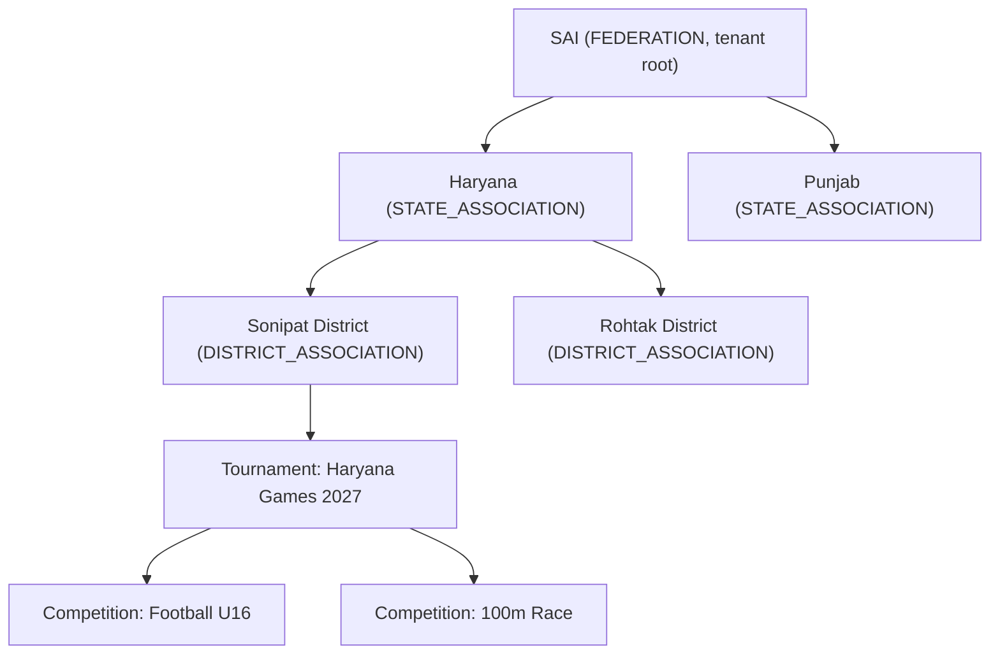

# 00 — Vision & Product Strategy

| | |
|---|---|
| **Version** | 1.0 |
| **Status** | Approved |
| **Date** | 2026-07-26 |
| **Owner** | Samarth |
| **Depends on** | `ARCHITECTURE_BRIEF.md` (frozen v1.0) |
| **Next doc** | `01_PRODUCT_REQUIREMENTS.md` |

---

## 1. Problem Statement

Organizing a sports tournament in India today is a logistics exercise held together by spreadsheets, WhatsApp groups, and paper forms. This is true at every level of the pyramid — from a district athletics meet in Sonipat to a national multi-sport event run by a federation.

### 1.1 How it actually works today

1. **Registration is paper + WhatsApp.** An organizer circulates a PDF or a photographed paper form in WhatsApp groups. Participants reply with photos of filled forms, Aadhaar cards, and birth certificates. Someone manually re-types everything into Excel.
2. **Approvals are opaque and untracked.** A player registering for a state championship typically needs sign-off from their club, then the district association, then the state association. Today this is a chain of phone calls and forwarded messages. Nobody can answer "where is my registration stuck?" — including the organizers.
3. **Fixtures are drawn by hand.** Round-robin tables and knockout brackets are built in Excel or on a whiteboard, photographed, and broadcast on WhatsApp. A single withdrawal means redrawing everything and re-broadcasting; stale versions circulate for days.
4. **Results live in someone's notebook.** Match results are recorded on paper scoresheets, aggregated manually into standings, and published (if at all) as a photo. Errors are common, disputes are unresolvable because there is no audit trail.
5. **Every sport is a special case.** Football needs a points table; 100m needs timed heats; chess needs Swiss pairings. Generic tools force organizers to fake one sport inside another's format or fall back to Excel.
6. **Every organizer rebuilds from scratch.** The same district association re-creates the same forms, the same approval chain, and the same fixture spreadsheets for every event, every year. Nothing is reusable; institutional knowledge leaves with the volunteer who built the spreadsheet.

### 1.2 Why this matters

India's sporting ecosystem is a deep hierarchy: **SAI → national federations → state associations → district associations → academies/colleges/clubs → athletes**. Government programs (Khelo India, state games) are pushing thousands of new events per year down this pyramid. The administrative capacity does not scale with paper. Talented athletes miss events because a form got lost in a WhatsApp thread; organizers spend more time on data entry than on sport.

## 2. Vision Statement

> **Become the operating system for competitive sport in India: a single white-label platform on which any organization in the sporting hierarchy — from SAI to a neighborhood club — can configure, run, and publish tournaments for any sport, with zero spreadsheets, zero paper, and full traceability from registration to podium.**

In one sentence: *"Configure a tournament for any sport, at any level of the Indian sports hierarchy, in minutes — and run it end-to-end online."*

### 2.1 Product principles

These principles bind every downstream design document:

1. **Configuration over code.** New sports, new approval chains, new registration forms must be tenant-configurable. If a customer request requires a deploy, the design has failed (`SportConfiguration`, `ApprovalWorkflow`, `RegistrationFormDefinition` exist for exactly this).
2. **The hierarchy is the tenant.** Access, data visibility, and delegation all follow the `OrganizationUnit` tree. No feature may assume a flat organizer.
3. **Simple statuses, rich state elsewhere.** User-visible status enums stay small (e.g., `Registration` has exactly `PENDING, APPROVED, REJECTED, WITHDRAWN`); process complexity lives in dedicated engines (workflow state), never leaks into status enums.
4. **Everything auditable.** Sports administration runs on disputes; every mutation carries a before/after trail from day one.
5. **Public by default, private by scope.** Published tournaments are shareable public artifacts (`/t/{slug}`); everything administrative is scope-checked.

## 3. Target Customers

| Segment | `OrganizationUnit.type` | Example | Primary need |
|---|---|---|---|
| Sports Authority of India | `FEDERATION` (root tenant) | SAI / Khelo India | Nationwide hierarchy, multi-level approvals, auditability |
| National / state federations | `FEDERATION`, `STATE_ASSOCIATION` | Haryana Olympic Association | Delegated administration to districts, standings, records |
| District associations | `DISTRICT_ASSOCIATION` | Sonipat District Athletics Assoc. | Easy event setup, athlete registration, fixtures |
| Academies | `ACADEMY` | Private cricket/badminton academies | Recurring internal events, branded public pages |
| Colleges & universities | `COLLEGE` | Inter-college & intramural sports | Many sports, many one-off competitions, fast setup |
| Clubs | `CLUB` | Local football/chess clubs | Leagues, ladders, member registration |
| Private organizers | `PRIVATE_ORGANIZER` | Corporate leagues, open tournaments | White-label branding, public discoverability |

A single hierarchy — e.g., **SAI → Haryana → Sonipat District** — is one tenant tree (`OrganizationUnit` with root parent = null), with tournaments attachable at any node.

## 4. Competitor Landscape

We compete with generic tournament tooling (Tournify-, Challonge-, LeagueRepublic-style products) and with the status quo (Excel + WhatsApp, which is free and universally understood).

| Capability | Tournify-style | Challonge-style | LeagueRepublic-style | **Us (V1)** |
|---|---|---|---|---|
| Bracket / fixture generation | Yes | Yes (brackets first) | Yes (leagues first) | Yes — pluggable `ROUND_ROBIN`, `SINGLE_ELIMINATION`, `DOUBLE_ELIMINATION`, `SWISS`, `NONE` |
| Multi-level org hierarchy (federation → state → district) | No — flat organizer account | No | Partial (league/club) | **Yes — first-class `OrganizationUnit` tree** |
| Configurable multi-level approval workflows | No | No | No | **Yes — Approval Workflow Engine** |
| Non-match sports (100m, long jump: time/distance results) | Weak | No (bracket-only) | No (match-only) | **Yes — Sport Configuration Engine (`TIME`, `DISTANCE`, `SCORE` evaluators)** |
| Custom registration forms per competition | Basic | No | Basic | **Yes — versioned `RegistrationFormDefinition` (JSON schema) as MVP** |
| White-label / tenant branding | Paid add-on | No | Partial | **Yes — commercial white-label product** |
| Scoped RBAC (district admin sees only their subtree) | No | No | No | **Yes — IAM-style scoped roles** |
| Audit trail for disputes | No | No | No | **Yes — `AuditLog` from day one** |
| India data residency | No | No | No | **Yes** |

### 4.1 Why generic tools fail for Indian federations

1. **They model an "organizer," not a hierarchy.** A flat account cannot express "SAI delegates to Haryana, which delegates to Sonipat, and a Sonipat admin must never see Rohtak's data." Our `OrganizationUnit` tree plus subtree-scoped RBAC is exactly this.
2. **They have no concept of approval chains.** Indian federation registration is inherently multi-party (club endorses → district verifies → state approves). Generic tools have a binary accept/reject at best; we ship a tenant-configurable `ApprovalWorkflow` engine — 1 level or 3 levels with zero code changes.
3. **They are bracket-shaped.** Athletics, swimming, and shooting don't fit match brackets. Our strategy-based `SportConfiguration` treats a timed 100m final and a football league as equal citizens.
4. **They assume a fixed registration form.** Federations need age-proof fields, Aadhaar numbers, guardian consent for minors, coach details — varying per competition. Dynamic forms are in our MVP, not a phase-4 promise.
5. **No white-label, no residency.** Government and federation buyers require Indian data residency and their own branding; foreign SaaS check neither box.

## 5. Differentiators

1. **Organization hierarchy as a first-class primitive.** Self-referencing `OrganizationUnit` tree; tenant = root node; every row is scoped; access to an `ORGANIZATION` scope grants the whole subtree.
2. **Configurable Approval Workflow Engine.** `ApprovalWorkflow` / `ApprovalStep` / `ApprovalInstance` / `ApprovalAction` — tenants define who approves what, at how many levels, per entity type. Registration status stays a clean `PENDING / APPROVED / REJECTED / WITHDRAWN`; workflow state carries the multi-level detail.
3. **Sport Configuration Engine.** One JSONB `SportConfiguration` per sport/competition selects `fixtureGenerator`, `resultEvaluator`, and `leaderboardStrategy` via factories (Strategy pattern). Adding chess (Swiss) is a new strategy implementation, not a schema change — and never an `if (sport == FOOTBALL)`.
4. **Dynamic registration forms in MVP.** Versioned `RegistrationFormDefinition` per `Competition`, answers stored as JSONB `RegistrationResponse`. Organizers self-serve their own forms.
5. **White-label + slug-based public pages.** Immutable public URLs (`/t/haryana-games-2027`) with tenant branding, letting every federation present the platform as its own.
6. **Trust infrastructure.** `AuditLog` with before/after state on every mutation, generic `Document` module for proofs and certificates uploads, India data residency.

## 6. Explicit Non-Goals for V1

The following are consciously **out of scope** for V1 (details and design hooks in `11_FUTURE_ENHANCEMENTS.md`):

- **Payments & registration fees** — no payment gateway, invoicing, or fee collection.
- **Certificates generation** — no automated participation/merit certificate rendering.
- **Native mobile apps** — responsive web only.
- **Live ball-by-ball / point-by-point scoring** — match results are entered post-hoc; `LIVE` status exists but no real-time score feed.
- **Notification delivery** — `Notification` schema is reserved in V1, but no email/SMS/push delivery pipeline ships.
- **AI-assisted scheduling**, **streaming**, **video analysis**.
- **Dedicated federation/coach/referee portals** beyond scoped RBAC access.
- **Analytics dashboards** beyond basic operational lists and leaderboards.
- **Aadhaar/KYC verification** — documents are uploaded and manually verified; no DigiLocker/eKYC integration.
- **Multi-language UI** — English only in V1 (strings externalized).
- **Microservices** — deliberately a modular monolith (Java 21 / Spring Boot 3.x, PostgreSQL 16).

## 7. MVP Scope Summary

**In scope (V1):**

1. **Tenant & org onboarding** — create `OrganizationUnit` trees (all 7 types), tenant lifecycle (`ACTIVE, SUSPENDED, ARCHIVED`).
2. **Identity & scoped RBAC** — `User` lifecycle (`ACTIVE, INVITED, SUSPENDED, DEACTIVATED`), seed roles `SUPER_ADMIN`, `TENANT_ADMIN`, `ORG_OFFICIAL`, `TOURNAMENT_ADMIN`, `COMPETITION_OFFICIAL`, `PARTICIPANT_USER`, `PUBLIC_VIEWER`; JWT auth.
3. **Tournament & Competition management** — full lifecycle (`DRAFT → PUBLISHED → REGISTRATION_OPEN → REGISTRATION_CLOSED → IN_PROGRESS → COMPLETED`, plus `CANCELLED`/`ARCHIVED`), venues.
4. **Dynamic registration forms** — versioned form definitions per competition, JSONB responses.
5. **Registration & approval** — polymorphic `Participant` (`INDIVIDUAL, TEAM, ORGANIZATION`), team rosters via `TeamMember`, configurable approval workflows.
6. **Fixtures & matches** — strategy-generated fixtures for launch sports; match statuses `SCHEDULED, LIVE, COMPLETED, WALKOVER, CANCELLED, POSTPONED`.
7. **Results & leaderboards** — pluggable result evaluation and leaderboard strategies (`POINTS_TABLE`, `LOWEST_TIME`, `HIGHEST_DISTANCE`, `HIGHEST_SCORE`, `BRACKET`).
8. **Documents** — S3 presigned upload/download attached to any entity.
9. **Audit** — `AuditLog` on all mutations from day one.
10. **Public pages** — slug-based tournament pages with fixtures, results, leaderboards.

**Launch sports:** Football (TEAM / ROUND_ROBIN / POINTS) and Athletics-100m (INDIVIDUAL / NONE / TIME). The architecture must accommodate Chess (SWISS) with only a new strategy implementation.

**Success criteria for MVP:** a district association can onboard, configure a two-sport tournament with custom forms and a 2-level approval chain, run it end-to-end, and publish live standings on a public page — without a single spreadsheet.

### 7.1 MVP walkthrough (golden path)

## 8. Measures of Success (first 12 months post-GA)

| Metric | Target | Why it matters |
|---|---|---|
| Tenants onboarded (org trees, all types) | 25+ | Validates hierarchy model across segments |
| Tournaments run end-to-end on platform | 100+ | Core value delivered, not just signups |
| Registrations processed through approval workflows | 50,000+ | Proves the workflow engine at real volume |
| Median "form published → first registration" time | < 24 h | Measures organizer self-service ease |
| Registrations requiring offline (spreadsheet) fallback | 0 | The founding promise |
| Sports live via configuration only (no code fork) | 3+ (incl. Chess/SWISS) | Proves the Sport Configuration Engine |
| Public page traffic served from cache | > 90% | Validates read-heavy public architecture |

## 9. Risks & Mitigations (product-level)

| Risk | Impact | Mitigation |
|---|---|---|
| Organizers cling to WhatsApp/Excel habits | Low adoption despite onboarding | Public slug pages give organizers an immediate shareable win; concierge onboarding for first tenants |
| Approval chains vary more than the workflow model allows | Custom-code pressure | Engine is level/role-generic by design (1..N levels, zero code change); gaps feed `11_FUTURE_ENHANCEMENTS.md`, not forks |
| No notification delivery in V1 frustrates participants | Perceived incompleteness | Explicit assumption (A-01 in `01_PRODUCT_REQUIREMENTS.md`): organizers communicate off-platform; `Notification` schema reserved so delivery ships fast post-MVP |
| Federation sales cycles are long | Revenue delay | Bottom-up wedge: academies, colleges, clubs, private organizers buy fast and pull hierarchies upward |
