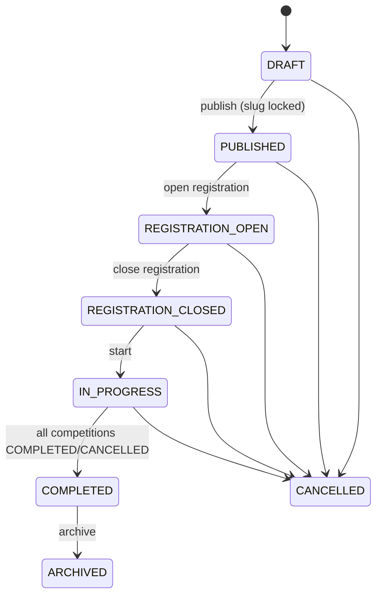
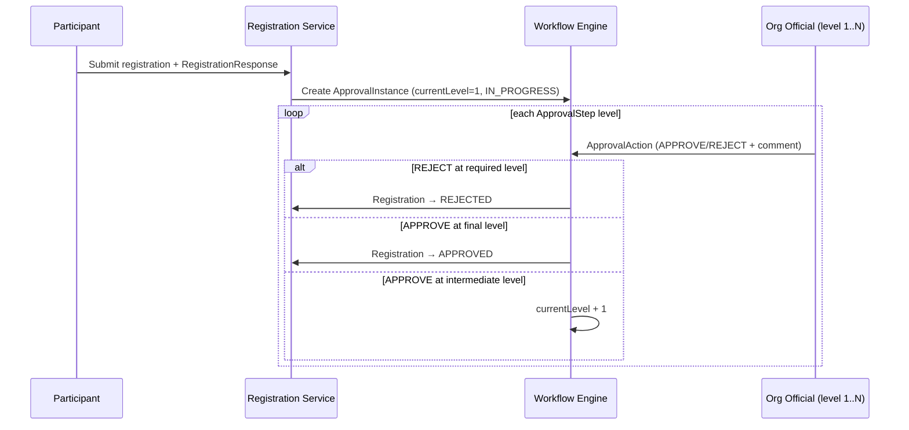

# 01 — Product Requirements

| | |
|---|---|
| **Version** | 1.0 |
| **Status** | Approved |
| **Date** | 2026-07-26 |
| **Owner** | Samarth |
| **Depends on** | `ARCHITECTURE_BRIEF.md` (frozen v1.0), `00_VISION.md` |
| **Next doc** | `02_DOMAIN_MODEL.md` |

---

## 1. Actors

Actors map 1:1 to the seed roles in the frozen brief. All roles except `SUPER_ADMIN` and `PUBLIC_VIEWER` are scoped via `UserRoleAssignment { userId, roleId, scopeType, scopeId }`.

| # | Actor | Seed role | Scope (`scopeType`) | Description |
|---|---|---|---|---|
| A1 | Super Admin | `SUPER_ADMIN` | `GLOBAL` | Platform operator (us). Onboards tenants, manages platform config, cross-tenant support. |
| A2 | Tenant Admin | `TENANT_ADMIN` | `ORGANIZATION` (root node) | Administers a tenant tree: child org units, users, roles, approval workflows, branding. |
| A3 | Org Official | `ORG_OFFICIAL` | `ORGANIZATION` (any node) | Official of a specific org unit (e.g., district secretary). Manages tournaments and approvals within their subtree. |
| A4 | Tournament Admin | `TOURNAMENT_ADMIN` | `TOURNAMENT` | Runs one tournament: competitions, forms, registrations, fixtures, publishing. |
| A5 | Competition Official | `COMPETITION_OFFICIAL` | `COMPETITION` | Referee/scorer for one competition: match scheduling updates, results entry. |
| A6 | Participant / Athlete | `PARTICIPANT_USER` | — (self) | Registers self (INDIVIDUAL) into competitions, tracks own registrations, matches, results. |
| A7 | Team Manager | `PARTICIPANT_USER` | — (self + managed `Participant` of type TEAM) | A participant user who creates/manages a TEAM `Participant` and its `TeamMember` roster. |
| A8 | Public Viewer | `PUBLIC_VIEWER` | — (anonymous) | Anyone browsing public tournament pages via slugs. No account required. |

> **Note:** "Team Manager" is a persona, not a distinct role — it is a `PARTICIPANT_USER` who owns a `Participant` of `participantType = TEAM`.

## 2. User Stories

### A1 — Super Admin

| ID | Story |
|---|---|
| US-001 | As a Super Admin, I can create a new tenant by creating a root `OrganizationUnit` (parent = null) with name, slug, and type, so a federation/organizer can start onboarding. |
| US-002 | As a Super Admin, I can suspend or archive a tenant (`OrganizationUnit` status → `SUSPENDED` / `ARCHIVED`), so non-paying or violating tenants lose access without data loss. |
| US-003 | As a Super Admin, I can invite the first Tenant Admin user for a tenant, so the tenant becomes self-service. |
| US-004 | As a Super Admin, I can manage the platform `Sport` catalog and default `SportConfiguration` templates, so tenants start from sensible defaults. |
| US-005 | As a Super Admin, I can search the `AuditLog` across tenants, so I can investigate support escalations and disputes. |

### A2 — Tenant Admin

| ID | Story |
|---|---|
| US-010 | As a Tenant Admin, I can create child `OrganizationUnit`s (e.g., `STATE_ASSOCIATION` → `DISTRICT_ASSOCIATION`) to model my real-world hierarchy. |
| US-011 | As a Tenant Admin, I can invite users by email and assign scoped roles (e.g., `ORG_OFFICIAL` on "Sonipat District"), so administration is delegated down the tree. |
| US-012 | As a Tenant Admin, I can suspend or deactivate a user (`User` status → `SUSPENDED` / `DEACTIVATED`) within my tenant. |
| US-013 | As a Tenant Admin, I can configure an `ApprovalWorkflow` with N `ApprovalStep`s (level, roleCode, approvalRequired) per entity type, so registrations follow my federation's real approval chain. |
| US-014 | As a Tenant Admin, I can configure tenant branding (logo, colors) applied to public slug pages, so the platform appears white-labeled as ours. |
| US-015 | As a Tenant Admin, I can view the `AuditLog` scoped to my tenant subtree, so I can answer "who changed what, when". |

### A3 — Org Official

| ID | Story |
|---|---|
| US-020 | As an Org Official, I can create a `Tournament` under my org unit with name, slug, dates, and description, starting in `DRAFT`. |
| US-021 | As an Org Official, I can act on `ApprovalInstance`s pending at my level (approve/reject with comment), so registrations routed to my org unit move forward. |
| US-022 | As an Org Official, I can view all tournaments, registrations, and results within my org subtree — but nothing outside it. |
| US-023 | As an Org Official, I can assign a `TOURNAMENT_ADMIN` for a tournament under my org unit, delegating day-to-day operations. |
| US-024 | As an Org Official, I can manage `Venue`s for my org unit, so competitions can be scheduled at real locations. |

### A4 — Tournament Admin

| ID | Story |
|---|---|
| US-030 | As a Tournament Admin, I can create `Competition`s inside my tournament (e.g., "Football U16", "100m Race"), each linked to a `Sport` and `SportConfiguration`. |
| US-031 | As a Tournament Admin, I can build a `RegistrationFormDefinition` per competition using a field palette (text, number, date, select, file), and publish it as a new version. |
| US-032 | As a Tournament Admin, I can move my tournament through its lifecycle (`DRAFT → PUBLISHED → REGISTRATION_OPEN → REGISTRATION_CLOSED → IN_PROGRESS → COMPLETED`), with each transition validated. |
| US-033 | As a Tournament Admin, I can review registrations with their `RegistrationResponse` answers and attached `Document`s, and see live workflow state ("pending at level 2"). |
| US-034 | As a Tournament Admin, I can generate fixtures for a competition using its configured `fixtureGenerator`, review the draft, and publish it. |
| US-035 | As a Tournament Admin, I can regenerate fixtures before any match is `COMPLETED` (e.g., after a withdrawal), with the old fixture set superseded and audited. |
| US-036 | As a Tournament Admin, I can record a `WALKOVER`, `POSTPONED`, or `CANCELLED` match, so real-world disruptions are reflected. |
| US-037 | As a Tournament Admin, I can cancel a tournament (`CANCELLED`) or archive a completed one (`ARCHIVED`). |

### A5 — Competition Official

| ID | Story |
|---|---|
| US-040 | As a Competition Official, I can see my assigned competition's match list and schedule. |
| US-041 | As a Competition Official, I can set a match to `LIVE` and then enter its `Result` (score, time, or distance per the competition's `resultEvaluator`), completing the match. |
| US-042 | As a Competition Official, I can correct a result within the allowed correction window, with the change captured in the `AuditLog` (before/after state). |

### A6 — Participant / Athlete

| ID | Story |
|---|---|
| US-050 | As an Athlete, I can sign up, verify my email, and maintain my profile as an `INDIVIDUAL` `Participant`. |
| US-051 | As an Athlete, I can browse open competitions and submit a `Registration` by filling the competition's dynamic form and uploading required `Document`s. |
| US-052 | As an Athlete, I can track my registration status (`PENDING / APPROVED / REJECTED / WITHDRAWN`) and see which approval level it is currently at. |
| US-053 | As an Athlete, I can withdraw my registration (status → `WITHDRAWN`) before the competition closes. |
| US-054 | As an Athlete, I can see my fixtures, match results, and leaderboard position in one place. |

### A7 — Team Manager

| ID | Story |
|---|---|
| US-060 | As a Team Manager, I can create a `Participant` of type `TEAM` and manage its `TeamMember` roster (add/remove members, jersey numbers, roles). |
| US-061 | As a Team Manager, I can register my team into a TEAM-type competition, filling the dynamic form once for the team. |
| US-062 | As a Team Manager, I can edit the roster while the registration is `PENDING`, and view it read-only after approval. |

### A8 — Public Viewer

| ID | Story |
|---|---|
| US-070 | As a Public Viewer, I can open `/t/{tournament-slug}` and see the tournament overview, competitions, venues, and schedule — no login required. |
| US-071 | As a Public Viewer, I can see published fixtures, match results, and leaderboards per competition. |
| US-072 | As a Public Viewer, I get the tenant's white-label branding on public pages, so the event looks like the federation's own site. |

## 3. Functional Requirements

### 3.1 Module: Organization Onboarding (`organization`)

| ID | Requirement |
|---|---|
| FR-001 | The system SHALL model tenants as self-referencing `OrganizationUnit` trees (`id, parentOrganizationUnitId, name, slug, type, status`); a root node (parent = null) is the tenant. |
| FR-002 | `OrganizationUnit.type` SHALL be one of `FEDERATION, STATE_ASSOCIATION, DISTRICT_ASSOCIATION, ACADEMY, COLLEGE, CLUB, PRIVATE_ORGANIZER`. |
| FR-003 | `OrganizationUnit.status` SHALL be one of `ACTIVE, SUSPENDED, ARCHIVED`; suspending a node SHALL block all write operations in its subtree. |
| FR-004 | Only `SUPER_ADMIN` SHALL create root org units; `TENANT_ADMIN` (and `ORG_OFFICIAL` where permitted) SHALL create child units within their subtree. |
| FR-005 | Every tenant-owned row SHALL carry `organization_unit_id`; enforcement via service-layer scope checks plus a Hibernate filter. |
| FR-006 | Moving an `OrganizationUnit` to a different parent SHALL be restricted to `TENANT_ADMIN` and audited; cycles SHALL be rejected. |

### 3.2 Module: User & Role Management (`identity`)

| ID | Requirement |
|---|---|
| FR-010 | The system SHALL support user lifecycle statuses `ACTIVE, INVITED, SUSPENDED, DEACTIVATED`; invited users become `ACTIVE` on accepting the invite and setting credentials. |
| FR-011 | Authentication SHALL use JWT access + refresh tokens via Spring Security; refresh tokens SHALL be revocable (logout, suspension). |
| FR-012 | Authorization SHALL use scoped RBAC: `UserRoleAssignment { userId, roleId, scopeType, scopeId }` with `scopeType ∈ {GLOBAL, ORGANIZATION, TOURNAMENT, COMPETITION}`. |
| FR-013 | An `ORGANIZATION`-scoped assignment SHALL grant access to the entire subtree of the referenced org unit. |
| FR-014 | Permissions SHALL be fine-grained strings (e.g., `tournament:create`, `registration:approve`) attached to roles via `RolePermission`; endpoint checks evaluate permission + scope. |
| FR-015 | Seed roles SHALL be provisioned exactly as: `SUPER_ADMIN, TENANT_ADMIN, ORG_OFFICIAL, TOURNAMENT_ADMIN, COMPETITION_OFFICIAL, PARTICIPANT_USER, PUBLIC_VIEWER`. |
| FR-016 | A user MAY hold multiple role assignments at different scopes simultaneously (e.g., `ORG_OFFICIAL` on one district and `PARTICIPANT_USER` globally). |

### 3.3 Module: Tournament & Competition Management (`tournament`)

| ID | Requirement |
|---|---|
| FR-020 | The system SHALL support `Tournament` CRUD with statuses `DRAFT, PUBLISHED, REGISTRATION_OPEN, REGISTRATION_CLOSED, IN_PROGRESS, COMPLETED, CANCELLED, ARCHIVED`. |
| FR-021 | Tournament lifecycle transitions SHALL be validated per the state machine below; invalid transitions return an RFC-7807 error. |
| FR-022 | Each tournament SHALL contain zero or more `Competition`s with statuses `DRAFT, OPEN, CLOSED, IN_PROGRESS, COMPLETED, CANCELLED`. |
| FR-023 | Each `Competition` SHALL reference a `Sport` and a `SportConfiguration` (JSONB: `sport, participantType, fixtureGenerator, resultEvaluator, leaderboardStrategy, rules{}`). |
| FR-024 | `SportConfiguration.fixtureGenerator` SHALL be one of `ROUND_ROBIN, SINGLE_ELIMINATION, DOUBLE_ELIMINATION, SWISS, NONE`; `resultEvaluator` one of `POINTS, WIN_LOSS, TIME, DISTANCE, SCORE`; `leaderboardStrategy` one of `POINTS_TABLE, LOWEST_TIME, HIGHEST_DISTANCE, HIGHEST_SCORE, BRACKET`. |
| FR-025 | Sport-specific behavior SHALL be resolved only via `FixtureGeneratorFactory`, `ResultEvaluatorFactory`, `LeaderboardStrategyFactory` — no sport-conditional branching in domain code. |
| FR-026 | The system SHALL support `Venue` CRUD per org unit; competitions and matches MAY reference venues. |
| FR-027 | Deleting business entities SHALL be soft delete (`deleted_at`); tournaments with any non-`DRAFT` competition SHALL NOT be hard-removed. |

### 3.4 Module: Dynamic Registration Forms (`registration`)

| ID | Requirement |
|---|---|
| FR-030 | Each `Competition` SHALL have at most one active `RegistrationFormDefinition` (JSON schema), versioned; publishing a change creates a new version. |
| FR-031 | Form fields SHALL support at minimum: text, number, date, single/multi select, boolean, and file-upload (backed by the `Document` module), each with required/optional and validation rules (regex, min/max, allowed mime types). |
| FR-032 | Submitted answers SHALL be stored as `RegistrationResponse` (JSONB) linked to the `Registration`, pinned to the form definition version used at submission time. |
| FR-033 | The server SHALL validate submissions against the pinned form definition version; client-side validation is advisory only. |
| FR-034 | Existing `RegistrationResponse`s SHALL remain readable and valid against their pinned version even after newer form versions are published. |

### 3.5 Module: Registration & Approval Workflow (`registration`, `workflow`)

| ID | Requirement |
|---|---|
| FR-040 | `Registration` SHALL link a `Participant` to a `Competition`; `Participant.participantType ∈ {INDIVIDUAL, TEAM, ORGANIZATION}`, with team rosters via `TeamMember`. |
| FR-041 | `Registration.status` SHALL be exactly `PENDING, APPROVED, REJECTED, WITHDRAWN`; no other statuses. Multi-level progress SHALL be derived from workflow state, never encoded in the registration status. |
| FR-042 | Registrations SHALL be accepted only while the competition is `OPEN` and the tournament is `REGISTRATION_OPEN`. |
| FR-043 | On submission, if an `ApprovalWorkflow` (matching `organizationUnitId` + `entityType`) exists, the system SHALL create an `ApprovalInstance { workflowId, entityType, entityId, currentLevel, status }` starting at level 1 with status `IN_PROGRESS`. |
| FR-044 | Each approve/reject decision SHALL be recorded as an `ApprovalAction { instanceId, stepLevel, actorId, decision, comment, timestamp }`; approval at the final level sets the instance to `APPROVED` and the registration to `APPROVED`; a rejection at any required level sets `REJECTED` on both. |
| FR-045 | Only users holding the `ApprovalStep.roleCode` at a scope covering the registration's org unit SHALL act at that step level. |
| FR-046 | If no workflow is configured for the entity type, a user with `registration:approve` SHALL approve/reject directly (implicit single step). |
| FR-047 | A participant-initiated withdrawal SHALL set the registration to `WITHDRAWN` and cancel any open `ApprovalInstance` (status → `CANCELLED`). |
| FR-048 | Workflow configuration changes SHALL apply to new instances only; in-flight instances complete on the definition they started with. |

### 3.6 Module: Fixtures & Matches (`fixture`)

| ID | Requirement |
|---|---|
| FR-050 | The system SHALL generate a `Fixture` set for a competition from its `APPROVED` registrations using the configured `fixtureGenerator` strategy. |
| FR-051 | V1 SHALL ship `ROUND_ROBIN` and `NONE` generators (launch sports); `SINGLE_ELIMINATION`, `DOUBLE_ELIMINATION`, and `SWISS` SHALL be addable as new strategy implementations with zero core changes. |
| FR-052 | Each `Match` SHALL have status `SCHEDULED, LIVE, COMPLETED, WALKOVER, CANCELLED, POSTPONED`, with participants linked via `MatchParticipant`. |
| FR-053 | Fixture regeneration SHALL be allowed only while no match in the fixture set is `COMPLETED`; regeneration supersedes the prior set and is audited. |
| FR-054 | Matches MAY carry scheduled time and `Venue`; a `POSTPONED` match SHALL be reschedulable back to `SCHEDULED`. |

### 3.7 Module: Results & Leaderboards (`result`)

| ID | Requirement |
|---|---|
| FR-060 | Result entry SHALL be validated by the competition's `resultEvaluator` strategy (`POINTS, WIN_LOSS, TIME, DISTANCE, SCORE`), producing `Result` records. |
| FR-061 | Recording a final result SHALL transition the match to `COMPLETED` (or `WALKOVER` where applicable) atomically with `Result` persistence. |
| FR-062 | `LeaderboardEntry` rows SHALL be recomputed by the configured `leaderboardStrategy` whenever a result is created or corrected; recomputation SHALL be idempotent. |
| FR-063 | Result corrections SHALL be permitted to authorized roles within a configurable window, with before/after state captured in `AuditLog`. |
| FR-064 | Tie-breaking rules SHALL be read from `SportConfiguration.rules{}` (e.g., head-to-head, goal difference), evaluated by the strategy — never hard-coded per sport. |

### 3.8 Module: Documents (`document`)

| ID | Requirement |
|---|---|
| FR-070 | The system SHALL provide a generic `Document` module: `{ id, organizationUnitId, entityType, entityId, fileName, fileUrl, mimeType, sizeBytes, uploadedBy, createdAt }`, attachable to any entity. |
| FR-071 | Uploads and downloads SHALL use S3 presigned URLs; the backend SHALL never proxy file bytes. |
| FR-072 | Uploads SHALL enforce configurable max size and an allowlist of mime types; document access SHALL respect the owning entity's scope. |

### 3.9 Module: Audit (`audit`)

| ID | Requirement |
|---|---|
| FR-080 | Every state-changing operation SHALL write an `AuditLog { id, actorId, action, entityType, entityId, beforeState, afterState, organizationUnitId, ipAddress, timestamp }` via service-layer interceptor/AOP. |
| FR-081 | Audit writes SHALL be non-bypassable at the service layer and immutable (no update/delete API on audit records). |
| FR-082 | Audit queries SHALL be filterable by actor, entity type/id, action, org subtree, and time range; visibility limited to the caller's scope (`SUPER_ADMIN`: global). |

### 3.10 Module: Public Pages (`tournament`, read-only)

| ID | Requirement |
|---|---|
| FR-090 | Each tournament SHALL be reachable at `/t/{tournament-slug}` once `PUBLISHED`; slugs SHALL be unique platform-wide and immutable after publish. |
| FR-091 | Public pages SHALL expose only published data: tournament info, competitions, venues, fixtures, match results, leaderboards. `DRAFT` and `CANCELLED`-before-publish content SHALL never be publicly visible. |
| FR-092 | Public pages SHALL render tenant white-label branding and SHALL be served cache-friendly (Redis-backed, cacheable responses). |
| FR-093 | Public endpoints SHALL require no authentication and SHALL never expose participant PII beyond display name and team affiliation. |

## 4. Non-Functional Requirements

| ID | Category | Requirement |
|---|---|---|
| NFR-001 | Performance | p95 API latency ≤ 300 ms and p99 ≤ 800 ms for CRUD/read endpoints at nominal load (excluding file transfer). |
| NFR-002 | Performance | Public slug pages p95 ≤ 200 ms via Redis caching; leaderboard recomputation for a 64-participant competition ≤ 2 s. |
| NFR-003 | Performance | Fixture generation for 128 participants (any strategy) ≤ 5 s, executed asynchronously with progress status. |
| NFR-004 | Availability | 99.5% monthly uptime for V1; planned maintenance windows announced ≥ 48 h ahead and outside 06:00–23:00 IST. |
| NFR-005 | Availability | RPO ≤ 15 min (WAL archiving), RTO ≤ 4 h; daily automated backups with quarterly restore drills. |
| NFR-006 | Security | All traffic TLS 1.2+; passwords hashed with bcrypt/argon2; JWT access tokens ≤ 15 min TTL, refresh tokens revocable. |
| NFR-007 | Security | Tenant isolation enforced in the service layer + Hibernate filter on `organization_unit_id`; cross-tenant access attempts return 404 (not 403) and are audited. |
| NFR-008 | Security | OWASP ASVS L2 alignment; dependency and container scanning in CI; presigned URLs expire ≤ 15 min. |
| NFR-009 | Data residency | All persistent data (PostgreSQL, Redis, S3, backups, logs containing PII) SHALL reside in Indian regions. Compliance with the DPDP Act 2023: consent capture at signup, data-erasure workflow honoring soft delete + audit retention. |
| NFR-010 | Scalability | V1 targets: 100 tenants, 50k users, 500 concurrent tournaments, 1M registrations/year on a modular monolith with horizontal scaling of stateless app nodes behind a load balancer. |
| NFR-011 | Scalability | Database designed for single PostgreSQL 16 primary + read replica; no cross-tenant scans without subtree index support. |
| NFR-012 | Auditability | 100% of mutations audited (FR-080); audit retention ≥ 7 years; audit queries return within 3 s for a 90-day window. |
| NFR-013 | Observability | Structured JSON logs with correlation IDs, metrics (RED) and health probes; alerting on error-rate and latency SLO burn. |
| NFR-014 | Maintainability | Modular monolith with enforced module boundaries (`identity, organization, tournament, registration, fixture, result, workflow, document, audit, common`); ≥ 80% unit coverage on strategy and workflow engines. |
| NFR-015 | Usability | Responsive web (mobile-first for participant flows); registration submission achievable on a mid-range Android phone over 3G. |

## 5. Permission Matrix

Legend: **✓** allowed (within assigned scope) · **—** not allowed. Scope always constrains: e.g., a `TOURNAMENT_ADMIN`'s ✓ applies only to their tournament; `ORG_OFFICIAL`'s to their org subtree.

| Action (permission) | SUPER_ADMIN | TENANT_ADMIN | ORG_OFFICIAL | TOURNAMENT_ADMIN | COMPETITION_OFFICIAL | PARTICIPANT_USER | PUBLIC_VIEWER |
|---|---|---|---|---|---|---|---|
| Create tenant (root org unit) | ✓ | — | — | — | — | — | — |
| Manage org units (`organization:manage`) | ✓ | ✓ | ✓ (subtree) | — | — | — | — |
| Invite users / assign roles (`user:manage`) | ✓ | ✓ | ✓ (subtree) | — | — | — | — |
| Configure approval workflows (`workflow:configure`) | ✓ | ✓ | — | — | — | — | — |
| Create tournament (`tournament:create`) | ✓ | ✓ | ✓ | — | — | — | — |
| Edit tournament / lifecycle (`tournament:manage`) | ✓ | ✓ | ✓ | ✓ | — | — | — |
| Manage competitions & sport config (`competition:manage`) | ✓ | ✓ | ✓ | ✓ | — | — | — |
| Build registration forms (`form:manage`) | ✓ | ✓ | ✓ | ✓ | — | — | — |
| Submit registration (`registration:submit`) | — | — | — | — | — | ✓ | — |
| Withdraw own registration (`registration:withdraw`) | — | — | — | — | — | ✓ | — |
| Approve/reject registration (`registration:approve`) | ✓ | ✓ | ✓ | ✓ | — | — | — |
| Generate/publish fixtures (`fixture:manage`) | ✓ | ✓ | ✓ | ✓ | — | — | — |
| Enter/correct results (`result:record`) | ✓ | ✓ | ✓ | ✓ | ✓ | — | — |
| Upload documents (`document:upload`) | ✓ | ✓ | ✓ | ✓ | ✓ | ✓ (own entities) | — |
| View audit log (`audit:read`) | ✓ (global) | ✓ (tenant) | ✓ (subtree) | — | — | — | — |
| View public pages | ✓ | ✓ | ✓ | ✓ | ✓ | ✓ | ✓ |

## 6. Constraints & Assumptions

### Constraints

| ID | Constraint |
|---|---|
| C-01 | Tech stack fixed per brief: Java 21, Spring Boot 3.x modular monolith; PostgreSQL 16 shared-schema multi-tenancy; Redis; S3-compatible storage; React SPA; JWT auth. No microservices in V1. |
| C-02 | All entity names, enums, and statuses are frozen by `ARCHITECTURE_BRIEF.md`; requirement documents may not introduce conflicting names. |
| C-03 | API conventions fixed: REST under `/api/v1`, plural nouns, camelCase JSON, RFC-7807 errors, cursor pagination. |
| C-04 | Payments, notifications delivery, certificates, native apps, live scoring are out of V1 scope (see `11_FUTURE_ENHANCEMENTS.md`); `Notification` schema is reserved but no delivery ships. |
| C-05 | India data residency is mandatory for all persistent stores and backups (NFR-009). |
| C-06 | Launch sports: Football (TEAM/ROUND_ROBIN/POINTS) and Athletics-100m (INDIVIDUAL/NONE/TIME); Chess (SWISS) must be supportable via a new strategy implementation only. |

### Assumptions

| ID | Assumption |
|---|---|
| A-01 | Organizers own participant communication in V1 (WhatsApp/email off-platform), since notification delivery is post-MVP. |
| A-02 | One user account maps to one person; a Team Manager registers on behalf of a team via a TEAM `Participant` they own. |
| A-03 | Document verification (age proof, ID) is a manual step performed by approvers viewing uploaded `Document`s; no automated KYC in V1. |
| A-04 | Tenants accept English-only UI in V1; all user-facing strings are externalized to enable later localization. |
| A-05 | Public traffic peaks (result publishing) are read-heavy and cache-absorbable; no live-scoring write bursts exist in V1. |
| A-06 | Tenant onboarding volume in year 1 is low enough for Super Admin–assisted (concierge) tenant creation. |
