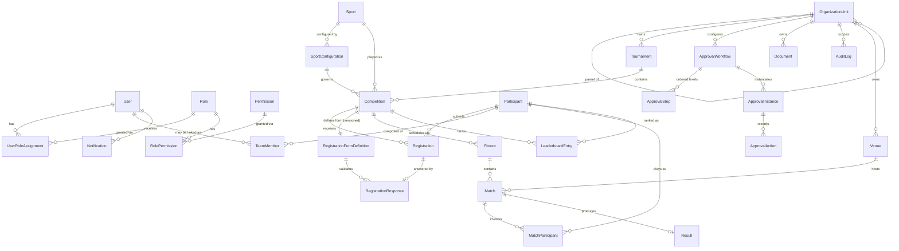
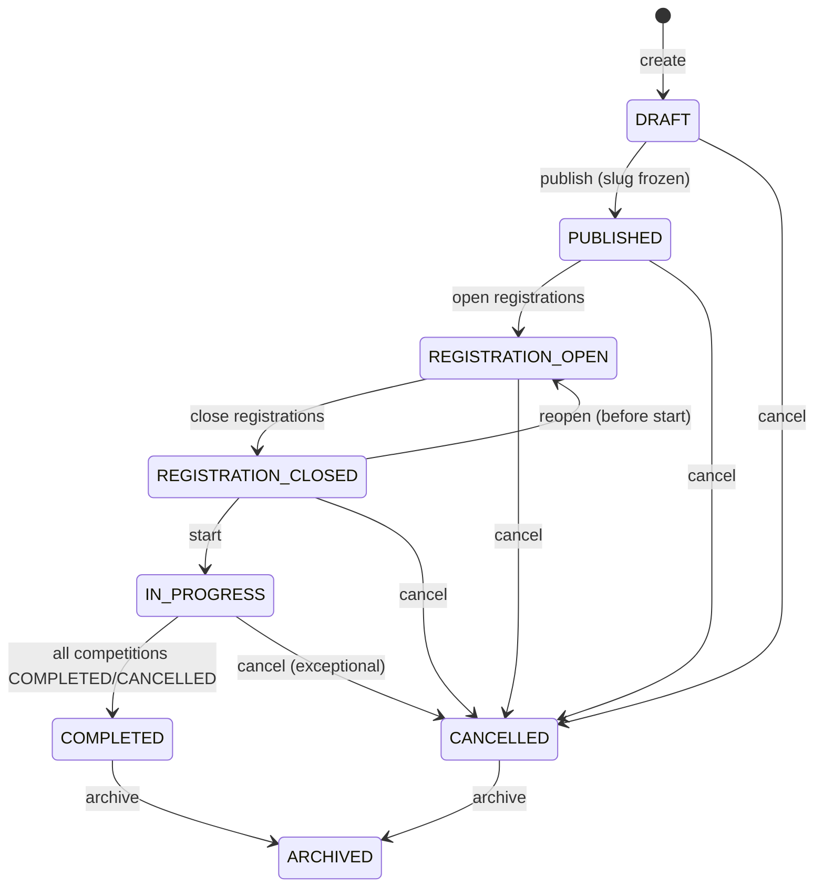
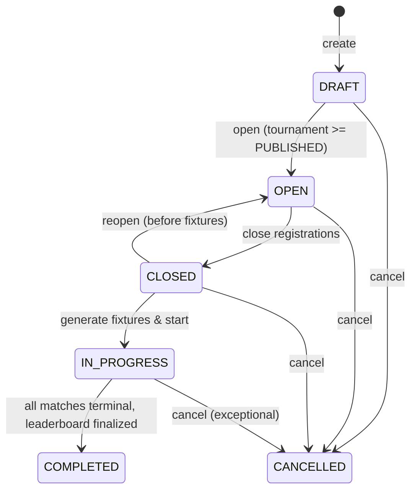
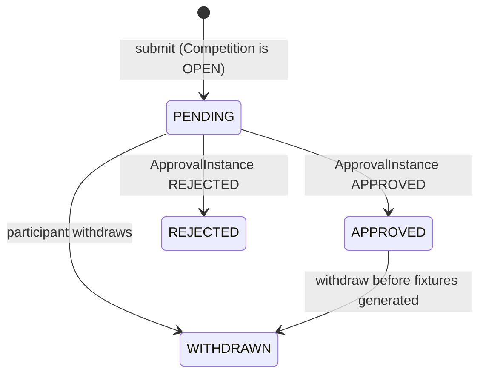
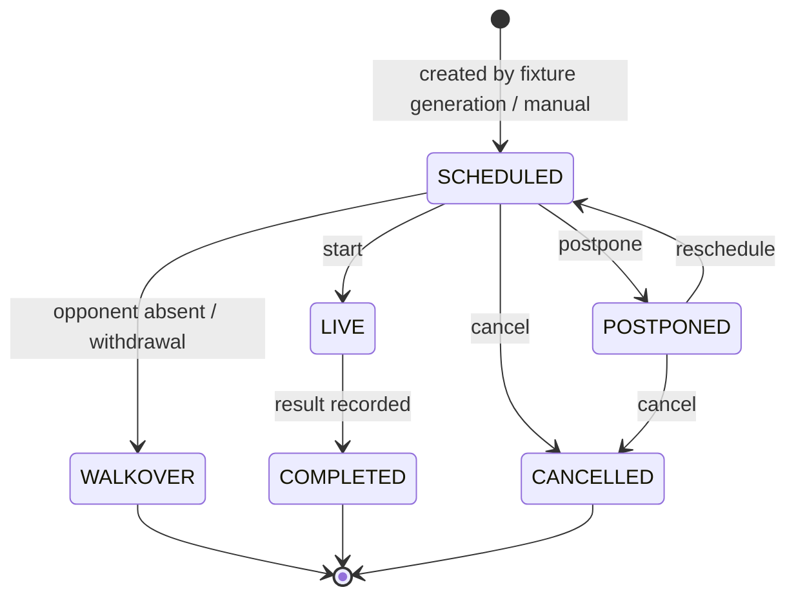
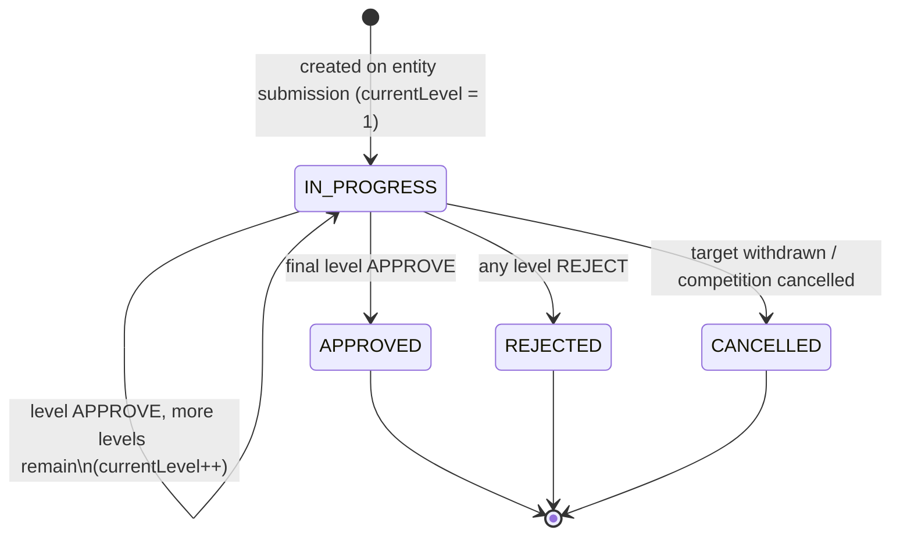

# 02 — Domain Model

| | |
|---|---|
| **Version** | 1.0 |
| **Status** | Approved |
| **Date** | 2026-07-26 |
| **Owner** | Samarth |
| **Upstream** | ARCHITECTURE_BRIEF.md (FROZEN v1.0), 01_PRODUCT_REQUIREMENTS |
| **Downstream** | 03_HLD, 04_DATABASE_DESIGN, 05_RBAC_AND_ORGANIZATION, 06_SPORT_CONFIGURATION_ENGINE, 07_APPROVAL_WORKFLOW_ENGINE |

---

## 1. Purpose & Scope

This document defines the canonical domain model for the Tournament Management Platform: every entity, its purpose, key attributes, relationships, lifecycle, and business invariants. All names, enums, and statuses are taken verbatim from the frozen Architecture Brief. Physical persistence details (types, indexes, DDL) live in 04_DATABASE_DESIGN; this document is the logical/conceptual layer.

## 2. Bounded Contexts

The platform is a modular monolith. Entities are grouped into three bounded contexts (domains). Cross-context references are by identifier only (no cross-context object graphs at the module boundary).

```mermaid
flowchart LR
    subgraph IDENTITY["Identity Domain"]
        U[User]
        R[Role]
        P[Permission]
        RP[RolePermission]
        URA[UserRoleAssignment]
        OU[OrganizationUnit]
    end

    subgraph COMPETITION["Competition Domain"]
        S[Sport]
        SC[SportConfiguration]
        T[Tournament]
        C[Competition]
        V[Venue]
        PA[Participant]
        TM[TeamMember]
        REG[Registration]
        RFD[RegistrationFormDefinition]
        RR[RegistrationResponse]
        F[Fixture]
        M[Match]
        MP[MatchParticipant]
        RES[Result]
        LE[LeaderboardEntry]
    end

    subgraph PLATFORM["Platform Domain"]
        AW[ApprovalWorkflow]
        AS[ApprovalStep]
        AI[ApprovalInstance]
        AA[ApprovalAction]
        D[Document]
        AL[AuditLog]
        N[Notification]
    end

    COMPETITION -- "org scoping, actor identity" --> IDENTITY
    PLATFORM -- "polymorphic entityType/entityId refs" --> COMPETITION
    PLATFORM -- "actorId, organizationUnitId" --> IDENTITY
```



**Context responsibilities**

| Context | Responsibility | Java modules |
|---|---|---|
| Identity | Who can do what, where: users, roles, permissions, scoped assignments, tenant hierarchy | `identity`, `organization` |
| Competition | The sporting core: tournaments, competitions, participants, registrations, fixtures, matches, results, leaderboards | `tournament`, `registration`, `fixture`, `result` |
| Platform | Cross-cutting configurable machinery: approval workflows, documents, audit, notifications | `workflow`, `document`, `audit` |

## 3. Overall Entity Relationship Diagram



## 4. Identity Domain

### 4.1 OrganizationUnit

**Purpose.** The tenancy and hierarchy backbone. A self-referencing tree where the root node (parent = null) is the tenant; descendants model federations down to clubs (e.g., SAI → Haryana → Sonipat District).

**Key attributes.** `id`, `parentOrganizationUnitId` (nullable, self-FK), `name`, `slug`, `type`, `status`.

- `type ∈ {FEDERATION, STATE_ASSOCIATION, DISTRICT_ASSOCIATION, ACADEMY, COLLEGE, CLUB, PRIVATE_ORGANIZER}`
- `status ∈ {ACTIVE, SUSPENDED, ARCHIVED}`

**Relationships.** Parent/children (self); owns Tournaments, Venues, ApprovalWorkflows, Documents; scopes AuditLog entries; target of ORGANIZATION-scoped UserRoleAssignments.

**Business rules / invariants.**
- BR-OU-1: The tree is acyclic; a node can never be its own ancestor (validated on re-parenting).
- BR-OU-2: The root node (parent = null) is the tenant boundary. Every tenant-owned row in the system carries `organization_unit_id`; scope checks resolve access against the subtree.
- BR-OU-3: An ORGANIZATION-scoped role grant on a node applies to the entire subtree beneath it.
- BR-OU-4: A `SUSPENDED` unit blocks all write operations within its subtree; reads remain for admins. `ARCHIVED` is terminal and read-only.
- BR-OU-5: `slug` is unique platform-wide.
- BR-OU-6: A unit cannot be archived while it owns a Tournament in `IN_PROGRESS` or `REGISTRATION_OPEN` status.

### 4.2 User

**Purpose.** An authenticated principal (organizer, official, participant account holder, viewer). Authentication via JWT (access + refresh) under Spring Security.

**Key attributes.** `id`, `email` (unique), `passwordHash`, `fullName`, `phone`, `status`.

- `status ∈ {ACTIVE, INVITED, SUSPENDED, DEACTIVATED}`

**Relationships.** Has many UserRoleAssignments; may be linked from TeamMember; is `actorId` on ApprovalAction and AuditLog; receives Notifications.

**Business rules.**
- BR-U-1: A User exists platform-wide (not per-tenant); tenancy is conferred only via UserRoleAssignment scopes.
- BR-U-2: `INVITED` users cannot authenticate until activation; `SUSPENDED`/`DEACTIVATED` users fail token issuance and refresh.
- BR-U-3: Email is the login identifier and must be unique among non-deleted users.

### 4.3 Role

**Purpose.** A named bundle of Permissions. Seed roles: `SUPER_ADMIN (GLOBAL)`, `TENANT_ADMIN (ORGANIZATION)`, `ORG_OFFICIAL (ORGANIZATION)`, `TOURNAMENT_ADMIN (TOURNAMENT)`, `COMPETITION_OFFICIAL (COMPETITION)`, `PARTICIPANT_USER`, `PUBLIC_VIEWER`.

**Key attributes.** `id`, `code` (unique, e.g. `TENANT_ADMIN`), `name`, `description`, `defaultScopeType`, `isSystemRole`.

**Business rules.**
- BR-R-1: System (seed) roles are immutable; tenants may create custom roles scoped to their tenant in a later phase.
- BR-R-2: A Role's `defaultScopeType` constrains which `scopeType` values are legal in assignments of that role.

### 4.4 Permission

**Purpose.** Fine-grained capability string checked at the service layer, e.g. `tournament:create`, `registration:approve`, `match:record-result`.

**Key attributes.** `id`, `code` (unique, `resource:action` format), `description`.

**Business rules.**
- BR-P-1: Permission codes follow `resource:action`; the catalog is code-owned (seeded via migration), never user-editable in V1.

### 4.5 RolePermission

**Purpose.** Join entity mapping Roles to Permissions (many-to-many).

**Key attributes.** `roleId`, `permissionId` (composite uniqueness).

**Business rules.**
- BR-RP-1: (roleId, permissionId) is unique. Deleting a role cascades its RolePermission rows.

### 4.6 UserRoleAssignment

**Purpose.** IAM-style scoped grant: *which user* holds *which role* at *which scope*.

**Key attributes.** `userId`, `roleId`, `scopeType`, `scopeId`.

- `scopeType ∈ {GLOBAL, ORGANIZATION, TOURNAMENT, COMPETITION}`

**Relationships.** User ↔ Role join; `scopeId` polymorphically points at an OrganizationUnit, Tournament, or Competition depending on `scopeType`.

**Business rules.**
- BR-URA-1: `scopeType = GLOBAL` requires `scopeId = null`; all other scope types require a non-null `scopeId` referencing an entity of the matching type.
- BR-URA-2: (userId, roleId, scopeType, scopeId) is unique — no duplicate grants.
- BR-URA-3: ORGANIZATION scope grants access to the whole OrganizationUnit subtree (BR-OU-3).
- BR-URA-4: Only holders of `iam:assign` at an equal-or-wider scope may create an assignment (no privilege escalation beyond one's own scope).

## 5. Competition Domain

### 5.1 Sport

**Purpose.** Catalog of sports (Football, Athletics-100m, Chess, …). Pure reference data; all behavioral variation lives in SportConfiguration.

**Key attributes.** `id`, `code` (unique), `name`, `description`.

**Business rules.**
- BR-S-1: No sport-specific branching in code (`if (sport == FOOTBALL)` is forbidden); behavior is selected via SportConfiguration strategy keys.

### 5.2 SportConfiguration

**Purpose.** The Strategy-pattern configuration record that tells the engines how a sport/competition behaves. JSONB `config` shape:

```json
{
  "sport": "FOOTBALL",
  "participantType": "TEAM",
  "fixtureGenerator": "ROUND_ROBIN",
  "resultEvaluator": "POINTS",
  "leaderboardStrategy": "POINTS_TABLE",
  "rules": { "minTeamSize": 11, "maxTeamSize": 18, "matchDurationMin": 90 }
}
```

**Key attributes.** `id`, `organizationUnitId`, `sportId`, `config` (JSONB), `version`, `isActive`.

- `fixtureGenerator ∈ {ROUND_ROBIN, SINGLE_ELIMINATION, DOUBLE_ELIMINATION, SWISS, NONE}`
- `resultEvaluator ∈ {POINTS, WIN_LOSS, TIME, DISTANCE, SCORE}`
- `leaderboardStrategy ∈ {POINTS_TABLE, LOWEST_TIME, HIGHEST_DISTANCE, HIGHEST_SCORE, BRACKET}`

**Relationships.** Belongs to a Sport; referenced by Competitions; resolved by `FixtureGeneratorFactory`, `ResultEvaluatorFactory`, `LeaderboardStrategyFactory`.

**Business rules.**
- BR-SC-1: All three strategy keys must resolve to a registered strategy implementation at save time; unknown keys are rejected.
- BR-SC-2: `participantType` in the config constrains the `participantType` of Registrations into Competitions using this configuration.
- BR-SC-3: A configuration in use by a non-`DRAFT` Competition is immutable; changes require a new version.
- BR-SC-4: Launch configs: Football (TEAM / ROUND_ROBIN / POINTS / POINTS_TABLE), Athletics-100m (INDIVIDUAL / NONE / TIME / LOWEST_TIME). Chess (SWISS) must be supportable by adding only a strategy impl + config row.

### 5.3 Tournament

**Purpose.** Top-level organizing event (e.g., "Khelo India 2027") owned by an OrganizationUnit; container for Competitions; anchor of the public slug URL `/t/{tournament-slug}`.

**Key attributes.** `id`, `organizationUnitId`, `name`, `slug` (unique platform-wide), `description`, `startDate`, `endDate`, `status`, `publishedAt`.

- `status ∈ {DRAFT, PUBLISHED, REGISTRATION_OPEN, REGISTRATION_CLOSED, IN_PROGRESS, COMPLETED, CANCELLED, ARCHIVED}`

**Lifecycle.**



**Business rules.**
- BR-T-1: `slug` is unique per platform and **immutable after publish** (mutable only while `DRAFT`).
- BR-T-2: A Tournament cannot enter `REGISTRATION_OPEN` unless it has at least one Competition.
- BR-T-3: `COMPLETED` requires every child Competition to be `COMPLETED` or `CANCELLED`.
- BR-T-4: Cancelling a Tournament cancels all non-terminal child Competitions and open ApprovalInstances for its registrations.
- BR-T-5: Public (unauthenticated) visibility begins at `PUBLISHED`; `DRAFT` tournaments are visible only to scoped staff.
- BR-T-6: `startDate <= endDate`; dates may only be edited before `IN_PROGRESS`.

### 5.4 Competition

**Purpose.** A single competitive event within a Tournament (e.g., "Football U16", "100m Race"). Named `Competition` — never "TournamentEvent" or "Event". The unit that registrations, fixtures, and leaderboards attach to.

**Key attributes.** `id`, `tournamentId`, `organizationUnitId` (denormalized from tournament for scoping), `sportId`, `sportConfigurationId`, `name`, `maxRegistrations`, `registrationOpenAt`, `registrationCloseAt`, `status`.

- `status ∈ {DRAFT, OPEN, CLOSED, IN_PROGRESS, COMPLETED, CANCELLED}`

**Lifecycle.**



**Business rules.**
- BR-C-1: A Competition can be `OPEN` only while its Tournament is `PUBLISHED`, `REGISTRATION_OPEN`, or `REGISTRATION_CLOSED` — never while the Tournament is `DRAFT`.
- BR-C-2: Registrations are accepted **only** while Competition status is `OPEN` (see BR-REG-1).
- BR-C-3: Fixture generation requires status `CLOSED` and >= 2 `APPROVED` Registrations (unless `fixtureGenerator = NONE`).
- BR-C-4: `sportConfigurationId` must reference an active configuration of the same `sportId`; it is frozen once the Competition leaves `DRAFT`.
- BR-C-5: `COMPLETED` requires every Match in `COMPLETED`, `WALKOVER`, or `CANCELLED` status.
- BR-C-6: `organizationUnitId` must equal the owning Tournament's `organizationUnitId` (denormalization invariant).

### 5.5 Venue

**Purpose.** Physical location where Matches are held (stadium, ground, track, hall).

**Key attributes.** `id`, `organizationUnitId`, `name`, `addressLine`, `city`, `state`, `capacity`, `facilities` (JSONB).

**Business rules.**
- BR-V-1: A Venue belongs to one OrganizationUnit; Matches of tournaments within that unit's tenant tree may reference it.
- BR-V-2: A Venue with scheduled future Matches cannot be soft-deleted.

### 5.6 Participant

**Purpose.** Polymorphic competing entity: a person, a team, or an organization.

**Key attributes.** `id`, `organizationUnitId`, `participantType`, `displayName`, `contactEmail`, `profile` (JSONB: DOB/gender for INDIVIDUAL, coach info for TEAM, etc.).

- `participantType ∈ {INDIVIDUAL, TEAM, ORGANIZATION}`

**Relationships.** Submits Registrations; TEAM participants own TeamMembers; appears in MatchParticipant and LeaderboardEntry.

**Business rules.**
- BR-PA-1: `participantType` is immutable after creation.
- BR-PA-2: Only `TEAM` participants may own TeamMember rows.
- BR-PA-3: A Participant of type `TEAM` must have **>= `rules.minTeamSize` and <= `rules.maxTeamSize` TeamMembers** (per the SportConfiguration of the Competition) at the moment its Registration is submitted and at approval time.

### 5.7 TeamMember

**Purpose.** Join entity listing the individuals belonging to a TEAM Participant, optionally linked to a platform User.

**Key attributes.** `id`, `participantId` (must be a TEAM), `userId` (nullable), `fullName`, `dateOfBirth`, `memberRole` (e.g. CAPTAIN, PLAYER, COACH), `jerseyNumber`.

**Business rules.**
- BR-TM-1: `participantId` must reference a Participant with `participantType = TEAM`.
- BR-TM-2: At most one member per team has `memberRole = CAPTAIN`.
- BR-TM-3: Roster is frozen (no add/remove) once the team's Registration for an `IN_PROGRESS` Competition is `APPROVED`, unless a COMPETITION_OFFICIAL performs an explicit roster amendment (audited).

### 5.8 Registration

**Purpose.** A Participant's application to compete in a Competition. Intentionally simple status; multi-level approval complexity lives in the Approval Workflow engine, not here.

**Key attributes.** `id`, `organizationUnitId`, `competitionId`, `participantId`, `status`, `submittedAt`, `decidedAt`, `withdrawnAt`.

- `status ∈ {PENDING, APPROVED, REJECTED, WITHDRAWN}`

**Lifecycle.**



**Business rules.**
- BR-REG-1: A Registration must reference a Competition whose status is `OPEN` at submission time.
- BR-REG-2: (competitionId, participantId) is unique among non-withdrawn registrations — one live registration per participant per competition.
- BR-REG-3: The Participant's `participantType` must equal the `participantType` in the Competition's SportConfiguration.
- BR-REG-4: If the Competition's `maxRegistrations` is set, submissions beyond the cap are rejected at submit time.
- BR-REG-5: Status transitions to `APPROVED`/`REJECTED` are driven exclusively by the terminal state of the linked ApprovalInstance; internal tracking like "pending at level 2" is read from workflow state, never encoded in this enum.
- BR-REG-6: A completed RegistrationResponse valid against the Competition's active RegistrationFormDefinition version is required before submission (BR-RR-1).
- BR-REG-7: `WITHDRAWN` after approval is allowed only before fixture generation; afterwards the participant is handled via Match `WALKOVER`.

### 5.9 RegistrationFormDefinition

**Purpose.** Versioned JSON schema describing the dynamic registration form for a Competition (Dynamic Forms are MVP).

**Key attributes.** `id`, `organizationUnitId`, `competitionId`, `version`, `schema` (JSONB — fields, types, validation, conditional visibility), `isActive`.

**Business rules.**
- BR-RFD-1: Exactly one active version per Competition; publishing a new version deactivates the previous one.
- BR-RFD-2: A version that has RegistrationResponses is immutable — corrections require a new version.
- BR-RFD-3: Schema changes are prohibited once the Competition leaves `OPEN`.

### 5.10 RegistrationResponse

**Purpose.** The submitted answers (JSONB) for a Registration, pinned to the form definition version they were validated against.

**Key attributes.** `id`, `registrationId` (one-to-one), `formDefinitionId`, `answers` (JSONB), `submittedAt`.

**Business rules.**
- BR-RR-1: `answers` must validate against the referenced RegistrationFormDefinition `schema` at write time; server-side validation is authoritative.
- BR-RR-2: `formDefinitionId` must be the version that was active at submission; it never silently migrates to newer versions.
- BR-RR-3: Answers are immutable after the Registration is decided (`APPROVED`/`REJECTED`).

### 5.11 Fixture

**Purpose.** A generated scheduling structure for a Competition — a round-robin round, a bracket round (e.g., semifinal), or a Swiss round — produced by the configured `fixtureGenerator` strategy. Groups Matches.

**Key attributes.** `id`, `competitionId`, `roundNumber`, `roundName` (e.g. "Round 3", "Semifinal"), `generatorKey` (strategy that produced it), `generatedAt`.

**Business rules.**
- BR-F-1: Fixtures exist only for Competitions whose configuration has `fixtureGenerator ≠ NONE`.
- BR-F-2: Fixtures are generated only from `APPROVED` Registrations, only when the Competition is `CLOSED` (transitioning it to `IN_PROGRESS`).
- BR-F-3: Regeneration is allowed only while no Match in the fixture set has left `SCHEDULED`.

### 5.12 Match

**Purpose.** A single playable unit: a football game, a 100m race heat/final, a chess pairing.

**Key attributes.** `id`, `fixtureId` (nullable when `fixtureGenerator = NONE`), `competitionId`, `venueId` (nullable), `scheduledAt`, `status`.

- `status ∈ {SCHEDULED, LIVE, COMPLETED, WALKOVER, CANCELLED, POSTPONED}`

**Lifecycle.**



**Business rules.**
- BR-M-1: A Match must have >= 1 MatchParticipant before `LIVE` (>= 2 for head-to-head evaluators `POINTS`/`WIN_LOSS`/`SCORE`; racing/field events with `TIME`/`DISTANCE` may have many).
- BR-M-2: `COMPLETED` requires a Result row; `WALKOVER` produces a Result with the walkover outcome; `CANCELLED` never has a Result.
- BR-M-3: Terminal statuses (`COMPLETED`, `WALKOVER`, `CANCELLED`) are immutable except via an audited result-correction flow.
- BR-M-4: Two Matches at the same Venue must not overlap in scheduled time window (soft warning in V1, not hard constraint).

### 5.13 MatchParticipant

**Purpose.** Join entity binding Participants into a Match with slot metadata (home/away, lane, seed).

**Key attributes.** `id`, `matchId`, `participantId`, `slot` (e.g. HOME/AWAY/LANE_1..n), `seed`.

**Business rules.**
- BR-MP-1: (matchId, participantId) is unique.
- BR-MP-2: The Participant must hold an `APPROVED` Registration in the Match's Competition.

### 5.14 Result

**Purpose.** Recorded outcome of a Match, interpreted by the configured `resultEvaluator` strategy. One Result per Match.

**Key attributes.** `id`, `matchId` (unique), `evaluatorKey`, `payload` (JSONB — e.g. `{"scores": {"pA": 2, "pB": 1}}` for SCORE/POINTS, `{"times": {"pX": 10.72}}` for TIME), `winnerParticipantId` (nullable — draws, timed events), `recordedBy`, `recordedAt`.

**Business rules.**
- BR-RES-1: `payload` must satisfy the schema expected by the evaluator (`POINTS`, `WIN_LOSS`, `TIME`, `DISTANCE`, `SCORE`).
- BR-RES-2: Writing a Result transitions the Match to `COMPLETED` in the same transaction and triggers leaderboard recomputation.
- BR-RES-3: Corrections create an AuditLog entry with beforeState/afterState; raw history is never lost.

### 5.15 LeaderboardEntry

**Purpose.** Materialized ranking row per Competition per Participant, computed by the configured `leaderboardStrategy` (`POINTS_TABLE`, `LOWEST_TIME`, `HIGHEST_DISTANCE`, `HIGHEST_SCORE`, `BRACKET`).

**Key attributes.** `id`, `competitionId`, `participantId`, `rank`, `metrics` (JSONB — played/won/lost/drawn/points, or bestTime, etc.), `computedAt`.

**Business rules.**
- BR-LE-1: (competitionId, participantId) is unique.
- BR-LE-2: Entries are derived data — always recomputable from Results; strategies must be idempotent.
- BR-LE-3: The leaderboard is frozen when the Competition reaches `COMPLETED`.

## 6. Platform Domain

### 6.1 ApprovalWorkflow

**Purpose.** Tenant-configurable definition of a multi-level approval process for a given entity type (V1: Registration). A tenant may configure 1 level or 3 levels — zero code changes.

**Key attributes.** `id`, `organizationUnitId`, `workflowName`, `entityType`, `isActive`.

**Business rules.**
- BR-AW-1: At most one active workflow per (organizationUnitId, entityType); resolution walks up the OrganizationUnit tree to find the nearest active workflow.
- BR-AW-2: A workflow with open (IN_PROGRESS) ApprovalInstances cannot be deactivated or structurally edited; changes require a new workflow version.
- BR-AW-3: If no workflow resolves for an entity type, the entity auto-approves at submission (single implicit level).

### 6.2 ApprovalStep

**Purpose.** One ordered level within an ApprovalWorkflow, naming the role that must act.

**Key attributes.** `id`, `workflowId`, `level` (1..n), `roleCode`, `approvalRequired` (boolean — false = notify-only step, auto-advances).

**Business rules.**
- BR-AS-1: (workflowId, level) is unique; levels are contiguous starting at 1.
- BR-AS-2: `roleCode` must reference an existing Role code.

### 6.3 ApprovalInstance

**Purpose.** A running execution of a workflow against one target entity (polymorphic `entityType` + `entityId`). Holds the cursor (`currentLevel`) and overall status.

**Key attributes.** `id`, `workflowId`, `entityType`, `entityId`, `currentLevel`, `status`.

- `status ∈ {IN_PROGRESS, APPROVED, REJECTED, CANCELLED}`

**Lifecycle.**



**Business rules.**
- BR-AI-1: One `IN_PROGRESS` instance per (entityType, entityId) at a time.
- BR-AI-2: A `REJECT` decision at any level terminates the instance as `REJECTED` (no continuation).
- BR-AI-3: Terminal instance status is projected onto the target entity in the same transaction (e.g., Registration `PENDING → APPROVED/REJECTED`); Registration `WITHDRAWN` cancels the instance.
- BR-AI-4: "Pending at level N" is derived from `currentLevel` — never stored on the target entity.

### 6.4 ApprovalAction

**Purpose.** Immutable record of a single decision taken on an instance.

**Key attributes.** `id`, `instanceId`, `stepLevel`, `actorId`, `decision` (APPROVE / REJECT), `comment`, `timestamp`.

**Business rules.**
- BR-AA-1: The actor must hold the step's `roleCode` at a scope covering the target entity, verified at action time.
- BR-AA-2: `stepLevel` must equal the instance's `currentLevel` at action time (optimistic-lock protected).
- BR-AA-3: Actions are append-only — never updated or soft-deleted.
- BR-AA-4: A `REJECT` decision requires a non-empty `comment`.

### 6.5 Document

**Purpose.** Generic file-attachment module (MVP): ID proofs, consent forms, tournament banners — attached polymorphically to any entity, stored in S3 via presigned upload/download.

**Key attributes.** `id`, `organizationUnitId`, `entityType`, `entityId`, `fileName`, `fileUrl`, `mimeType`, `sizeBytes`, `uploadedBy`, `createdAt`.

**Business rules.**
- BR-D-1: `fileUrl` is an S3 object key; clients receive time-limited presigned URLs only, never raw keys.
- BR-D-2: MIME type and size limits enforced server-side before presign issuance.
- BR-D-3: Access checks resolve against the referenced entity's scope, not the document itself.

### 6.6 AuditLog

**Purpose.** Append-only trail of every state-changing operation, written via service-layer interceptor/AOP. MVP, day one.

**Key attributes.** `id`, `actorId`, `action`, `entityType`, `entityId`, `beforeState` (JSONB), `afterState` (JSONB), `organizationUnitId`, `ipAddress`, `timestamp`.

**Business rules.**
- BR-AL-1: Append-only — no update, no delete, **no soft delete**.
- BR-AL-2: Written in the same transaction as the mutation it records.
- BR-AL-3: Sensitive fields (password hashes, tokens) are redacted from beforeState/afterState.

### 6.7 Notification

**Purpose.** Schema reserved in V1; delivery (email/SMS/push) is post-MVP. Rows may be written by domain events (e.g., registration approved) so history exists when delivery ships.

**Key attributes.** `id`, `organizationUnitId`, `recipientUserId`, `channel` (EMAIL/SMS/PUSH/IN_APP), `templateCode`, `payload` (JSONB), `status` (PENDING/SENT/FAILED — delivery statuses inert in V1), `createdAt`.

**Business rules.**
- BR-N-1: No delivery attempts in V1; rows remain `PENDING`.
- BR-N-2: `payload` carries template variables only — never full rendered content with PII duplication.

## 7. Cross-Domain Invariant Summary

| # | Invariant | Enforced at |
|---|---|---|
| I-1 | Every tenant-owned row carries `organization_unit_id`; reads/writes pass service-layer scope checks + Hibernate filter | Service layer + ORM |
| I-2 | Registration requires Competition `OPEN` (BR-REG-1) | Service (transactional) |
| I-3 | Tournament slug unique platform-wide, immutable after publish (BR-T-1) | Service + DB unique index |
| I-4 | TEAM Participant roster within SportConfiguration `minTeamSize`/`maxTeamSize` at submit and approval (BR-PA-3) | Service validation |
| I-5 | Registration status changes only via ApprovalInstance terminal state or withdrawal (BR-REG-5, BR-AI-3) | Workflow module |
| I-6 | One live Registration per (competition, participant) (BR-REG-2) | DB partial unique index |
| I-7 | AuditLog and ApprovalAction are append-only (BR-AL-1, BR-AA-3) | No update/delete paths; DB grants |
| I-8 | Strategy keys must resolve to registered implementations (BR-SC-1) | Factory validation on save |
| I-9 | Terminal statuses (Match, ApprovalInstance) are immutable outside audited correction flows | State-machine guards |

## 8. Open Points (tracked, non-blocking)

1. Cross-tenant participant identity (an athlete competing under two federations) — deferred; V1 treats Participants as tenant-local (14_ARCHITECTURAL_DECISIONS candidate).
2. Venue double-booking as hard constraint (exclusion constraint on tstzrange) — soft warning in V1 (BR-M-4).
3. Custom tenant-defined roles — post-V1 (BR-R-1).
