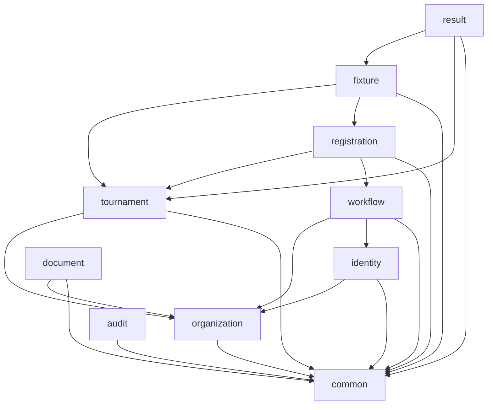
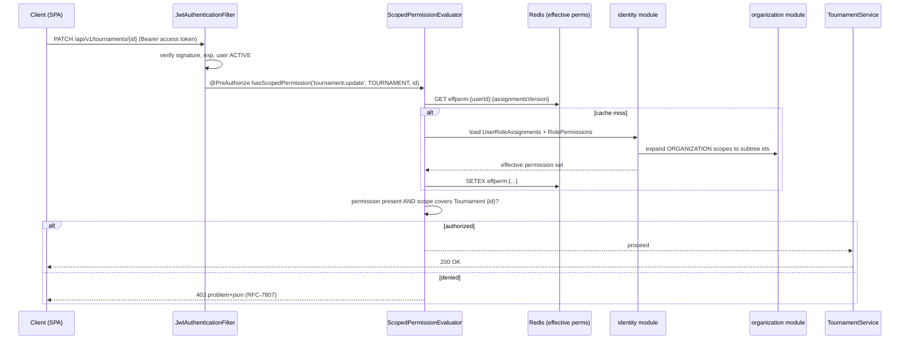
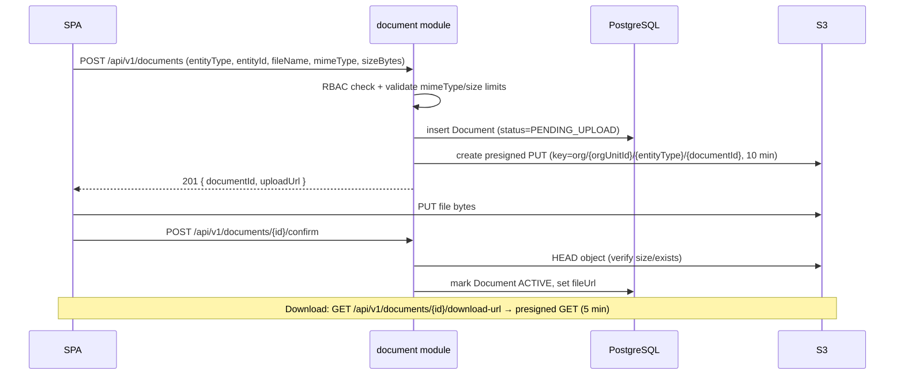
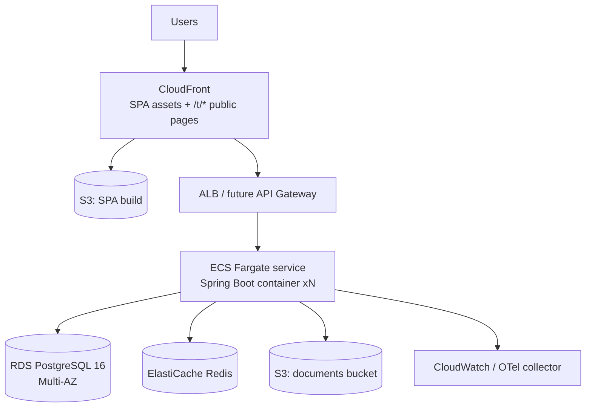

# 03 — High-Level Design (HLD)

| Field | Value |
|---|---|
| Version | 1.0 |
| Status | Approved |
| Date | 2026-07-26 |
| Owner | Samarth |
| Depends on | ARCHITECTURE_BRIEF.md (frozen), 02_DOMAIN_MODEL |
| Consumed by | 04_DATABASE_DESIGN, 05–09, 13, 14 |

---

## 1. Purpose & Scope

This document describes the high-level architecture of the Tournament Management Platform: system context, module decomposition, layering, multi-tenancy, security, caching, file storage, deployment topology, observability, and cross-cutting concerns. Detailed schemas live in 04; module internals live in 09 (LLD).

Everything here conforms to the frozen ARCHITECTURE_BRIEF.md. Entity names, enums, and module names are used verbatim.

## 2. System Context

```mermaid
flowchart LR
    subgraph Actors
        ADMIN[Org / Tournament Admins]
        OFFICIAL[Officials & Approvers]
        PART[Participants]
        PUBLIC[Public Viewers]
    end

    subgraph Edge
        CF[CloudFront CDN\npublic pages + SPA assets]
        GW[API Gateway\n(future — pass-through in V1)]
    end

    subgraph Platform["Tournament Management Platform"]
        SPA[React SPA]
        API[Spring Boot Modular Monolith\ncom.acme.tms]
    end

    subgraph Data
        PG[(PostgreSQL 16\nshared schema)]
        REDIS[(Redis\ncache + rate limits)]
        S3[(S3-compatible\nobject storage)]
    end

    subgraph External["External (post-MVP)"]
        MAIL[Email/SMS provider\n(Notification delivery reserved)]
        PAY[Payment gateway\n(future)]
    end

    ADMIN --> SPA
    OFFICIAL --> SPA
    PART --> SPA
    PUBLIC --> CF
    SPA --> CF
    CF --> GW
    GW --> API
    API --> PG
    API --> REDIS
    API -->|presigned URLs| S3
    SPA -->|direct upload/download\nvia presigned URL| S3
    API -.-> MAIL
    API -.-> PAY
```

Key context decisions:

- **Single backend deployable.** The Spring Boot application is a modular monolith (brief §Tech Stack). No service-to-service network calls in V1.
- **API Gateway is a placeholder.** In V1 CloudFront/ALB routes directly to the monolith. The `/api/v1` versioned base path and stateless JWT auth mean a gateway (rate limiting, WAF, canary routing) can be inserted later with zero application change.
- **Browsers talk to S3 directly** for file bytes via presigned URLs; the API never proxies file content (§10).
- **Public pages** (`/t/{tournament-slug}`, e.g. `/t/haryana-games-2027`) are served through CloudFront with edge caching; slugs are unique per platform and immutable after publish.

## 3. Module Decomposition

Java packages follow `com.acme.tms.<module>` exactly as frozen in the brief.

| Module | Owns (entities) | Responsibility |
|---|---|---|
| `identity` | `User`, `Role`, `Permission`, `RolePermission`, `UserRoleAssignment` | AuthN (JWT), scoped RBAC evaluation (see 05) |
| `organization` | `OrganizationUnit` | Tenant tree, subtree resolution, org lifecycle |
| `tournament` | `Sport`, `SportConfiguration`, `Tournament`, `Competition`, `Venue` | Tournament/competition lifecycle, sport config resolution |
| `registration` | `Participant`, `TeamMember`, `Registration`, `RegistrationFormDefinition`, `RegistrationResponse` | Registration intake, dynamic forms, participant management |
| `fixture` | `Fixture`, `Match`, `MatchParticipant` | Fixture generation via strategy engine (see 06), scheduling |
| `result` | `Result`, `LeaderboardEntry` | Result recording, evaluation, leaderboards |
| `workflow` | `ApprovalWorkflow`, `ApprovalStep`, `ApprovalInstance`, `ApprovalAction` | Generic multi-level approval engine (see 07) |
| `document` | `Document` | Generic file attachments, S3 presigned flows |
| `audit` | `AuditLog` | AOP-based audit trail, day-one MVP |
| `common` | — (no entities) | Shared DTO base classes, error model (RFC-7807), pagination, ID generation (UUID v7), Hibernate tenancy filter, utilities |

`Notification` schema is reserved and parked in `workflow`-adjacent tables; delivery is post-MVP (brief §Core Entity List).

### 3.1 Allowed Inter-Module Dependencies

Dependencies flow strictly downward. Enforced at build time with ArchUnit tests (see 13_CODING_STANDARDS).



Rules:

1. **`common` depends on nothing** and everything may depend on it.
2. **`audit` is write-only from other modules via events** — modules publish `AuditEvent` (Spring `ApplicationEventPublisher`); the `audit` module listens. No module reads from `audit` except its own query API.
3. **`workflow` never depends on `registration`.** The approval engine references targets generically via `{entityType, entityId}` (brief §6). The `registration` module calls `workflow` and registers a callback (`ApprovalOutcomeHandler`) — dependency points registration→workflow only.
4. **No cycles.** Cross-module reads that would create a cycle go through published events or read-only query interfaces exposed in the lower module.
5. Modules communicate **in-process via Java interfaces** (`<Module>Api` facades), never by reaching into another module's repositories or entities.

## 4. Layered Architecture (within each module)

```
com.acme.tms.registration
├── api/            REST controllers, request/response DTOs   (web layer)
├── application/    services, transaction boundaries, mappers (service layer)
├── domain/         entities, enums, domain services          (domain layer)
├── infra/          JPA repositories, Redis/S3 adapters       (infrastructure)
└── RegistrationApi.java   in-process facade for other modules
```

Rules per layer:

- **Controller** — thin; binds HTTP, validates request DTOs (`jakarta.validation`), delegates to one service method, never touches repositories or entities. Returns response DTOs only.
- **Service** — owns `@Transactional` boundaries; orchestrates domain logic, RBAC scope checks, audit event publication, cache interactions.
- **Repository** — Spring Data JPA interfaces; all tenant-owned queries run under the Hibernate tenancy filter (§5).
- **DTO mapping** — MapStruct mappers in `application/`. Entities never cross the module boundary; facades and controllers exchange DTOs. JSON is camelCase; DB is snake_case (brief §Conventions).

## 5. Multi-Tenancy Design

**Model: shared schema, single PostgreSQL 16 database, row-level scoping by `organization_unit_id`** (frozen in brief). The tenant is the root `OrganizationUnit` (parent = null); scoping is hierarchical, not flat.

### 5.1 Mechanics

1. **Every tenant-owned row carries `organization_unit_id`** (brief §Conventions). Platform-global rows (`Permission`, seed `Role`s, `Sport` defaults) do not.
2. **JWT carries scope context.** The access token includes `userId` plus the user's role assignments summary; on each request a `TenantContext` (request-scoped) is resolved: the acting `organizationUnitId` and the precomputed set of org-unit IDs the caller may see (subtree expansion, cached — see 05 §7).
3. **Hibernate filter** as defense-in-depth:

```java
@FilterDef(name = "orgUnitFilter",
    parameters = @ParamDef(name = "orgUnitIds", type = UUID.class))
@Filter(name = "orgUnitFilter",
    condition = "organization_unit_id IN (:orgUnitIds)")
public abstract class TenantScopedEntity extends BaseEntity { ... }
```

A `TenantFilterAspect` enables the filter on the Hibernate `Session` at transaction start using `TenantContext`. GLOBAL-scoped callers (e.g. `SUPER_ADMIN`) run unfiltered.

4. **Service-layer scope checks are the primary control** (brief §Conventions): every mutating service method verifies via `identity` that the caller's permission covers the target resource's scope (algorithm in 05 §6). The Hibernate filter is the safety net for reads; it is never the sole control.
5. **Public endpoints** (`/api/v1/public/t/{slug}`, leaderboards) bypass tenant context and use dedicated read-only projections of `PUBLISHED`+ tournaments only.

### 5.2 Why shared schema

- One SAI-scale tenant plus a long tail of clubs — schema-per-tenant would explode migrations for small tenants.
- Hierarchical scoping (STATE_ASSOCIATION sees its DISTRICT_ASSOCIATIONs) is a query concern, natural in shared schema, painful across schemas.
- Escape hatch: a very large tenant can later be moved to a dedicated DB behind the same `TenantContext` abstraction (routing DataSource).

## 6. Security Architecture

### 6.1 Authentication

- **JWT access token** (15 min TTL, RS256) + **refresh token** (30 days, rotated on use, stored hashed in PostgreSQL, revocable).
- Access token claims: `sub` (userId), `email`, `assignmentsVersion` (bumped on role change → forces permission cache refresh), standard `iat/exp/jti`.
- User statuses `ACTIVE, INVITED, SUSPENDED, DEACTIVATED`: only `ACTIVE` may authenticate; `INVITED` may complete invite acceptance; refresh is rejected for `SUSPENDED`/`DEACTIVATED`.

### 6.2 Spring Security filter chain

```
Request
  → RateLimitFilter (Redis token bucket, per IP + per user)
  → JwtAuthenticationFilter (parse/verify access token → Authentication)
  → TenantContextFilter (resolve TenantContext from claims + path)
  → AuthorizationFilter (@PreAuthorize with custom ScopedPermissionEvaluator)
  → Controller
```

Stateless (`SessionCreationPolicy.STATELESS`); CSRF disabled for the API (token-based auth); CORS restricted to SPA origins per environment.

### 6.3 Scoped RBAC check flow



Full authorization algorithm, seed roles, and permission catalog: **05_RBAC_AND_ORGANIZATION.md**.

### 6.4 Other controls

- Passwords: bcrypt (cost 12). Secrets via AWS Secrets Manager / env injection — never in the repo.
- All writes produce `AuditLog` rows (actor, before/after JSONB, `ipAddress`) via service-layer AOP interceptor (brief §10).
- Input validation at the edge (§12.1); all queries parameterized via JPA.

## 7. Caching Strategy (Redis)

| Cache | Key pattern | TTL | Invalidation |
|---|---|---|---|
| Leaderboards | `lb:{competitionId}` | 60 s | Explicit evict on `Result` create/update/void for that Competition; TTL as backstop |
| Sport configurations | `sportcfg:{competitionId}` and `sportcfg:sport:{sportId}` | 24 h | Evict on `SportConfiguration` change (competition override or sport default) |
| Effective permission sets | `effperm:{userId}:{assignmentsVersion}` | 15 min | Version bump on any `UserRoleAssignment`/`RolePermission` change (old keys expire naturally); org-tree change bumps a global `orgTreeVersion` mixed into the key |
| Public tournament pages | `pub:t:{slug}` | 5 min | Evict on Tournament/Competition publish-state change; CloudFront honors short s-maxage |
| Refresh-token denylist / rate limits | `rt:deny:{jti}`, `ratelimit:{...}` | token TTL / window | Natural expiry |

Principles:

- Redis is **always a cache, never a source of truth** — every value is reconstructible from PostgreSQL.
- Cache-aside pattern everywhere; write paths evict, they do not write-through (avoids dual-write inconsistency).
- Versioned keys preferred over broadcast eviction for permission data (no cross-instance pub/sub needed for correctness).

## 8. File Storage Flow (S3, presigned URLs)

The `document` module owns `Document { id, organizationUnitId, entityType, entityId, fileName, fileUrl, mimeType, sizeBytes, uploadedBy, createdAt }`. The API brokers metadata and signatures only; bytes go browser↔S3.



- Bucket is private; server-side encryption on; keys are namespaced by `organizationUnitId` so tenancy is visible in storage layout.
- Orphaned `PENDING_UPLOAD` rows older than 24 h are reaped by a scheduled job.
- Soft delete (`deleted_at`) on `Document`; S3 lifecycle rule purges after retention window.

## 9. Deployment Topology & Environments



- **Packaging:** single Docker image (Temurin 21 JRE base, layered Spring Boot jar). Same image promoted across environments; configuration via env vars only.
- **Runtime:** ECS Fargate in V1 (lowest ops burden). The container is 12-factor and stateless, so migration to K8s (EKS) is a manifest exercise, not a code change — noted for tenants demanding on-prem/K8s white-label deployment.
- **Scaling:** horizontal on the ECS service (stateless app, JWT auth, Redis-backed rate limits). RDS Multi-AZ; read replica deferred until read pressure justifies it.
- **Migrations:** Flyway, run on app start with a startup lock; backward-compatible migrations only (expand→migrate→contract).
- **Environments:** `dev` (shared, auto-deploy on merge) → `staging` (prod-shaped, seeded demo tenants, release-candidate deploys) → `prod` (manual promotion, blue/green on ECS). Separate AWS accounts per environment.

## 10. Observability

- **Structured logs:** JSON to stdout (Logback + logstash encoder). Mandatory fields: `timestamp, level, traceId, spanId, userId, organizationUnitId, module, message`. No PII payloads in logs.
- **Metrics:** Micrometer → Prometheus/CloudWatch. RED metrics per endpoint plus domain counters: `tms_registrations_submitted_total`, `tms_approval_actions_total{decision}`, `tms_fixture_generation_seconds`, cache hit ratios per cache from §7.
- **Tracing:** OpenTelemetry auto-instrumentation (HTTP, JDBC, Redis client). `traceId` propagated to the SPA via response header for support tooling. In-process module boundaries get manual spans around facade calls so future extraction preserves trace shape.
- **Health:** Spring Actuator `/actuator/health` (liveness/readiness split) wired to ECS health checks.
- **Alerting:** p99 latency, 5xx rate, DB connection saturation, Redis eviction rate, approval-instance stuck-age (domain alert).

## 11. Key Cross-Cutting Concerns

### 11.1 Validation

- Syntactic validation at controller DTOs (`jakarta.validation`), including enum membership for all canonical enums.
- Domain validation in services (e.g., Tournament status transitions restricted to the frozen enum's legal edges; `SportConfiguration` strategy-key validation per 06 §7).
- Dynamic form answers (`RegistrationResponse` JSONB) validated against the versioned `RegistrationFormDefinition` JSON schema at submit time.

### 11.2 Exception handling

- Single `@RestControllerAdvice` in `common` mapping exceptions to **RFC-7807 problem+json** (brief §Conventions) with stable `type` URIs, e.g. `https://errors.acme-tms.dev/registration/duplicate-submit`.
- Domain exceptions (`ScopeDeniedException` → 403, `EntityNotInScopeException` → 404, `IllegalStatusTransitionException` → 409, `ValidationException` → 422) defined in `common`, thrown anywhere.
- `traceId` echoed in every problem response.

### 11.3 Idempotency — registration submit

- `POST /api/v1/registrations` requires an `Idempotency-Key` header (client-generated UUID).
- Redis `SET idem:{userId}:{key} NX EX 86400` guards the fast path; the durable guard is a unique constraint on `(competition_id, participant_id)` for non-`WITHDRAWN` registrations.
- Replay with the same key returns the original `201` body; same participant+competition with a different key returns `409 problem+json`.
- The same pattern (`Idempotency-Key` + Redis + DB uniqueness) is reused for approval actions (`ApprovalAction` per instance+level+actor) and result recording.

### 11.4 Auditing

Service-layer AOP interceptor (`@Audited(action = "...")`) captures before/after JSONB snapshots and writes `AuditLog` asynchronously within the same transaction's commit hook — never lost on rollback, never blocking the caller (brief §10).

## 12. Why Modular Monolith (not Microservices) — and the Extraction Path

**Decision (frozen in brief):** modular monolith in V1. Rationale:

1. **Domain coupling is real:** registration → workflow → fixture → result form one transactional narrative per tournament. Distributed sagas for a v1 with one team is accidental complexity.
2. **Tenancy + RBAC are cross-cutting:** subtree scope resolution touches every request; in-process it is a cached function call, across services it becomes a chatty auth service on the critical path.
3. **Operational cost:** one deployable, one DB, one on-call surface — appropriate for the team size and SLA of V1.
4. **The brief's module rules keep the option open:** enforced acyclic dependencies (§3.1), facade-only communication, DTO-only boundaries, and event-based audit mean modules are already shaped like services.

**Extraction path (when a module earns it — e.g., `result`/leaderboards under read-heavy public load):**

1. Module already communicates via its `<Module>Api` facade → introduce an HTTP/gRPC implementation of the same interface behind a feature flag.
2. Carve the module's tables into a dedicated schema (they are already domain-prefixed per 04), then a dedicated database; replace cross-module reads with the facade or with events already flowing for audit.
3. Deploy as a second ECS service behind the (now real) API gateway; the SPA and other modules are unaffected because contracts (`/api/v1`, DTOs) do not change.
4. Candidate order if ever needed: `result` (public read scale) → `document` (I/O profile) → `workflow` (reused by other products). `identity`/`organization` are extracted last, if ever.

---

*End of 03_HLD. Next: 04_DATABASE_DESIGN.*
