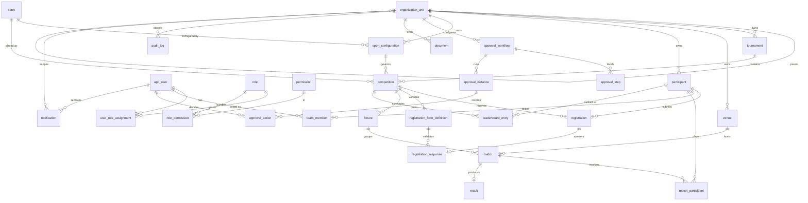

# 04 — Database Design (PostgreSQL 16)

| | |
|---|---|
| **Version** | 1.0 |
| **Status** | Approved |
| **Date** | 2026-07-26 |
| **Owner** | Samarth |
| **Upstream** | ARCHITECTURE_BRIEF.md (FROZEN v1.0), 02_DOMAIN_MODEL, 03_HLD |
| **Downstream** | 09_LLD, Flyway migrations `V1__*` onward |

---

## 1. Scope

Physical design for the single PostgreSQL 16 database backing the modular monolith. Covers naming conventions, multi-tenancy strategy, soft-delete strategy, the full ER diagram, per-table specifications for all 27 tables, DDL for the 8 most important tables, indexing rationale, migrations (Flyway), and partitioning for `audit_log`.

## 2. Conventions

- **Naming:** `snake_case` for tables and columns; singular table names (`tournament`, not `tournaments`).
- **Primary keys:** `id uuid` — **UUID v7** (time-ordered), generated in the application layer (Java 21 / `uuid_v7()` helper). Time-ordering keeps B-tree inserts append-mostly and avoids the random-UUID page-split penalty.
- **Audit columns** on every table: `created_at timestamptz NOT NULL DEFAULT now()`, `created_by uuid`, `updated_at timestamptz NOT NULL DEFAULT now()`, `updated_by uuid`. `updated_at/updated_by` maintained by the application (Hibernate `@PreUpdate`), not triggers.
- **Soft delete:** `deleted_at timestamptz NULL` on business entities only (see §5). No row is physically deleted from business tables in normal operation.
- **Enums:** stored as `varchar` + `CHECK` constraints (not native `pg_enum`) so Flyway can evolve value sets without `ALTER TYPE` locking headaches. Values are exactly the canonical enums from the brief.
- **Timestamps:** always `timestamptz` (UTC in DB, rendered per-tenant in API layer).
- **FKs:** always declared; `ON DELETE RESTRICT` by default (soft delete makes cascades irrelevant); join/child tables of hard-owned aggregates use `ON DELETE CASCADE` where noted.
- **JSONB:** used for strategy configs, dynamic form schemas/answers, result payloads, audit before/after snapshots. GIN-indexed where queried.

## 3. Multi-Tenancy Strategy

**Shared schema, shared database, org-scoped rows.**

1. Every tenant-owned table carries `organization_unit_id uuid NOT NULL` referencing `organization_unit(id)`. The tenant is the root `organization_unit` (parent = null); rows reference their *owning node*, which may be anywhere in the tenant's subtree.
2. **Enforcement layer 1 — service-layer scope checks:** every request resolves the caller's `UserRoleAssignment` scopes to a set of permitted `organization_unit_id` subtrees (materialized via a recursive CTE, cached in Redis) before executing queries.
3. **Enforcement layer 2 — Hibernate filter:** a global filter `@Filter(name = "orgScope", condition = "organization_unit_id IN (:orgIds)")` is enabled per-session by a request interceptor, so an omitted `WHERE` clause cannot leak cross-tenant rows.
4. **Composite indexes lead with `organization_unit_id`** on tenant tables (§9), so the filter predicate is always index-supported.
5. Exceptions (platform-global tables, no `organization_unit_id`): `app_user`, `role`, `permission`, `role_permission`, `sport`. `user_role_assignment` scopes via `(scope_type, scope_id)` instead.
6. Row-Level Security (RLS) is deliberately **not** used in V1 (single app role, connection pooling with per-request `SET` overhead); revisit if a direct-SQL analytics surface is exposed (ADR-007).

## 4. Reserved Words & Table Name Notes

`user` is reserved in PostgreSQL → the `User` entity maps to **`app_user`**. All other entities map 1:1 snake_cased: `OrganizationUnit → organization_unit`, `RegistrationFormDefinition → registration_form_definition`, etc.

## 5. Soft Delete Strategy

- Business entities get `deleted_at timestamptz NULL`; deletion = `UPDATE ... SET deleted_at = now()`. Hibernate `@SQLRestriction("deleted_at IS NULL")` hides deleted rows by default.
- Unique constraints that must ignore deleted rows are **partial unique indexes** with `WHERE deleted_at IS NULL` (e.g., tournament slug, live registration per participant).
- **Soft delete does NOT apply to:**
  - `audit_log` — append-only by definition (BR-AL-1); no `deleted_at`, no update path; retention handled by partition drops (§11).
  - `approval_action` — immutable decision record (BR-AA-3); no `deleted_at`.
  - `notification` — delivery ledger; rows are terminal-state records, purged by retention job, not user-deletable.
- Hard deletes are permitted only via GDPR/DPDP erasure tooling, which also scrubs JSONB snapshots.

## 6. Migration Tooling

**Flyway**, SQL-first migrations under `src/main/resources/db/migration`:

- `V1__baseline_identity.sql`, `V2__competition_core.sql`, `V3__registration_forms.sql`, `V4__fixtures_results.sql`, `V5__workflow_engine.sql`, `V6__platform_docs_audit.sql`, `V7__seed_roles_permissions.sql`, …
- Rules: migrations are immutable once merged; no `flyway repair` in prod; every migration runs in CI against a disposable PG16 container; destructive changes require a two-step expand/contract pattern.
- Seed data (roles, permissions, sports, launch sport_configurations) ships as repeatable-safe versioned migrations.

## 7. Full ER Diagram



## 8. Per-Table Specifications

Legend: PK = primary key, FK = foreign key, U = unique, N = nullable. Audit columns (`created_at, created_by, updated_at, updated_by`) and `deleted_at` (where applicable per §5) exist on every table and are not repeated below.

### 8.1 Identity Domain

#### organization_unit
Tenancy/hierarchy backbone (self-referencing tree; root = tenant).

| Column | Type | Null | Notes |
|---|---|---|---|
| id | uuid | no | PK, UUID v7 |
| parent_organization_unit_id | uuid | yes | FK → organization_unit(id); null = tenant root |
| name | varchar(200) | no | |
| slug | varchar(120) | no | U (partial, `WHERE deleted_at IS NULL`) |
| type | varchar(30) | no | CHECK: FEDERATION, STATE_ASSOCIATION, DISTRICT_ASSOCIATION, ACADEMY, COLLEGE, CLUB, PRIVATE_ORGANIZER |
| status | varchar(20) | no | CHECK: ACTIVE, SUSPENDED, ARCHIVED; default ACTIVE |

Indexes: `ux_org_unit_slug` (partial unique); `ix_org_unit_parent (parent_organization_unit_id)` — subtree walks via recursive CTE.

#### app_user
Platform-global principal (`user` is reserved → `app_user`).

| Column | Type | Null | Notes |
|---|---|---|---|
| id | uuid | no | PK |
| email | varchar(320) | no | U (partial, non-deleted) |
| password_hash | varchar(100) | yes | null for INVITED |
| full_name | varchar(200) | no | |
| phone | varchar(20) | yes | |
| status | varchar(20) | no | CHECK: ACTIVE, INVITED, SUSPENDED, DEACTIVATED; default INVITED |

Indexes: `ux_app_user_email` (partial unique, lower(email)).

#### role
| Column | Type | Null | Notes |
|---|---|---|---|
| id | uuid | no | PK |
| code | varchar(50) | no | U; seed: SUPER_ADMIN, TENANT_ADMIN, ORG_OFFICIAL, TOURNAMENT_ADMIN, COMPETITION_OFFICIAL, PARTICIPANT_USER, PUBLIC_VIEWER |
| name | varchar(100) | no | |
| description | text | yes | |
| default_scope_type | varchar(20) | no | CHECK: GLOBAL, ORGANIZATION, TOURNAMENT, COMPETITION |
| is_system_role | boolean | no | default true for seeds |

#### permission
| Column | Type | Null | Notes |
|---|---|---|---|
| id | uuid | no | PK |
| code | varchar(80) | no | U; `resource:action` e.g. `tournament:create`, `registration:approve` |
| description | text | yes | |

#### role_permission
Join table; no soft delete (pure mapping, re-creatable).

| Column | Type | Null | Notes |
|---|---|---|---|
| id | uuid | no | PK |
| role_id | uuid | no | FK → role, ON DELETE CASCADE |
| permission_id | uuid | no | FK → permission |

Constraints: U `(role_id, permission_id)`.

#### user_role_assignment
Scoped RBAC grant. See DDL §10.2.

| Column | Type | Null | Notes |
|---|---|---|---|
| id | uuid | no | PK |
| user_id | uuid | no | FK → app_user |
| role_id | uuid | no | FK → role |
| scope_type | varchar(20) | no | CHECK: GLOBAL, ORGANIZATION, TOURNAMENT, COMPETITION |
| scope_id | uuid | yes | null iff scope_type = GLOBAL (CHECK enforced) |

Constraints: partial U `(user_id, role_id, scope_type, scope_id) WHERE deleted_at IS NULL`. Indexes: `ix_ura_user (user_id)` — permission resolution is per-user, hottest read in the system; `ix_ura_scope (scope_type, scope_id)` — reverse lookup "who has access to this tournament".

### 8.2 Competition Domain

#### sport
Global reference catalog; no `organization_unit_id`.

| Column | Type | Null | Notes |
|---|---|---|---|
| id | uuid | no | PK |
| code | varchar(50) | no | U (e.g. FOOTBALL, ATHLETICS_100M, CHESS) |
| name | varchar(100) | no | |
| description | text | yes | |

#### sport_configuration
Strategy-pattern config. See DDL §10.6.

| Column | Type | Null | Notes |
|---|---|---|---|
| id | uuid | no | PK |
| organization_unit_id | uuid | no | FK → organization_unit |
| sport_id | uuid | no | FK → sport |
| config | jsonb | no | `{sport, participantType, fixtureGenerator, resultEvaluator, leaderboardStrategy, rules{}}` |
| version | int | no | default 1 |
| is_active | boolean | no | default true |

Constraints: CHECK constraints validating the three strategy keys inside `config` against allowed sets (defense-in-depth beside factory validation). Indexes: `ix_sport_config_org (organization_unit_id, sport_id)`; **GIN** `ix_sport_config_config ON sport_configuration USING gin (config jsonb_path_ops)` — admin queries like "all TEAM configs using SWISS" filter on JSONB containment.

#### tournament
See DDL §10.3.

| Column | Type | Null | Notes |
|---|---|---|---|
| id | uuid | no | PK |
| organization_unit_id | uuid | no | FK → organization_unit |
| name | varchar(200) | no | |
| slug | varchar(120) | no | U platform-wide (partial); immutable after publish (service-enforced) |
| description | text | yes | |
| start_date | date | yes | |
| end_date | date | yes | CHECK `start_date <= end_date` |
| status | varchar(30) | no | CHECK: DRAFT, PUBLISHED, REGISTRATION_OPEN, REGISTRATION_CLOSED, IN_PROGRESS, COMPLETED, CANCELLED, ARCHIVED; default DRAFT |
| published_at | timestamptz | yes | |

Indexes: `ux_tournament_slug` (partial unique) — public `/t/{slug}` lookup, the hottest unauthenticated read; `ix_tournament_org_status (organization_unit_id, status)` — tenant dashboards list "my open tournaments".

#### competition
See DDL §10.4.

| Column | Type | Null | Notes |
|---|---|---|---|
| id | uuid | no | PK |
| tournament_id | uuid | no | FK → tournament |
| organization_unit_id | uuid | no | FK → organization_unit (denormalized = tournament's, invariant BR-C-6) |
| sport_id | uuid | no | FK → sport |
| sport_configuration_id | uuid | no | FK → sport_configuration |
| name | varchar(200) | no | |
| max_registrations | int | yes | CHECK > 0 |
| registration_open_at | timestamptz | yes | |
| registration_close_at | timestamptz | yes | |
| status | varchar(20) | no | CHECK: DRAFT, OPEN, CLOSED, IN_PROGRESS, COMPLETED, CANCELLED; default DRAFT |

Indexes: `ix_competition_tournament (tournament_id)`; `ix_competition_org_status (organization_unit_id, status)` — "open competitions across my org subtree".

#### venue
| Column | Type | Null | Notes |
|---|---|---|---|
| id | uuid | no | PK |
| organization_unit_id | uuid | no | FK → organization_unit |
| name | varchar(200) | no | |
| address_line | varchar(300) | yes | |
| city | varchar(100) | yes | |
| state | varchar(100) | yes | |
| capacity | int | yes | |
| facilities | jsonb | yes | |

Indexes: `ix_venue_org (organization_unit_id)`.

#### participant
| Column | Type | Null | Notes |
|---|---|---|---|
| id | uuid | no | PK |
| organization_unit_id | uuid | no | FK → organization_unit |
| participant_type | varchar(20) | no | CHECK: INDIVIDUAL, TEAM, ORGANIZATION; immutable (service) |
| display_name | varchar(200) | no | |
| contact_email | varchar(320) | yes | |
| profile | jsonb | yes | |

Indexes: `ix_participant_org_type (organization_unit_id, participant_type)`.

#### team_member
| Column | Type | Null | Notes |
|---|---|---|---|
| id | uuid | no | PK |
| participant_id | uuid | no | FK → participant (must be TEAM — service + trigger-free service check) |
| user_id | uuid | yes | FK → app_user |
| full_name | varchar(200) | no | |
| date_of_birth | date | yes | |
| member_role | varchar(20) | no | CHECK: CAPTAIN, PLAYER, COACH; default PLAYER |
| jersey_number | int | yes | |

Constraints: partial U `(participant_id) WHERE member_role = 'CAPTAIN' AND deleted_at IS NULL` — one captain per team. Indexes: `ix_team_member_participant (participant_id)`.

#### registration
See DDL §10.5.

| Column | Type | Null | Notes |
|---|---|---|---|
| id | uuid | no | PK |
| organization_unit_id | uuid | no | FK → organization_unit |
| competition_id | uuid | no | FK → competition |
| participant_id | uuid | no | FK → participant |
| status | varchar(20) | no | CHECK: PENDING, APPROVED, REJECTED, WITHDRAWN; default PENDING |
| submitted_at | timestamptz | no | default now() |
| decided_at | timestamptz | yes | |
| withdrawn_at | timestamptz | yes | |

Constraints: partial U `(competition_id, participant_id) WHERE status <> 'WITHDRAWN' AND deleted_at IS NULL` — one live registration (I-6). Indexes: `ix_registration_org_comp_status (organization_unit_id, competition_id, status)` — approval queues ("PENDING for competition X"); `ix_registration_participant (participant_id)` — "my registrations".

#### registration_form_definition
| Column | Type | Null | Notes |
|---|---|---|---|
| id | uuid | no | PK |
| organization_unit_id | uuid | no | FK → organization_unit |
| competition_id | uuid | no | FK → competition |
| version | int | no | |
| schema | jsonb | no | dynamic form JSON schema |
| is_active | boolean | no | default true |

Constraints: U `(competition_id, version)`; partial U `(competition_id) WHERE is_active AND deleted_at IS NULL` — exactly one active version (BR-RFD-1).

#### registration_response
| Column | Type | Null | Notes |
|---|---|---|---|
| id | uuid | no | PK |
| registration_id | uuid | no | FK → registration; U (one response per registration) |
| form_definition_id | uuid | no | FK → registration_form_definition (version pinned) |
| answers | jsonb | no | validated against schema at write time |
| submitted_at | timestamptz | no | default now() |

Indexes: **GIN** `ix_reg_response_answers ON registration_response USING gin (answers jsonb_path_ops)` — organizer ad-hoc filters ("all U16 registrants with bloodGroup = O+"); containment queries on dynamic answers are otherwise seq scans.

#### fixture
| Column | Type | Null | Notes |
|---|---|---|---|
| id | uuid | no | PK |
| competition_id | uuid | no | FK → competition |
| round_number | int | no | |
| round_name | varchar(100) | yes | |
| generator_key | varchar(30) | no | CHECK: ROUND_ROBIN, SINGLE_ELIMINATION, DOUBLE_ELIMINATION, SWISS, NONE |
| generated_at | timestamptz | no | default now() |

Constraints: U `(competition_id, round_number)`. Indexes: `ix_fixture_competition (competition_id)`.

#### match
| Column | Type | Null | Notes |
|---|---|---|---|
| id | uuid | no | PK |
| competition_id | uuid | no | FK → competition |
| fixture_id | uuid | yes | FK → fixture; null when fixtureGenerator = NONE |
| venue_id | uuid | yes | FK → venue |
| scheduled_at | timestamptz | yes | |
| status | varchar(20) | no | CHECK: SCHEDULED, LIVE, COMPLETED, WALKOVER, CANCELLED, POSTPONED; default SCHEDULED |

Indexes: `ix_match_competition_status (competition_id, status)` — live scoreboards; `ix_match_venue_time (venue_id, scheduled_at)` — venue calendars & overlap warnings (BR-M-4).

#### match_participant
| Column | Type | Null | Notes |
|---|---|---|---|
| id | uuid | no | PK |
| match_id | uuid | no | FK → match, ON DELETE CASCADE |
| participant_id | uuid | no | FK → participant |
| slot | varchar(20) | yes | HOME/AWAY/LANE_n |
| seed | int | yes | |

Constraints: U `(match_id, participant_id)`. Indexes: `ix_match_participant_participant (participant_id)` — participant schedules.

#### result
| Column | Type | Null | Notes |
|---|---|---|---|
| id | uuid | no | PK |
| match_id | uuid | no | FK → match; U (one result per match) |
| evaluator_key | varchar(20) | no | CHECK: POINTS, WIN_LOSS, TIME, DISTANCE, SCORE |
| payload | jsonb | no | evaluator-shaped outcome data |
| winner_participant_id | uuid | yes | FK → participant; null for draws/timed events |
| recorded_by | uuid | no | FK → app_user |
| recorded_at | timestamptz | no | default now() |

#### leaderboard_entry
Derived/materialized; recomputable from `result` (BR-LE-2).

| Column | Type | Null | Notes |
|---|---|---|---|
| id | uuid | no | PK |
| competition_id | uuid | no | FK → competition |
| participant_id | uuid | no | FK → participant |
| rank | int | no | |
| metrics | jsonb | no | strategy-shaped (points table row, best time, …) |
| computed_at | timestamptz | no | default now() |

Constraints: U `(competition_id, participant_id)`. Indexes: `ix_leaderboard_comp_rank (competition_id, rank)` — public standings read path.

### 8.3 Platform Domain

#### approval_workflow — see DDL §10.7
| Column | Type | Null | Notes |
|---|---|---|---|
| id | uuid | no | PK |
| organization_unit_id | uuid | no | FK → organization_unit |
| workflow_name | varchar(150) | no | |
| entity_type | varchar(50) | no | V1: 'Registration' |
| is_active | boolean | no | default true |

Constraints: partial U `(organization_unit_id, entity_type) WHERE is_active AND deleted_at IS NULL` (BR-AW-1).

#### approval_step — see DDL §10.7
| Column | Type | Null | Notes |
|---|---|---|---|
| id | uuid | no | PK |
| workflow_id | uuid | no | FK → approval_workflow, ON DELETE CASCADE |
| level | int | no | 1..n contiguous |
| role_code | varchar(50) | no | logical ref → role.code |
| approval_required | boolean | no | default true |

Constraints: U `(workflow_id, level)`; CHECK `level >= 1`.

#### approval_instance
| Column | Type | Null | Notes |
|---|---|---|---|
| id | uuid | no | PK |
| organization_unit_id | uuid | no | FK → organization_unit (denormalized for scoping) |
| workflow_id | uuid | no | FK → approval_workflow |
| entity_type | varchar(50) | no | |
| entity_id | uuid | no | polymorphic target |
| current_level | int | no | default 1 |
| status | varchar(20) | no | CHECK: IN_PROGRESS, APPROVED, REJECTED, CANCELLED; default IN_PROGRESS |

Constraints: partial U `(entity_type, entity_id) WHERE status = 'IN_PROGRESS'` — one open instance per target (BR-AI-1). Indexes: `ix_approval_instance_org_status (organization_unit_id, status, current_level)` — approver work queues ("everything waiting at my level in my org").

#### approval_action
Append-only; **no soft delete, no updates** (§5).

| Column | Type | Null | Notes |
|---|---|---|---|
| id | uuid | no | PK |
| instance_id | uuid | no | FK → approval_instance |
| step_level | int | no | |
| actor_id | uuid | no | FK → app_user |
| decision | varchar(10) | no | CHECK: APPROVE, REJECT |
| comment | text | yes | required by service when decision = REJECT |
| timestamp | timestamptz | no | default now() |

Indexes: `ix_approval_action_instance (instance_id, step_level)`.

#### document
| Column | Type | Null | Notes |
|---|---|---|---|
| id | uuid | no | PK |
| organization_unit_id | uuid | no | FK → organization_unit |
| entity_type | varchar(50) | no | polymorphic |
| entity_id | uuid | no | |
| file_name | varchar(255) | no | |
| file_url | varchar(1024) | no | S3 object key |
| mime_type | varchar(120) | no | |
| size_bytes | bigint | no | CHECK > 0 |
| uploaded_by | uuid | no | FK → app_user |

Indexes: `ix_document_entity (entity_type, entity_id)` — "attachments of this registration"; `ix_document_org (organization_unit_id)`.

#### audit_log — see DDL §10.8
Append-only, partitioned, **no soft delete / no audit columns beyond its own timestamp** (§5, §11).

| Column | Type | Null | Notes |
|---|---|---|---|
| id | uuid | no | part of PK (with timestamp — partition key) |
| actor_id | uuid | yes | null for system actions |
| action | varchar(80) | no | e.g. `tournament:publish` |
| entity_type | varchar(50) | no | |
| entity_id | uuid | no | |
| before_state | jsonb | yes | redacted snapshot |
| after_state | jsonb | yes | redacted snapshot |
| organization_unit_id | uuid | yes | FK (NOT VALID on partitions is acceptable) |
| ip_address | inet | yes | |
| timestamp | timestamptz | no | default now(); partition key |

Indexes (per partition): `(organization_unit_id, timestamp)`; `(entity_type, entity_id, timestamp)` — entity history screens.

#### notification
Schema reserved; delivery post-MVP. No soft delete (retention-purged).

| Column | Type | Null | Notes |
|---|---|---|---|
| id | uuid | no | PK |
| organization_unit_id | uuid | yes | FK → organization_unit |
| recipient_user_id | uuid | no | FK → app_user |
| channel | varchar(10) | no | CHECK: EMAIL, SMS, PUSH, IN_APP |
| template_code | varchar(80) | no | |
| payload | jsonb | no | template variables |
| status | varchar(10) | no | CHECK: PENDING, SENT, FAILED; default PENDING (inert in V1) |

Indexes: `ix_notification_recipient (recipient_user_id, created_at)`.

## 9. Indexing Rationale Summary

| Index | Why |
|---|---|
| Leading `organization_unit_id` composites on tenant tables | The Hibernate `orgScope` filter injects `organization_unit_id IN (...)` into virtually every query; leading with it makes every tenant listing index-supported and keeps tenants from scanning each other's pages. |
| `ux_tournament_slug` partial unique | Enforces I-3 (platform-wide, ignoring soft-deleted); backs the highest-QPS public route `/t/{slug}`. |
| Partial unique on `registration (competition_id, participant_id)` | Race-proof enforcement of "one live registration" (I-6) — service checks alone lose under concurrency. |
| GIN on `registration_response.answers` | Dynamic-form answers are schemaless; organizer filters use `@>` containment which only GIN serves. `jsonb_path_ops` chosen: smaller, containment-only, matches the query shape. |
| GIN on `sport_configuration.config` | Same containment pattern for config discovery/admin tooling. |
| Partial unique on `approval_instance (entity_type, entity_id) WHERE status='IN_PROGRESS'` | Concurrency-safe BR-AI-1. |
| `ix_match_venue_time` | Venue calendar rendering and overlap detection scan by venue + time range. |
| UUID v7 PKs everywhere | Time-ordered inserts → right-leaning B-trees, no random page splits, cheap cursor pagination on `id`. |

## 10. DDL — Eight Core Tables

```sql
-- =====================================================================
-- 10.1 organization_unit
-- =====================================================================
CREATE TABLE organization_unit (
    id                          uuid PRIMARY KEY,
    parent_organization_unit_id uuid REFERENCES organization_unit (id),
    name                        varchar(200) NOT NULL,
    slug                        varchar(120) NOT NULL,
    type                        varchar(30)  NOT NULL
        CHECK (type IN ('FEDERATION','STATE_ASSOCIATION','DISTRICT_ASSOCIATION',
                        'ACADEMY','COLLEGE','CLUB','PRIVATE_ORGANIZER')),
    status                      varchar(20)  NOT NULL DEFAULT 'ACTIVE'
        CHECK (status IN ('ACTIVE','SUSPENDED','ARCHIVED')),
    created_at                  timestamptz  NOT NULL DEFAULT now(),
    created_by                  uuid,
    updated_at                  timestamptz  NOT NULL DEFAULT now(),
    updated_by                  uuid,
    deleted_at                  timestamptz
);
CREATE UNIQUE INDEX ux_org_unit_slug ON organization_unit (slug) WHERE deleted_at IS NULL;
CREATE INDEX ix_org_unit_parent ON organization_unit (parent_organization_unit_id);

-- =====================================================================
-- 10.2 user_role_assignment
-- =====================================================================
CREATE TABLE user_role_assignment (
    id          uuid PRIMARY KEY,
    user_id     uuid        NOT NULL REFERENCES app_user (id),
    role_id     uuid        NOT NULL REFERENCES role (id),
    scope_type  varchar(20) NOT NULL
        CHECK (scope_type IN ('GLOBAL','ORGANIZATION','TOURNAMENT','COMPETITION')),
    scope_id    uuid,
    created_at  timestamptz NOT NULL DEFAULT now(),
    created_by  uuid,
    updated_at  timestamptz NOT NULL DEFAULT now(),
    updated_by  uuid,
    deleted_at  timestamptz,
    CONSTRAINT ck_ura_global_scope
        CHECK ((scope_type = 'GLOBAL') = (scope_id IS NULL))
);
CREATE UNIQUE INDEX ux_ura_grant
    ON user_role_assignment (user_id, role_id, scope_type, coalesce(scope_id, '00000000-0000-0000-0000-000000000000'))
    WHERE deleted_at IS NULL;
CREATE INDEX ix_ura_user  ON user_role_assignment (user_id) WHERE deleted_at IS NULL;
CREATE INDEX ix_ura_scope ON user_role_assignment (scope_type, scope_id) WHERE deleted_at IS NULL;

-- =====================================================================
-- 10.3 tournament
-- =====================================================================
CREATE TABLE tournament (
    id                   uuid PRIMARY KEY,
    organization_unit_id uuid         NOT NULL REFERENCES organization_unit (id),
    name                 varchar(200) NOT NULL,
    slug                 varchar(120) NOT NULL,
    description          text,
    start_date           date,
    end_date             date,
    status               varchar(30)  NOT NULL DEFAULT 'DRAFT'
        CHECK (status IN ('DRAFT','PUBLISHED','REGISTRATION_OPEN','REGISTRATION_CLOSED',
                          'IN_PROGRESS','COMPLETED','CANCELLED','ARCHIVED')),
    published_at         timestamptz,
    created_at           timestamptz  NOT NULL DEFAULT now(),
    created_by           uuid,
    updated_at           timestamptz  NOT NULL DEFAULT now(),
    updated_by           uuid,
    deleted_at           timestamptz,
    CONSTRAINT ck_tournament_dates CHECK (start_date IS NULL OR end_date IS NULL OR start_date <= end_date)
);
CREATE UNIQUE INDEX ux_tournament_slug ON tournament (slug) WHERE deleted_at IS NULL;
CREATE INDEX ix_tournament_org_status ON tournament (organization_unit_id, status) WHERE deleted_at IS NULL;

-- =====================================================================
-- 10.4 competition
-- =====================================================================
CREATE TABLE competition (
    id                     uuid PRIMARY KEY,
    tournament_id          uuid         NOT NULL REFERENCES tournament (id),
    organization_unit_id   uuid         NOT NULL REFERENCES organization_unit (id),
    sport_id               uuid         NOT NULL REFERENCES sport (id),
    sport_configuration_id uuid         NOT NULL REFERENCES sport_configuration (id),
    name                   varchar(200) NOT NULL,
    max_registrations      int          CHECK (max_registrations > 0),
    registration_open_at   timestamptz,
    registration_close_at  timestamptz,
    status                 varchar(20)  NOT NULL DEFAULT 'DRAFT'
        CHECK (status IN ('DRAFT','OPEN','CLOSED','IN_PROGRESS','COMPLETED','CANCELLED')),
    created_at             timestamptz  NOT NULL DEFAULT now(),
    created_by             uuid,
    updated_at             timestamptz  NOT NULL DEFAULT now(),
    updated_by             uuid,
    deleted_at             timestamptz
);
CREATE INDEX ix_competition_tournament ON competition (tournament_id) WHERE deleted_at IS NULL;
CREATE INDEX ix_competition_org_status ON competition (organization_unit_id, status) WHERE deleted_at IS NULL;

-- =====================================================================
-- 10.5 registration
-- =====================================================================
CREATE TABLE registration (
    id                   uuid PRIMARY KEY,
    organization_unit_id uuid        NOT NULL REFERENCES organization_unit (id),
    competition_id       uuid        NOT NULL REFERENCES competition (id),
    participant_id       uuid        NOT NULL REFERENCES participant (id),
    status               varchar(20) NOT NULL DEFAULT 'PENDING'
        CHECK (status IN ('PENDING','APPROVED','REJECTED','WITHDRAWN')),
    submitted_at         timestamptz NOT NULL DEFAULT now(),
    decided_at           timestamptz,
    withdrawn_at         timestamptz,
    created_at           timestamptz NOT NULL DEFAULT now(),
    created_by           uuid,
    updated_at           timestamptz NOT NULL DEFAULT now(),
    updated_by           uuid,
    deleted_at           timestamptz
);
CREATE UNIQUE INDEX ux_registration_live
    ON registration (competition_id, participant_id)
    WHERE status <> 'WITHDRAWN' AND deleted_at IS NULL;
CREATE INDEX ix_registration_org_comp_status
    ON registration (organization_unit_id, competition_id, status) WHERE deleted_at IS NULL;
CREATE INDEX ix_registration_participant ON registration (participant_id) WHERE deleted_at IS NULL;

-- =====================================================================
-- 10.6 sport_configuration
-- =====================================================================
CREATE TABLE sport_configuration (
    id                   uuid PRIMARY KEY,
    organization_unit_id uuid        NOT NULL REFERENCES organization_unit (id),
    sport_id             uuid        NOT NULL REFERENCES sport (id),
    config               jsonb       NOT NULL,
    version              int         NOT NULL DEFAULT 1,
    is_active            boolean     NOT NULL DEFAULT true,
    created_at           timestamptz NOT NULL DEFAULT now(),
    created_by           uuid,
    updated_at           timestamptz NOT NULL DEFAULT now(),
    updated_by           uuid,
    deleted_at           timestamptz,
    CONSTRAINT ck_sc_fixture_generator CHECK (
        config->>'fixtureGenerator' IN ('ROUND_ROBIN','SINGLE_ELIMINATION','DOUBLE_ELIMINATION','SWISS','NONE')),
    CONSTRAINT ck_sc_result_evaluator CHECK (
        config->>'resultEvaluator' IN ('POINTS','WIN_LOSS','TIME','DISTANCE','SCORE')),
    CONSTRAINT ck_sc_leaderboard_strategy CHECK (
        config->>'leaderboardStrategy' IN ('POINTS_TABLE','LOWEST_TIME','HIGHEST_DISTANCE','HIGHEST_SCORE','BRACKET')),
    CONSTRAINT ck_sc_participant_type CHECK (
        config->>'participantType' IN ('INDIVIDUAL','TEAM','ORGANIZATION'))
);
CREATE INDEX ix_sport_config_org ON sport_configuration (organization_unit_id, sport_id) WHERE deleted_at IS NULL;
CREATE INDEX ix_sport_config_config ON sport_configuration USING gin (config jsonb_path_ops);

-- =====================================================================
-- 10.7 approval_workflow + approval_step
-- =====================================================================
CREATE TABLE approval_workflow (
    id                   uuid PRIMARY KEY,
    organization_unit_id uuid         NOT NULL REFERENCES organization_unit (id),
    workflow_name        varchar(150) NOT NULL,
    entity_type          varchar(50)  NOT NULL,
    is_active            boolean      NOT NULL DEFAULT true,
    created_at           timestamptz  NOT NULL DEFAULT now(),
    created_by           uuid,
    updated_at           timestamptz  NOT NULL DEFAULT now(),
    updated_by           uuid,
    deleted_at           timestamptz
);
CREATE UNIQUE INDEX ux_workflow_active
    ON approval_workflow (organization_unit_id, entity_type)
    WHERE is_active AND deleted_at IS NULL;

CREATE TABLE approval_step (
    id                uuid PRIMARY KEY,
    workflow_id       uuid        NOT NULL REFERENCES approval_workflow (id) ON DELETE CASCADE,
    level             int         NOT NULL CHECK (level >= 1),
    role_code         varchar(50) NOT NULL,
    approval_required boolean     NOT NULL DEFAULT true,
    created_at        timestamptz NOT NULL DEFAULT now(),
    created_by        uuid,
    updated_at        timestamptz NOT NULL DEFAULT now(),
    updated_by        uuid,
    deleted_at        timestamptz,
    CONSTRAINT ux_step_level UNIQUE (workflow_id, level)
);

-- =====================================================================
-- 10.8 audit_log (append-only, range-partitioned monthly; no deleted_at)
-- =====================================================================
CREATE TABLE audit_log (
    id                   uuid        NOT NULL,
    actor_id             uuid,
    action               varchar(80) NOT NULL,
    entity_type          varchar(50) NOT NULL,
    entity_id            uuid        NOT NULL,
    before_state         jsonb,
    after_state          jsonb,
    organization_unit_id uuid,
    ip_address           inet,
    timestamp            timestamptz NOT NULL DEFAULT now(),
    PRIMARY KEY (id, timestamp)
) PARTITION BY RANGE (timestamp);

CREATE TABLE audit_log_2026_07 PARTITION OF audit_log
    FOR VALUES FROM ('2026-07-01') TO ('2026-08-01');
CREATE TABLE audit_log_2026_08 PARTITION OF audit_log
    FOR VALUES FROM ('2026-08-01') TO ('2026-09-01');
-- pg_partman (or a scheduled Flyway-managed job) pre-creates future monthly partitions.

CREATE INDEX ix_audit_org_time    ON audit_log (organization_unit_id, timestamp);
CREATE INDEX ix_audit_entity_time ON audit_log (entity_type, entity_id, timestamp);

REVOKE UPDATE, DELETE ON audit_log FROM tms_app; -- append-only at the grant level
```

## 11. audit_log Partitioning & Retention

- **Monthly RANGE partitions on `timestamp`** (created ahead by pg_partman or an ops migration). Rationale: audit volume dominates row growth (every mutation writes a row); partition pruning keeps entity-history and compliance queries on 1–2 partitions; retention = `DETACH` + archive to S3 + `DROP`, which is instant vs. `DELETE` bloat.
- PK must include the partition key → `(id, timestamp)`.
- Old partitions (> 24 months, per compliance policy) are exported to S3 (Parquet) before drop.
- No `deleted_at`, no `updated_at` — the table is immutable by grant (`REVOKE UPDATE, DELETE`).

## 12. Connection & Operational Notes

- App connects as `tms_app` (owner is `tms_owner`, used only by Flyway) — least-privilege split; the append-only REVOKE in §10.8 relies on this.
- HikariCP pool; statement timeout 5s default, 30s for fixture generation.
- `pg_stat_statements` + auto_explain enabled from day one; every index above must justify itself in production or be dropped in a cleanup migration.
- Backups: WAL archiving + nightly base backup; PITR target 5 min RPO.

## 13. Open Points

1. RLS as defense-in-depth layer 3 — revisit if direct SQL/BI access is granted (ADR-007).
2. Exclusion constraint (`tstzrange` + `venue_id`) for hard venue overlap prevention — deferred with BR-M-4.
3. `leaderboard_entry` as table vs. materialized view — table chosen for V1 (strategy writes are transactional with results); re-evaluate at scale.
