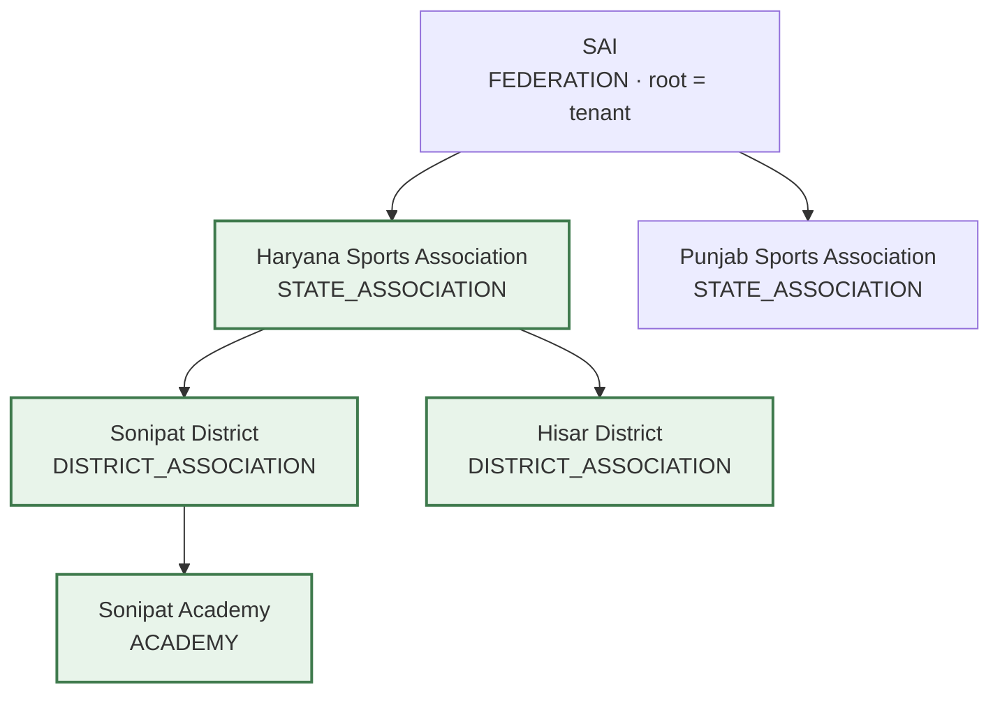
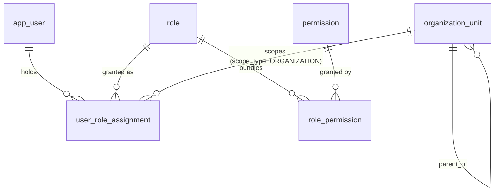
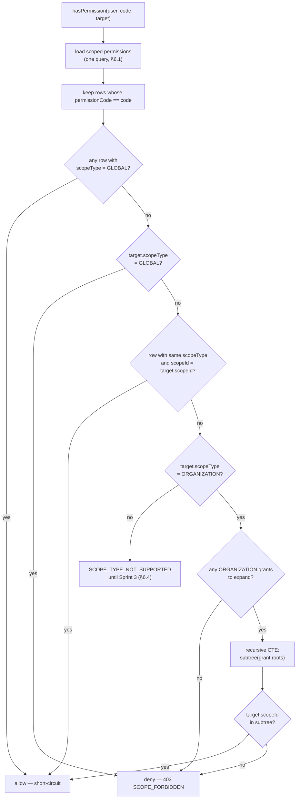

# 05 — RBAC & Organization

| Field | Value |
|---|---|
| Version | 1.0 |
| Status | Approved |
| Date | 2026-08-05 |
| Owner | Samarth |
| Depends on | ARCHITECTURE_BRIEF.md (frozen), 02_DOMAIN_MODEL §4, 04_DATABASE_DESIGN §8.1 |
| Consumed by | 01 §5, 03 §5–6, 07 §6, 08 §4, 09 §5, 10 (Sprint 1–2) |
| Implemented by | `V3__create_rbac.sql`, `V4__seed_rbac.sql`, `com.acme.tms.access.*` |

---

## 1. Purpose & Scope

This document owns two things that every other document defers to:

1. **The permission catalog** (§4) — the complete, closed set of permission strings. Brief §8 says permissions are "fine-grained strings like `tournament:create`"; the strings themselves are enumerated here and nowhere else. Adding one requires a PR against this section *and* a new Flyway seed migration, in that order (10 §Sprint 2 key risks).
2. **The scope-resolution algorithm** (§6) — how a `UserRoleAssignment` at some scope is turned into a yes/no for a permission on a concrete target. 03 §5.1 and §6.3, 07 §6, and 09 §5 all delegate here.

It also covers the organization tree that scoping rests on (§2), the seven system roles (§5), caching (§7), and the no-privilege-escalation rule (§8).

Not covered here: authentication, tokens and session lifecycle (03 §6.1, 08 §2); the Hibernate tenancy filter (03 §5.1), which is defense-in-depth and never the primary control.

## 2. The Organization Tree

`OrganizationUnit` is a self-referencing tree (02 §4.1, brief §1). The root node (`parentOrganizationUnitId = null`) is the tenant; everything tenant-owned hangs beneath it.



A `TENANT_ADMIN` grant on **Haryana** (shaded) reaches Haryana, Sonipat, Hisar and the Academy — the whole subtree, at any depth (BR-OU-3, BR-URA-3). It never reaches SAI (upward) or Punjab (sideways).

Facts the evaluator relies on:

- **Types** — `FEDERATION, STATE_ASSOCIATION, DISTRICT_ASSOCIATION, ACADEMY, COLLEGE, CLUB, PRIVATE_ORGANIZER`. The type is descriptive only: **authority comes from tree position, never from type.** A `CLUB` node with children scopes exactly like a `FEDERATION` node with children.
- **Statuses** — `ACTIVE, SUSPENDED, ARCHIVED` (02 §4.1, BR-OU-4). Status gates *operations*, not scope resolution: an archived unit is soft-deleted (`deleted_at` set) and therefore drops out of subtree expansion (§6.3).
- **Subtree query** — a recursive CTE over `organization_unit`, with `ix_organization_unit_parent` supporting the descent (04 §8.1). Chosen over materialized path in Sprint 1 so re-parenting stays a single-row update.

## 3. RBAC Model

Four tables, exactly as specified in 04 §8.1 and created by `V3__create_rbac.sql`.



| Entity | Table | Soft delete | Notes |
|---|---|---|---|
| `Role` | `role` | yes | `code`, `name`, `description`, `defaultScopeType`, `isSystemRole`. Partial-unique `ux_role_code` on non-deleted rows. |
| `Permission` | `permission` | yes | `code` (`resource:action`, ≤80 chars), `description`. Platform-global — carries no `organization_unit_id`. |
| `RolePermission` | `role_permission` | **no** | Pure mapping, re-creatable; unique `(role_id, permission_id)`; `ON DELETE CASCADE` from both parents (BR-RP-1). |
| `UserRoleAssignment` | `user_role_assignment` | yes | `(userId, roleId, scopeType, scopeId)`; the only row type that confers authority. |

**Scope enum** (`ScopeType`, brief §8): `GLOBAL, ORGANIZATION, TOURNAMENT, COMPETITION` — CHECK-constrained on both `role.default_scope_type` and `user_role_assignment.scope_type`.

Sprint 6 adds a fifth constant, `MATCH`, which is a **target only and never a grant** (ADR-015): match endpoints are addressed by match id, and authority over one is inherited from its competition via `MatchScopeResolver`. The two CHECK constraints deliberately still list only the original four, so the database refuses a MATCH-scoped assignment outright. Nothing in this document's grant model changes.

Constraints the algorithm in §6 takes as given, so it never has to defend against malformed rows:

- `ck_ura_global_scope`: `(scope_type = 'GLOBAL') = (scope_id IS NULL)` — the DB-level form of BR-URA-1.
- `ux_user_role_assignment`: partial-unique on `(user_id, role_id, scope_type, coalesce(scope_id, '000…0')) WHERE deleted_at IS NULL` — BR-URA-2, with the `coalesce` sentinel because SQL uniqueness ignores NULLs.
- `ix_ura_user` — the index behind the hottest read in the system (04 §8.1); `ix_ura_scope` — the reverse lookup, "who can reach this unit".
- Service-level: `role.defaultScopeType` must equal the requested `scopeType` (BR-R-2). `TOURNAMENT_ADMIN` at `GLOBAL` is rejected `400 VALIDATION_FAILED`, not silently widened.

## 4. Permission Catalog

The catalog **as seeded by `V4__seed_rbac.sql`** — 38 codes. Roles: SA = `SUPER_ADMIN`, TA = `TENANT_ADMIN`, OO = `ORG_OFFICIAL`, TRA = `TOURNAMENT_ADMIN`, CO = `COMPETITION_OFFICIAL`, PU = `PARTICIPANT_USER`, PV = `PUBLIC_VIEWER`.

| # | Code | Description (seeded) | SA | TA | OO | TRA | CO | PU | PV |
|---|---|---|:-:|:-:|:-:|:-:|:-:|:-:|:-:|
| 1 | `organization:create` | Create a child organization unit | ● | ● | | | | | |
| 2 | `organization:read` | Read an organization unit | ● | ● | ● | | | | |
| 3 | `organization:update` | Update an organization unit | ● | ● | | | | | |
| 4 | `organization:delete` | Archive an organization unit | ● | ● | | | | | |
| 5 | `user:invite` | Invite a user into an organization unit | ● | ● | | | | | |
| 6 | `user:read` | Read users within scope | ● | ● | ● | | | | |
| 7 | `role:assign` | Grant or revoke a role assignment | ● | ● | | | | | |
| 8 | `role:read` | Read role assignments | ● | ● | | | | | |
| 9 | `sport:read` | Read the sport catalog | ● | ● | ● | | | ● | ● |
| 10 | `sport-config:create` | Create a sport configuration | ● | ● | | | | | |
| 11 | `sport-config:read` | Read a sport configuration | ● | ● | ● | | | | |
| 12 | `sport-config:update` | Update a sport configuration | ● | ● | | | | | |
| 13 | `tournament:create` | Create a tournament | ● | ● | | | | | |
| 14 | `tournament:read` | Read a tournament | ● | ● | ● | ● | | ● | ● |
| 15 | `tournament:update` | Update a tournament | ● | ● | ● | ● | | | |
| 16 | `tournament:delete` | Delete a tournament | ● | ● | | | | | |
| 17 | `tournament:transition` | Transition a tournament lifecycle state | ● | ● | | ● | | | |
| 18 | `competition:create` | Create a competition | ● | ● | | ● | | | |
| 19 | `competition:read` | Read a competition | ● | ● | ● | ● | ● | ● | ● |
| 20 | `competition:update` | Update a competition | ● | ● | ● | ● | ● | | |
| 21 | `competition:transition` | Transition a competition lifecycle state | ● | ● | | ● | | | |
| 22 | `form:create` | Create a registration form definition | ● | ● | ● | ● | | | |
| 23 | `form:read` | Read a registration form definition | ● | ● | ● | ● | | ● | |
| 24 | `form:update` | Update a registration form definition | ● | ● | ● | ● | | | |
| 25 | `registration:create` | Submit a registration | ● | | | | | ● | |
| 26 | `registration:read` | Read a registration | ● | ● | ● | ● | ● | ● | |
| 27 | `registration:update` | Update or withdraw a registration | ● | ● | ● | ● | | ● | |
| 28 | `registration:approve` | Approve or reject a registration | ● | ● | ● | ● | ● | | |
| 29 | `fixture:generate` | Generate fixtures for a competition | ● | ● | ● | ● | | | |
| 30 | `fixture:read` | Read fixtures | ● | ● | ● | ● | ● | | |
| 31 | `match:schedule` | Schedule or update a match | ● | ● | ● | ● | ● | | |
| 32 | `match:read` | Read matches | ● | ● | ● | ● | ● | | |
| 33 | `result:record` | Record a match result | ● | ● | ● | ● | ● | | |
| 34 | `leaderboard:read` | Read a leaderboard | ● | ● | ● | ● | ● | ● | ● |
| 35 | `approval:read` | Read the approvals inbox | ● | ● | ● | ● | ● | | |
| 36 | `document:upload` | Upload a document | ● | ● | ● | ● | ● | ● | |
| 37 | `document:read` | Read a document | ● | ● | ● | ● | ● | ● | |
| 38 | `audit:read` | Read audit log entries | ● | ● | | | | | |
| | **Total** | | **38** | **37** | **23** | **22** | **12** | **10** | **4** |

### 4.1 Catalog rules

- **`resource:action`, lower-kebab resource, no wildcards** (BR-P-1). `sport-config` is one resource, not a namespace. There is no `*:*` — `SUPER_ADMIN` holds all 38 rows explicitly (`cross join permission` in V4), so a newly seeded permission is granted to nobody until a migration says otherwise.
- **Code-owned, never user-editable in V1.** No API creates or edits `permission` rows; `is_system_role = true` on all seven roles and their permission sets are equally frozen (BR-R-1).
- **Read/write split is by code, not by convention.** `:read` never implies `:update`; a role holding `tournament:update` without `tournament:read` is legal-but-nonsensical, and the matrix test (§11) is what keeps that from shipping.
- **Public reads are not permissionless.** `PUBLIC_VIEWER` is a real role for authenticated-but-unprivileged users. Genuinely anonymous endpoints (`/api/v1/public/t/{slug}`, 08 §6.3) bypass the aspect entirely and read `PUBLISHED`+ projections — they do not resolve `PUBLIC_VIEWER`.

### 4.2 Codes referenced by sibling docs but **not** in the seeded catalog

These appear in prose elsewhere; none exists in `V4__seed_rbac.sql`. Any endpoint that needs one must add it via a seed migration plus an update to §4 first.

| Cited as | In | Resolution |
|---|---|---|
| `iam:assign` | 02 §4.6 BR-URA-4 | Implemented as **`role:assign`** (matching 08 §4.2). Treat `iam:assign` as a stale alias. |
| `match:record-result` | 02 §4.4 (illustrative) | Implemented as **`result:record`**. |
| `registration:withdraw` | 01 §5, 07 §4.3 | Covered by **`registration:update`** ("update or withdraw"), plus the owner check of 08 §9.4. |
| `registration:submit` | 01 §5 | Implemented as **`registration:create`**. |
| `organization:manage`, `user:manage`, `tournament:manage`, `competition:manage`, `form:manage`, `fixture:manage` | 01 §5 | Product-level groupings, not codes. Each expands to the explicit verbs in §4 (e.g. `form:manage` → `form:create` + `form:read` + `form:update`). |
| `approval:act` | 07 §6, §10 | **Not yet seeded.** Sprint 5 adds it; `approval:read` covers the inbox only. |
| `workflow:configure` | 01 §5, 07 §10 | **Not yet seeded.** Sprint 5. |
| `venue:*`, `participant:*` | 08 §5.3 and the Sprint 3/4 API map | **Not yet seeded.** Added under the §4.1 rules when those endpoints land. |

### 4.3 Divergences from the product matrix in 01 §5

01 §5 is a product-level view written before the catalog was seeded; §4 above is canonical for who holds what (README §2, 10 §Sprint 2). Where the two disagree, the seed is what runs — and each row below is a **decision owed**, not a settled point:

| Difference | 01 §5 says | V4 seed says | Note |
|---|---|---|---|
| `tournament:create` for `ORG_OFFICIAL` | allowed | **denied** | Officials operate tournaments; creating them is a `TENANT_ADMIN` act. |
| Invite users / assign roles for `ORG_OFFICIAL` | allowed (subtree) | **denied** | Deliberate: delegation of authority stays with `TENANT_ADMIN` (§8). |
| `audit:read` for `ORG_OFFICIAL` | allowed (subtree) | **denied** | Audit is an admin capability in the seed. |
| `registration:approve` for `COMPETITION_OFFICIAL` | denied | **allowed** | The seed lets the competition official clear their own queue. |
| `competition:update`, `match:schedule`, `fixture:read`, `approval:read` for `COMPETITION_OFFICIAL` | not listed | **allowed** | The seed gives the day-of role a workable set. |
| `registration:create` for `SUPER_ADMIN` | denied | **allowed** | Falls out of "`SUPER_ADMIN` = every permission" (§4.1); harmless but worth knowing. |

**Resolved in Sprint 6, no seed change:** `COMPETITION_OFFICIAL` keeps `fixture:read` without `fixture:generate`. 08 §11.1 places the *check* at COMPETITION scope — that is where the endpoint is addressed, not a statement about who holds the permission — and 01 §5's restriction of fixture management to `TOURNAMENT_ADMIN` and above is the product decision that governs. Making the draw is an administrative act with consequences for the whole competition (it consumes the approved entry list and, once played, can no longer be rebuilt — BR-F-3); running matches on the day is not. The day-of official schedules, starts, postpones and records results, and reads the draw they are working from. Generation stays a `TOURNAMENT_ADMIN` / `ORG_OFFICIAL` / `TENANT_ADMIN` act.

## 5. The Seven System Roles

| Code | Name | `defaultScopeType` | Shape of authority |
|---|---|---|---|
| `SUPER_ADMIN` | Super Admin | `GLOBAL` | Every permission, everywhere. Platform operations only; not a tenant role. |
| `TENANT_ADMIN` | Tenant Admin | `ORGANIZATION` | Everything except `registration:create` — admins administer registrations, they don't submit them. Full org, user, role, sport-config, tournament and audit control over one subtree. |
| `ORG_OFFICIAL` | Organization Official | `ORGANIZATION` | Operational staff: runs tournaments and competitions inside the subtree (read + update, forms, approvals, fixtures, results) but cannot restructure the org, invite users, grant roles, create or delete tournaments, or read audit. |
| `TOURNAMENT_ADMIN` | Tournament Admin | `TOURNAMENT` | Owns one tournament end to end: lifecycle transitions, creating competitions under it, forms, approvals, fixtures, results. No organization-level reach at all. |
| `COMPETITION_OFFICIAL` | Competition Official | `COMPETITION` | Runs one competition on the day: schedule matches, record results, approve registrations, read fixtures. Cannot create or transition anything above a competition. |
| `PARTICIPANT_USER` | Participant | `GLOBAL` | Self-service: submit, read and update own registrations, read public-facing tournament data, upload documents. |
| `PUBLIC_VIEWER` | Public Viewer | `GLOBAL` | Read-only: tournaments, competitions, leaderboards, sports. |

Two consequences worth stating plainly, because they surprise readers:

1. **`PARTICIPANT_USER` and `PUBLIC_VIEWER` are `GLOBAL`-scoped** (`scope_id IS NULL`). They must be — a participant registers across tenants. Their permissions therefore hit the GLOBAL short-circuit of §6.2 and evaluate `true` everywhere. That is safe only for genuinely global capabilities, which is why the participant set contains no `:approve`, no `:transition`, and no `:create` beyond `registration:create`. **`registration:read` / `registration:update` for a participant must additionally be narrowed by a row-level owner check in the registration service** (08 §9.3–9.4); scope evaluation cannot do it. Sprint 4 owns that check; it is tracked in §12.
2. **A role's scope is pinned, not suggested.** `defaultScopeType` is validated on every grant, so `ORG_OFFICIAL` can only ever exist at `ORGANIZATION` and `COMPETITION_OFFICIAL` only at `COMPETITION`. There is no "same role, wider scope" move.

Delta view for reviewers: `ORG_OFFICIAL` = `TENANT_ADMIN` − {organization create/update/delete, `user:invite`, `role:*`, sport-config create/update, tournament create/delete/transition, competition create/transition, `audit:read`}. `COMPETITION_OFFICIAL` = `TOURNAMENT_ADMIN` − {`tournament:*`, competition create/transition, `form:*`, `registration:update`, `fixture:generate`}.

## 6. Permission Evaluation Algorithm

Implemented by `ScopeEvaluator.hasPermission(userId, permissionCode, ScopeTarget)`; `ScopeTarget` is `(scopeType, scopeId)` describing **the thing being touched**, not the grant.

### 6.1 One query, then pure logic

```sql
select ura.scope_type, ura.scope_id, p.code
from user_role_assignment ura
join role_permission rp on rp.role_id = ura.role_id
join permission p on p.id = rp.permission_id and p.deleted_at is null
where ura.user_id = :userId and ura.deleted_at is null
```

Every grant × permission the caller holds arrives in one round trip on `ix_ura_user` (04 §8.1). Everything after this is in-memory set logic plus, at most, one subtree query.

### 6.2 The decision



In prose, in evaluation order:

1. **GLOBAL grant → allow, immediately.** A `GLOBAL` assignment carrying the permission short-circuits everything: no target lookup, no subtree expansion. This is what makes `SUPER_ADMIN` cheap, and what makes §5's GLOBAL-role caveat matter.
2. **GLOBAL target → deny unless step 1 fired.** Asking for a global capability (creating a root `OrganizationUnit`, i.e. a new tenant) while holding only scoped grants is a denial, never a widening.
3. **Exact match → allow.** A grant whose `scopeType` equals the target's and whose `scopeId` equals the target's `scopeId` allows. This is the whole story for `TOURNAMENT` and `COMPETITION` grants today.
4. **ORGANIZATION subtree → allow if the target is inside it.** Reached only for `ORGANIZATION` targets that no exact grant covered. The caller's `ORGANIZATION` grant roots are expanded with one recursive CTE and the target must appear in the result. Roots are collected across *all* the caller's assignments, so someone holding Haryana **and** Punjab expands both in a single query.
5. **Otherwise deny** → `ScopeAccessDeniedException("SCOPE_FORBIDDEN")` → `403 problem+json` (08 §1.3).

Note the asymmetry that makes the model safe: a grant at Haryana covers everything **below** Haryana and nothing above or beside it. Sonipat's official reading Haryana's root is a 403 (`ScopedAccessIntegrationTest.grantIsScopedToASubtreeAndNotItsParent`).

### 6.3 Subtree expansion

```sql
with recursive subtree as (
    select id from organization_unit
    where id in (:rootIds) and deleted_at is null
    union all
    select child.id from organization_unit child
    join subtree on child.parent_organization_unit_id = subtree.id
    where child.deleted_at is null
)
select id from subtree
```

Soft-deleted units are excluded at **both** the root and every descent step, so archiving a mid-tree node severs the branch below it for scope purposes even though the rows survive. Cycles are impossible by BR-OU-1 (validated on re-parenting), which is what lets the CTE run without a depth guard.

### 6.4 Current limitation (Sprint 3 lifts it)

`TOURNAMENT` and `COMPETITION` targets resolve **only** by exact `scopeId` match. An `ORGANIZATION` grant does *not* yet reach a tournament owned inside its subtree, because that needs the tournament → owning-unit lookup arriving with the `Tournament` entity. Until then, a `TOURNAMENT`/`COMPETITION` target that no exact grant covers raises `SCOPE_TYPE_NOT_SUPPORTED` (a loud `400`) rather than a quiet `false` — a missing capability must never look like a considered denial. Sprint 3 replaces this branch with: resolve the target's owning `organizationUnitId`, then run step 4 against it (and per 09 §5, `TOURNAMENT` scope additionally covers its child competitions).

### 6.5 Listing: `visibleOrganizationUnitIds(userId, permissionCode)`

Point checks answer "may I touch X". List endpoints need the inverse — "which X may I see" — and must not leak existence via a 403 per row. `visibleOrganizationUnitIds` returns every unit reachable with a permission: all units for a GLOBAL holder, otherwise the expanded subtree of the caller's `ORGANIZATION` grants, otherwise empty. `GET /api/v1/organization-units` filters through it, so a Haryana admin listing units sees exactly their own nodes and no sign that Punjab exists.

## 7. Caching

**Current state: nothing is cached.** Both `findScopedPermissions` and `findSubtreeIds` hit PostgreSQL on every check. That is deliberate for Sprint 2 — correctness and a measurable baseline first — and it is the open item behind program risk R6 (10 §5).

The design the caches must implement when switched on (09 §12, 03 §5.1):

| Cache | Key | TTL | Invalidated by |
|---|---|---|---|
| `userGrants` | `grants:{userId}` | 5 min | any `user_role_assignment` create/revoke for that user (`@CacheEvict`) |
| `orgSubtree` | `org:subtree:{orgUnitId}` | 30 min | `OrganizationUnit` create, re-parent, status change, archive |

Rules that keep a cache from becoming a security hole:

- **Read-through only; the DB is the source of truth.** No decision may depend on cache freshness — a cold cache must produce the same answer, slower.
- **Evict on grant *and* revoke.** Revocation is the security-critical direction: `ScopedAccessIntegrationTest.revokingAGrantRemovesTheAccessItConferred` asserts access disappears immediately, so a revoke that merely waits out a TTL fails the suite.
- **Never cache the decision, only the inputs.** Caching `(user, permission, target) → boolean` would multiply keys by every entity in the system and make invalidation intractable. Cache grants and subtrees; recompute the decision.
- **`assignmentsVersion` in the access token** (03 §6.1) is the cross-node signal: bumping it on any role change makes stale per-node caches unusable without a distributed evict. It is claim-only today and unused by the evaluator.

Permissions are resolved server-side and never baked into the JWT (ADR-012) — so a revoked role stops working within the cache TTL rather than at token expiry.

## 8. No Privilege Escalation

**The rule (BR-URA-4): a grant may never reach beyond the granter's own `role:assign` scope.** Enforced in `RoleAssignmentService.requireGrantAuthority` on both grant and revoke — the same check, because removing someone else's authority is the same power as giving it.

```
requireGrantAuthority(scopeType, scopeId):
    if not hasPermission(caller, "role:assign", ScopeTarget(scopeType, scopeId)):
        403 SCOPE_FORBIDDEN
```

The check targets **the scope of the assignment being created**, not the caller's own scope — so the escalation attempts all collapse into one denial:

| Attempt | Outcome |
|---|---|
| Haryana `TENANT_ADMIN` grants `TENANT_ADMIN` on Punjab | `403 SCOPE_FORBIDDEN` — Punjab is outside the caller's subtree |
| Haryana `TENANT_ADMIN` grants themselves `SUPER_ADMIN` (GLOBAL) | `403 SCOPE_FORBIDDEN` — no GLOBAL `role:assign` (§6.2 step 2) |
| Haryana `TENANT_ADMIN` grants `TENANT_ADMIN` on SAI, their parent | `403` — upward is outside the subtree |
| `ORG_OFFICIAL` grants anything | `403` — the role has no `role:assign` at all |
| Anyone creates a root `OrganizationUnit` through the API | `403` — root creation is checked against `ScopeTarget.global()` |
| Grant a role at a scope its `defaultScopeType` forbids | `400 VALIDATION_FAILED` (BR-R-2) |
| Re-grant an existing (user, role, scope) | `409 ASSIGNMENT_EXISTS` (BR-URA-2) |
| Revoke the last GLOBAL `SUPER_ADMIN` | `409 LAST_SUPER_ADMIN` — the platform can never be locked out |

Supporting guarantees:

- **Downward-only by construction.** Because authority is a subtree and `role:assign` is itself scope-checked, a granter's reachable set is closed under granting: nothing a delegate receives can exceed what the granter held.
- **Reading assignments is scoped too.** `GET /users/{id}/role-assignments` returns the caller's own assignments unconditionally, and another user's only for those grants the caller can see with `role:read` — so listing cannot be used to enumerate other tenants.
- **Invite carries the same check.** `POST /users/invite` with an `initialRole` routes through `RoleAssignmentService.assign`, so an invite cannot mint authority the inviter lacks (08 §4.1).
- **Bootstrap is the one unchecked grant.** `AuthService.bootstrapRegister` creates a root unit plus a user and grants `TENANT_ADMIN` on it via the no-caller `RoleAssignmentService.grant`. There is no authenticated caller to check, and the grant is confined to the tree that same call just created. No `SUPER_ADMIN` user is seeded by migration; platform admins are provisioned out of band.

## 9. Enforcement in Code

Package `com.acme.tms.access` (`domain`, `repository`, `service`, `aspect`, `annotation`, `api`) — a split of the `identity` module of 09 §1, kept separate so `identity` and `organization` can both depend on scope evaluation without a cycle. See §12.

**Declarative — the default.** One annotation per endpoint, checked by `PermissionAspect` (`@Order(1)`, ahead of any business logic):

```java
@PatchMapping("/{id}")
@RequiresPermission(value = "organization:update", scope = ScopeType.ORGANIZATION, scopeIdParam = "id")
public OrganizationUnitResponse update(@PathVariable UUID id, @Valid @RequestBody UpdateOrganizationUnitRequest request) { … }
```

- `scopeIdParam` names a method parameter, optionally dotted into a request record: `"id"`, or `"request.organizationUnitId"` (`POST /users/invite`). Resolution is by parameter name plus accessor reflection — a typo throws `IllegalStateException` on first call, never a silent allow.
- Omitted or blank for `GLOBAL` scope.
- The aspect resolves the caller from the security context (`CurrentUser.requireUserId`, `401 UNAUTHENTICATED` if absent), builds the `ScopeTarget`, calls `ScopeEvaluator`, and throws `403 SCOPE_FORBIDDEN` on failure.

**Imperative — where the target scope is not a parameter.** The service calls `ScopeEvaluator` directly:

| Case | Why the annotation cannot express it |
|---|---|
| `OrganizationUnitService.createScoped` | Authority is checked against the **parent** (`organization:create` on the parent subtree), or `ScopeTarget.global()` when creating a root |
| `OrganizationUnitService.listVisible` | Filtering, not gating — uses `visibleOrganizationUnitIds` (§6.5) |
| `RoleAssignmentService.assign` / `revoke` | Target scope comes from the request body and applies to grant *and* revoke (§8) |
| `RoleAssignmentService.list` | Per-row visibility filter with an own-assignments exemption |

Rule (13 §9): scope checks run **before** business validation, so an out-of-scope caller receives `403` and learns nothing about whether the entity exists or is valid.

## 10. APIs (summary — contracts in 08 §3–4)

| Endpoint | Permission | Scope | Notes |
|---|---|---|---|
| `POST /api/v1/organization-units` | `organization:create` | parent's ORGANIZATION, or GLOBAL for a root | root creation is effectively closed (§8) |
| `GET /api/v1/organization-units` | `organization:read` | filtered | returns only the visible subtree (§6.5) |
| `GET /api/v1/organization-units/{id}` · `/tree` | `organization:read` | ORGANIZATION | |
| `PATCH /api/v1/organization-units/{id}` | `organization:update` | ORGANIZATION | archived units are read-only (`409 UNIT_ARCHIVED`) |
| `DELETE /api/v1/organization-units/{id}` | `organization:delete` | ORGANIZATION | archive = status `ARCHIVED` + soft delete |
| `POST /api/v1/users/invite` | `user:invite` | ORGANIZATION of `request.organizationUnitId` | optional `initialRole` re-checked as a grant |
| `POST /api/v1/users/{userId}/role-assignments` | `role:assign` | scope **of the requested assignment** | `400`, `403`, `404 USER_NOT_FOUND` / `404 SCOPE_ENTITY_NOT_FOUND`, `409 ASSIGNMENT_EXISTS` |
| `GET /api/v1/users/{userId}/role-assignments` | `role:read` (own always) | per assignment | |
| `DELETE /api/v1/users/{userId}/role-assignments/{assignmentId}` | `role:assign` | scope of the assignment | `409 LAST_SUPER_ADMIN` |

## 11. Testing

The authz matrix is a test artifact, not a document artifact — this section states what must stay green (10 §Sprint 2 DoD, program risk R1).

- **`PermissionMatrixIntegrationTest`** — table-driven role × endpoint × scope grid. Each case grants exactly one role at the tenant root and asserts the status code, so a permission accidentally added to a seed role fails here rather than in production.
- **`ScopedAccessIntegrationTest`** — the negative half: Haryana cannot reach Punjab; a subtree grant does not reach its parent; `ORG_OFFICIAL` cannot invite or grant; a tenant admin cannot escalate to GLOBAL; nobody creates a root tenant; revocation immediately removes access; duplicate grants `409`.
- Both run on Testcontainers PostgreSQL against the real `V3`/`V4` migrations — the catalog under test is the seeded catalog, never a fixture.
- **Adding a permission requires a matrix row.** A seeded code with no assertion is treated as an untested grant in review (13 §13.3).

## 12. Open Points

1. **`com.acme.tms.access` is not in the frozen module list** (brief §Conventions lists `identity`, `organization`, …). The split is deliberate — both `identity` and `organization` depend on scope evaluation — but the brief is frozen, so this needs an ADR in 14 plus a one-line amendment, or a merge back into `identity`. Tracked, not resolved.
2. **Caching is unimplemented** (§7). Benchmark the 10k-node subtree case before switching it on; R6 stays open until then.
3. **`TOURNAMENT` / `COMPETITION` scope resolution is incomplete** (§6.4) — Sprint 3 must land owning-unit resolution *and* delete the `SCOPE_TYPE_NOT_SUPPORTED` branch, or that branch becomes a permanent hole in the model.
4. **Row-level ownership for `PARTICIPANT_USER`** (§5, note 1) — required in Sprint 4 alongside `Registration`; scope evaluation alone does not confine a GLOBAL-scoped participant to their own rows.
5. **`approval:act` / `workflow:configure`** (§4.2) must be seeded before Sprint 5 wires the approval endpoints; 07 §6 assumes them today.
6. **Custom tenant roles** (BR-R-1) remain post-MVP — see `11_FUTURE_ENHANCEMENTS.md`. `is_system_role` already distinguishes them, so the table needs no change.

---

*End of 05_RBAC_AND_ORGANIZATION. Next: 06_SPORT_CONFIGURATION_ENGINE.*
