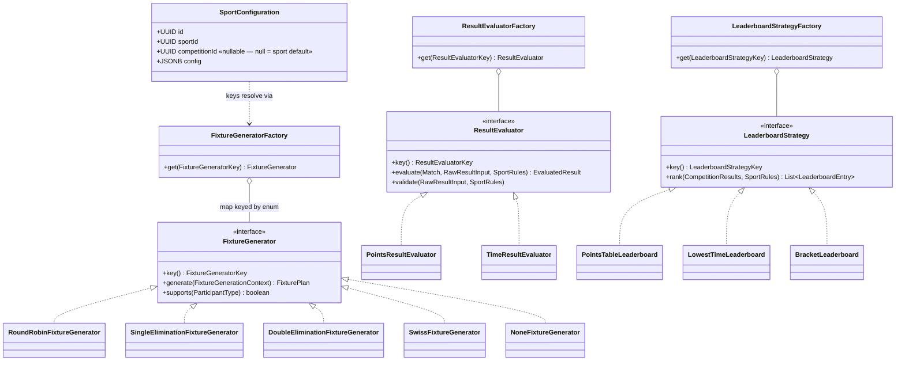

# 06 — Sport Configuration Engine

| Field | Value |
|---|---|
| Version | 1.0 |
| Status | Approved |
| Date | 2026-07-26 |
| Owner | Samarth |
| Depends on | ARCHITECTURE_BRIEF.md (frozen), 03_HLD, 04_DATABASE_DESIGN |
| Consumed by | 08, 09 (fixture/result module LLD) |

---

## 1. Problem

The platform must run Football leagues, 100m sprints, Swiss-system Chess, and sports we have not heard of yet — with **zero sport-specific branching in domain code**. The frozen rule (brief §7): **no `if (sport == FOOTBALL)` anywhere.** Sport behavior differs along exactly three axes:

1. How fixtures/matches are generated (league, brackets, Swiss rounds, or none at all for a timed final),
2. How a raw result is evaluated and validated (points, win/loss, a time, a distance, a score),
3. How standings are ranked (points table, lowest time, bracket progression, tiebreak systems).

Everything else (registration, approval, documents, audit) is sport-agnostic already. So the engine isolates those three axes behind **Strategy interfaces**, selected at runtime by keys stored in a JSONB `SportConfiguration` — adding a sport is configuration plus (at most) one new strategy implementation.

## 2. Design Overview — Strategy Pattern

- `SportConfiguration` (entity, `tournament` module) holds a JSONB config: `{ sport, participantType, fixtureGenerator, resultEvaluator, leaderboardStrategy, rules{} }` (brief §7, verbatim shape).
- Three strategy interfaces in `com.acme.tms.fixture` / `com.acme.tms.result`: `FixtureGenerator`, `ResultEvaluator`, `LeaderboardStrategy`.
- Three factories (brief §7): `FixtureGeneratorFactory`, `ResultEvaluatorFactory`, `LeaderboardStrategyFactory` — Spring-managed registries keyed by enum.
- Strategy keys are **closed enums** (frozen):
  - `fixtureGenerator ∈ { ROUND_ROBIN, SINGLE_ELIMINATION, DOUBLE_ELIMINATION, SWISS, NONE }`
  - `resultEvaluator ∈ { POINTS, WIN_LOSS, TIME, DISTANCE, SCORE }`
  - `leaderboardStrategy ∈ { POINTS_TABLE, LOWEST_TIME, HIGHEST_DISTANCE, HIGHEST_SCORE, BRACKET }`
- `rules{}` is the free-form (schema-validated) parameter bag each strategy interprets: points-per-win, legs, rounds, tiebreakers, timing precision, etc.



## 3. SportConfiguration JSONB Schema

Stored in `sport_configuration.config` (JSONB). Validated on write against this JSON Schema (draft 2020-12), and re-validated against the strategy registries (§7).

```json
{
  "$schema": "https://json-schema.org/draft/2020-12/schema",
  "$id": "https://schemas.acme-tms.dev/sport-configuration/v1",
  "type": "object",
  "required": ["sport", "participantType", "fixtureGenerator",
               "resultEvaluator", "leaderboardStrategy", "rules"],
  "additionalProperties": false,
  "properties": {
    "sport": { "type": "string", "minLength": 1 },
    "participantType": { "enum": ["INDIVIDUAL", "TEAM", "ORGANIZATION"] },
    "fixtureGenerator": {
      "enum": ["ROUND_ROBIN", "SINGLE_ELIMINATION", "DOUBLE_ELIMINATION", "SWISS", "NONE"]
    },
    "resultEvaluator": {
      "enum": ["POINTS", "WIN_LOSS", "TIME", "DISTANCE", "SCORE"]
    },
    "leaderboardStrategy": {
      "enum": ["POINTS_TABLE", "LOWEST_TIME", "HIGHEST_DISTANCE", "HIGHEST_SCORE", "BRACKET"]
    },
    "rules": { "type": "object" }
  }
}
```

`rules` is validated a second time by the *selected strategies* (each strategy publishes its own rules sub-schema, §7).

### 3.1 Example — Football (MVP: TEAM / ROUND_ROBIN / POINTS)

```json
{
  "sport": "FOOTBALL",
  "participantType": "TEAM",
  "fixtureGenerator": "ROUND_ROBIN",
  "resultEvaluator": "POINTS",
  "leaderboardStrategy": "POINTS_TABLE",
  "rules": {
    "pointsForWin": 3, "pointsForDraw": 1, "pointsForLoss": 0,
    "legs": 1, "matchDurationMinutes": 90,
    "tiebreakers": ["GOAL_DIFFERENCE", "GOALS_FOR", "HEAD_TO_HEAD"],
    "teamSize": { "min": 11, "max": 18 }
  }
}
```

### 3.2 Example — Athletics 100m (MVP: INDIVIDUAL / NONE / TIME)

```json
{
  "sport": "ATHLETICS_100M",
  "participantType": "INDIVIDUAL",
  "fixtureGenerator": "NONE",
  "resultEvaluator": "TIME",
  "leaderboardStrategy": "LOWEST_TIME",
  "rules": {
    "timeUnit": "SECONDS", "precision": 3,
    "attemptsPerParticipant": 1,
    "recordLowerBoundSeconds": 9.0,
    "disqualificationCodes": ["FALSE_START", "LANE_VIOLATION", "DNF", "DNS"]
  }
}
```

`NONE` still produces one `Fixture` container with heat/final `Match`es created manually or by the official — the generator contributes no pairing logic, only the shell (so `result` code never special-cases "no fixtures").

### 3.3 Example — Chess (post-MVP proof: SWISS / Buchholz)

```json
{
  "sport": "CHESS",
  "participantType": "INDIVIDUAL",
  "fixtureGenerator": "SWISS",
  "resultEvaluator": "WIN_LOSS",
  "leaderboardStrategy": "POINTS_TABLE",
  "rules": {
    "rounds": 7,
    "pointsForWin": 1, "pointsForDraw": 0.5, "pointsForLoss": 0,
    "pairing": { "avoidRematch": true, "colorBalance": true },
    "tiebreakers": ["BUCHHOLZ", "SONNEBORN_BERGER", "DIRECT_ENCOUNTER"]
  }
}
```

Chess requires exactly one new class (`SwissFixtureGenerator`) plus tiebreaker functions registered for `POINTS_TABLE` — no change to `registration`, `result` persistence, or any controller (brief §Conventions promise).

## 4. Strategy Interfaces (Java)

```java
public interface FixtureGenerator {
    FixtureGeneratorKey key();                       // enum: ROUND_ROBIN, ...
    boolean supports(ParticipantType participantType);
    /** Pure function: approved participants + rules → fixture plan. No persistence. */
    FixturePlan generate(FixtureGenerationContext ctx);
}

public record FixtureGenerationContext(
    UUID competitionId,
    List<SeededParticipant> participants,   // APPROVED registrations, optional seeds
    SportRules rules,                       // typed view over config.rules
    Optional<FixturePlan> previousRounds) {}// used by SWISS for round N pairing
```

```java
public interface ResultEvaluator {
    ResultEvaluatorKey key();                        // POINTS, WIN_LOSS, TIME, DISTANCE, SCORE
    /** Reject malformed raw input (e.g. negative time, score for a walkover). */
    void validate(RawResultInput input, SportRules rules) throws ResultValidationException;
    /** Raw officials' input → normalized EvaluatedResult persisted as Result. */
    EvaluatedResult evaluate(Match match, RawResultInput input, SportRules rules);
}
```

```java
public interface LeaderboardStrategy {
    LeaderboardStrategyKey key();                    // POINTS_TABLE, LOWEST_TIME, ...
    /** All evaluated Results of a Competition → ordered LeaderboardEntry list (rank, ties resolved). */
    List<LeaderboardEntry> rank(CompetitionResults results, SportRules rules);
}
```

Contract notes:

- Strategies are **stateless, thread-safe Spring singletons**; all context arrives via parameters.
- `generate` and `rank` are pure — persistence of `Fixture`/`Match`/`MatchParticipant`/`LeaderboardEntry` happens in the calling service, keeping strategies trivially unit-testable.
- `SportRules` is an immutable typed wrapper over `config.rules` with accessor helpers (`rules.getInt("pointsForWin", 3)`) plus per-strategy typed views.

## 5. Factory Registry (Spring, map-injected)

Spring injects all implementations of an interface as a list; the factory indexes them by enum key at startup. No reflection, no manual registration list to forget.

```java
@Component
public class FixtureGeneratorFactory {

    private final Map<FixtureGeneratorKey, FixtureGenerator> registry;

    public FixtureGeneratorFactory(List<FixtureGenerator> generators) {
        this.registry = generators.stream()
            .collect(Collectors.toUnmodifiableMap(FixtureGenerator::key, g -> g));
        // duplicate key → IllegalStateException at startup: fail fast
    }

    public FixtureGenerator get(FixtureGeneratorKey key) {
        FixtureGenerator g = registry.get(key);
        if (g == null) throw new UnknownStrategyException("fixtureGenerator", key);
        return g;
    }

    public Set<FixtureGeneratorKey> registeredKeys() { return registry.keySet(); }
}
```

`ResultEvaluatorFactory` and `LeaderboardStrategyFactory` are identical in shape. `registeredKeys()` powers config validation (§7) and the admin UI's dropdowns.

## 6. Config Resolution per Competition

`SportConfiguration` rows exist at two levels:

1. **Sport default** — `competitionId = null`, one per `Sport` per tenant (seeded from platform defaults on tenant creation).
2. **Competition override** — `competitionId` set; a full config document (not a patch) that wins outright.

Resolution (in `tournament` module, cached per 03 §7 as `sportcfg:{competitionId}`):

```
resolve(competition):
    override = findByCompetitionId(competition.id)
    if override != null: return override.config
    return findSportDefault(competition.sportId, competition.organizationUnitId).config
```

- Full-document override (no deep merge) keeps semantics obvious and validation simple; the admin UI pre-fills the editor from the default.
- Overrides are **frozen once the Competition leaves `DRAFT`/`OPEN`**: changing `fixtureGenerator` after fixtures exist is rejected (`409`); `rules` tweaks that don't invalidate existing data (e.g. tiebreaker order) are allowed until `IN_PROGRESS`, and audited.

## 7. Validation Rules (on create/update of a SportConfiguration)

1. **JSON Schema** (§3) — shape, required keys, enum membership.
2. **Registry check** — each of the three keys must be in the corresponding factory's `registeredKeys()`. Catches an enum value present in the schema but with no deployed implementation.
3. **participantType match** — `config.participantType` must equal the target Competition's participant type, and the chosen `FixtureGenerator.supports(participantType)` must return true (e.g. bracket generators support all types; a hypothetical relay generator may only support TEAM).
4. **Strategy rules sub-schema** — each selected strategy exposes `rulesSchema()`; `config.rules` is validated against all three (union of required keys, e.g. `POINTS` requires `pointsForWin`).
5. **Cross-key coherence matrix** — a small allowlist rejecting nonsense combos, e.g. `leaderboardStrategy=BRACKET` requires `fixtureGenerator ∈ {SINGLE_ELIMINATION, DOUBLE_ELIMINATION}`; `resultEvaluator=TIME` requires `leaderboardStrategy=LOWEST_TIME`.
6. Failures return `422 problem+json` with per-path errors.

## 8. Fixture Generation — End-to-End

```mermaid
sequenceDiagram
    participant A as Tournament Admin (SPA)
    participant FC as FixtureController
    participant FS as FixtureService
    participant TS as tournament module (config)
    participant RG as registration module
    participant F as FixtureGeneratorFactory
    participant G as RoundRobinFixtureGenerator
    participant DB as PostgreSQL

    A->>FC: POST /api/v1/competitions/{id}/fixtures:generate
    FC->>FS: generate(competitionId)   [RBAC: fixture:generate]
    FS->>TS: resolve SportConfiguration (cache sportcfg:{id})
    FS->>RG: list APPROVED registrations → participants
    FS->>FS: preconditions: competition CLOSED, no existing fixtures, participants ≥ min
    FS->>F: get(ROUND_ROBIN)
    F-->>FS: RoundRobinFixtureGenerator
    FS->>G: generate(ctx{participants, rules})
    G-->>FS: FixturePlan (rounds → pairings)
    FS->>DB: persist Fixture, Match(SCHEDULED), MatchParticipant (one tx)
    FS-->>FC: FixtureDto
    Note over FS,DB: AuditLog via @Audited; leaderboard cache warmed lazily
```

Result recording and leaderboard follow the same pattern: `ResultEvaluatorFactory.get(key).evaluate(...)` → persist `Result` → evict `lb:{competitionId}` → `LeaderboardStrategyFactory.get(key).rank(...)` on next read.

## 9. Extension Guide

### 9.1 Adding a new sport in 30 minutes (no new strategy needed)

If the sport's behavior maps to existing keys (most do):

- [ ] Insert a `Sport` row (name, code) — migration or admin API.
- [ ] Author its default `SportConfiguration` JSON (pick the three keys, write `rules`).
- [ ] `POST /api/v1/sport-configurations` — server runs §7 validation.
- [ ] Optionally author a `RegistrationFormDefinition` for its competitions.
- [ ] Smoke test: create a DRAFT competition, generate fixtures in staging.

Kabaddi = TEAM/ROUND_ROBIN/POINTS with different `rules` — pure configuration, zero code, no deploy.

### 9.2 Adding a new fixture format (new strategy key)

- [ ] Add the enum constant (e.g. `GROUP_STAGE_KNOCKOUT`) to `FixtureGeneratorKey` and to the JSON Schema enum (§3).
- [ ] Implement `FixtureGenerator` in `com.acme.tms.fixture.strategy`; annotate `@Component`; implement `key()`, `supports()`, `rulesSchema()`, `generate()`.
- [ ] Factory picks it up automatically via constructor map-injection — no registration code.
- [ ] Update the coherence matrix (§7.5) if the new format constrains leaderboard choices.
- [ ] Unit tests: pairing properties (everyone plays N, no rematch, bye handling for odd counts); golden-file test for a canonical bracket.
- [ ] ArchUnit already forbids the strategy from importing other modules' internals.
- [ ] Deploy — existing configs are untouched; new key is now selectable.

Same checklist shape applies to a new `ResultEvaluator` or `LeaderboardStrategy` (e.g. `HIGHEST_DISTANCE` for javelin ships as an evaluator+strategy pair).

## 10. Non-Goals (V1)

- Cross-competition aggregation (medal tallies across a Tournament) — post-MVP, composes on top of `LeaderboardEntry`.
- Runtime-pluggable strategies (uploading pairing logic as config/scripts) — deliberately excluded; strategy keys are closed enums and implementations ship with the deployable.
- Per-match rule overrides — `rules` is per-Competition only.

---

*End of 06_SPORT_CONFIGURATION_ENGINE. Next: 07_APPROVAL_WORKFLOW_ENGINE.*
