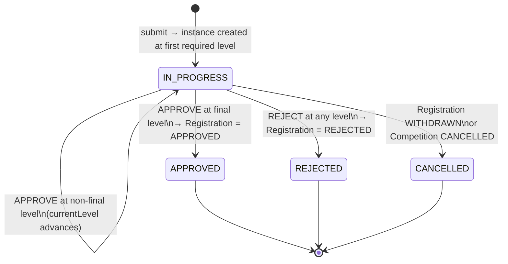
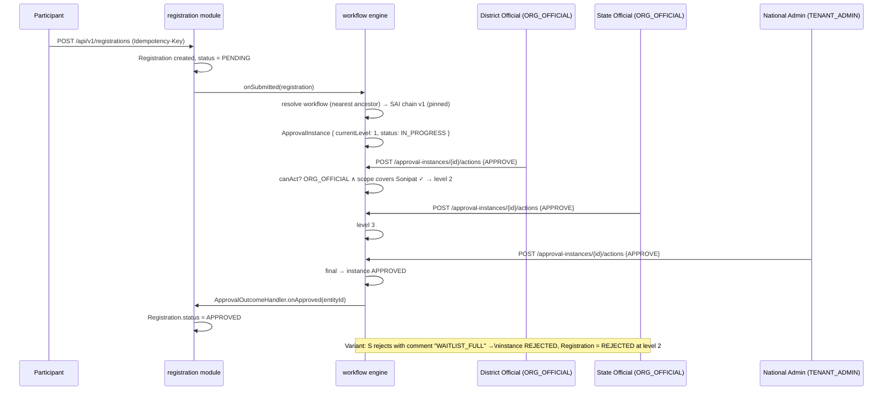

# 07 — Approval Workflow Engine

| Field | Value |
|---|---|
| Version | 1.0 |
| Status | Approved |
| Date | 2026-07-26 |
| Owner | Samarth |
| Depends on | ARCHITECTURE_BRIEF.md (frozen), 03_HLD, 05_RBAC_AND_ORGANIZATION |
| Consumed by | 08, 09 (workflow module LLD) |

---

## 1. Design Goal

The frozen decision (brief §5): **`Registration.status` stays `PENDING, APPROVED, REJECTED, WITHDRAWN` — nothing else, ever.** SAI needs District→State→National three-level approval; a club needs one click. Neither concern may leak into the registration status enum. "Pending at level 2" is **workflow state**, not registration state.

So multi-level approval lives in a **separate, tenant-configurable engine** in the `workflow` module (`com.acme.tms.workflow`). The engine is generic over `{entityType, entityId}`: registrations today, result verification or org onboarding tomorrow (§9), with zero registration-specific code inside it.

## 2. Entities (canonical, brief §6)

### 2.1 ApprovalWorkflow — the template

| Attribute | Type | Notes |
|---|---|---|
| `id` | UUID v7 | PK |
| `organizationUnitId` | UUID | owning tenant node; resolution walks ancestors (§4.1) |
| `workflowName` | String | e.g. "SAI National Registration Chain" |
| `entityType` | String | e.g. `REGISTRATION`; open set for genericity |
| `version` | int | incremented on any step change; instances pin a version (§7.1) |
| `active` | boolean | exactly one active version per (organizationUnitId, entityType) |
| audit cols | — | `created_at/created_by/updated_at/updated_by`, `deleted_at` |

### 2.2 ApprovalStep — one level in the chain

| Attribute | Type | Notes |
|---|---|---|
| `id` | UUID v7 | PK |
| `workflowId` | UUID | FK → ApprovalWorkflow (a specific version's steps) |
| `level` | int | 1..N, contiguous, unique per workflow |
| `roleCode` | String | seed or tenant role code, e.g. `ORG_OFFICIAL` — who may act (§6) |
| `approvalRequired` | boolean | `false` = notify-only/optional level, auto-advanced |
| `stepName` | String | display, e.g. "District Verification" |

### 2.3 ApprovalInstance — one entity moving through one workflow version

| Attribute | Type | Notes |
|---|---|---|
| `id` | UUID v7 | PK |
| `workflowId` | UUID | **pinned** workflow version at creation (§7.1) |
| `entityType` / `entityId` | String / UUID | the subject, e.g. `REGISTRATION` / registration id |
| `currentLevel` | int | level awaiting action |
| `status` | enum | `IN_PROGRESS, APPROVED, REJECTED, CANCELLED` (canonical) |
| `organizationUnitId` | UUID | scope anchor for RBAC + tenancy filter |

Uniqueness: at most one `IN_PROGRESS` instance per `(entityType, entityId)` (partial unique index).

### 2.4 ApprovalAction — an immutable decision record

| Attribute | Type | Notes |
|---|---|---|
| `id` | UUID v7 | PK |
| `instanceId` | UUID | FK → ApprovalInstance |
| `stepLevel` | int | level at which the action was taken |
| `actorId` | UUID | FK → User |
| `decision` | enum | `APPROVE, REJECT` |
| `comment` | String | required on REJECT (carries tenant-defined reason, §7.3) |
| `timestamp` | Instant | — |

Actions are append-only — never updated or deleted; together with `AuditLog` they form the approval trail.

## 3. Configuring Chains — Worked Examples

### 3.1 SAI: three-level chain (District → State → National)

```
ApprovalWorkflow { organizationUnitId: SAI, workflowName: "SAI Registration Chain",
                   entityType: REGISTRATION, version: 1, active: true }
  ApprovalStep { level: 1, roleCode: ORG_OFFICIAL,  stepName: "District Verification", approvalRequired: true }
  ApprovalStep { level: 2, roleCode: ORG_OFFICIAL,  stepName: "State Approval",        approvalRequired: true }
  ApprovalStep { level: 3, roleCode: TENANT_ADMIN,  stepName: "National Ratification", approvalRequired: true }
```

Who acts at each level is `roleCode` **intersected with scoped RBAC** (§6): level 1 is satisfied by any `ORG_OFFICIAL` whose ORGANIZATION scope covers the registration's competition — in practice the Sonipat district official; level 2 by the Haryana state official (whose subtree also covers Sonipat, but they act at level 2 because that is the instance's `currentLevel`); level 3 by SAI's `TENANT_ADMIN`.

### 3.2 Club: single step

```
ApprovalWorkflow { organizationUnitId: RiversideClub, workflowName: "Club Quick Approve",
                   entityType: REGISTRATION, version: 1, active: true }
  ApprovalStep { level: 1, roleCode: TOURNAMENT_ADMIN, stepName: "Organizer Review", approvalRequired: true }
```

Same engine, same code path — **1 vs 3 levels is pure data** (brief §6: "zero code changes").

## 4. Engine Algorithm

### 4.1 On registration submit (caller: `registration` module)

```
onSubmitted(registration):                        # registration.status = PENDING already
    wf = findActiveWorkflow(entityType=REGISTRATION,
                            org = registration.competition.organizationUnit,
                            walk ancestors upward until found)      # nearest wins
    if wf == null:
        applyNoWorkflowPolicy(registration)                          # §7.2
        return
    instance = ApprovalInstance(workflowId = wf.id (pinned version),
                                entityType = REGISTRATION,
                                entityId   = registration.id,
                                currentLevel = firstRequiredLevel(wf),   # skips approvalRequired=false
                                status = IN_PROGRESS)
    save(instance); emit(ApprovalInstanceCreated)                    # notification hook, §8
```

Nearest-ancestor resolution lets Haryana define a state-specific chain that overrides SAI's default for Haryana's subtree.

### 4.2 On approver action

```
act(instanceId, actor, decision, comment):
    instance = load(instanceId)  FOR UPDATE                # serialize concurrent actions
    require instance.status == IN_PROGRESS                 # else 409
    step = stepAt(instance.workflowId, instance.currentLevel)
    require canAct(actor, step, instance)                  # §6 — roleCode ∧ scope
    append ApprovalAction(instanceId, instance.currentLevel, actor, decision, comment)

    if decision == REJECT:
        instance.status = REJECTED
        callback: Registration.status = REJECTED           # via ApprovalOutcomeHandler
    else:  # APPROVE
        next = nextRequiredLevel(instance)                 # skips approvalRequired=false
        if next == null:                                   # final level approved
            instance.status = APPROVED
            callback: Registration.status = APPROVED
        else:
            instance.currentLevel = next
    save(instance); emit(ApprovalAdvanced | ApprovalCompleted)
```

The callback is the `ApprovalOutcomeHandler` interface implemented by the `registration` module (dependency direction registration→workflow only, per 03 §3.1). A rejection is **terminal** — resubmission (post-`WITHDRAWN` or post-`REJECTED`, if the tenant allows) creates a new Registration and a new instance; there is no "send back to level 1" in V1.

### 4.3 State machine



Note: `CANCELLED` is instance-only. Withdrawal sets `Registration = WITHDRAWN` (participant's own action via `registration:withdraw`) and cancels the instance; the engine never sets WITHDRAWN.

### 4.4 Sequence — SAI 3-level, happy path with a level-2 rejection variant



## 5. Registration Status vs Workflow State (the contract)

| Question | Answered by |
|---|---|
| Can this participant compete? | `Registration.status` (only `APPROVED` feeds fixture generation) |
| Where is it stuck / who acts next? | `ApprovalInstance.currentLevel` + step's `roleCode` |
| Who approved/rejected, when, why? | `ApprovalAction` rows |

The SPA renders "Pending — awaiting State Approval (2/3)" entirely from workflow state while `Registration.status` remains `PENDING`.

## 6. Who Can Act — roleCode ∧ Scoped RBAC

`canAct(actor, step, instance)` requires **all** of:

1. Actor holds a `UserRoleAssignment` whose role code equals `step.roleCode` (or is `SUPER_ADMIN`).
2. That assignment's **scope covers the subject entity** per the 05 §6 lattice check (e.g. ORGANIZATION scope's `path` prefix covers the registration's competition; TOURNAMENT scope covers its tournament).
3. Actor holds permission `approval:act` (granted implicitly with roles used in steps).
4. Instance is `IN_PROGRESS` and the action targets `currentLevel` (stale-level submissions → `409`).

Self-approval guard: the instance subject's owner (`registration.participant`'s owning user) cannot act on their own instance, regardless of roles.

Idempotency: `Idempotency-Key` per 03 §11.3 + unique `(instanceId, stepLevel, actorId, decision)` — a double-click cannot record two actions or double-advance (`FOR UPDATE` lock serializes it anyway).

## 7. Edge Cases

### 7.1 Workflow changed mid-flight → instances pin the version

Editing steps **creates a new `ApprovalWorkflow` version row** (version+1, becomes `active`; old row kept, deactivated). `ApprovalInstance.workflowId` points at the version that existed at creation, so in-flight instances complete under their original chain — no instance ever sees its steps mutate. Tenant admins may optionally bulk-cancel-and-recreate in-flight instances onto the new version (explicit admin action, fully audited); the engine never migrates silently.

### 7.2 No workflow configured → tenant policy

If ancestor walk finds no active workflow for `(org, REGISTRATION)`, apply the tenant setting `approval.noWorkflowPolicy`:

- `AUTO_APPROVE` — Registration → `APPROVED` immediately, no instance created; an `AuditLog` entry records "auto-approved (no workflow)". Suits open club events.
- `DIRECT_SINGLE_APPROVAL` (default) — engine synthesizes an implicit 1-level chain (`roleCode = TOURNAMENT_ADMIN`) so someone still clicks approve. Equivalent to §3.2 without configuration.

### 7.3 Waitlist is NOT a status

Frozen enums have no `WAITLISTED`. Capacity handling: an approver rejects with a tenant-configurable rejection reason code in `ApprovalAction.comment` (e.g. `WAITLIST_FULL` from the tenant's reason catalog). Registration becomes `REJECTED`; the tenant's ops flow may invite re-submission if a slot opens. A true waitlist feature, if ever built, layers on top (11_FUTURE_ENHANCEMENTS) without touching these enums.

### 7.4 Others

- **Approver loses role/scope mid-flight:** `canAct` evaluates at action time; nothing pre-assigns actors, so revocation simply changes who can click.
- **Competition cancelled / registration withdrawn:** in-flight instances → `CANCELLED` via the outcome handler's inverse hook.
- **All steps `approvalRequired=false`:** degenerate chain → instance is created and immediately `APPROVED` (equivalent to AUTO_APPROVE but leaves an instance trail).
- **Concurrent approvals at same level:** row lock + level check → second actor gets `409 problem+json`.

## 8. Notification Hooks (reserved)

The engine emits domain events at every transition: `ApprovalInstanceCreated`, `ApprovalAdvanced` (payload: next `roleCode` + scope hint for audience resolution), `ApprovalCompleted{APPROVED|REJECTED}`, `ApprovalCancelled`. In V1 the only consumers are `audit` and the SPA's polling endpoints. The `Notification` entity schema is reserved (brief §Core Entity List); the delivery worker (email/SMS fan-out to "everyone who can act at the new level") is post-MVP and will subscribe to these same events — **no engine change required**.

## 9. Genericity — Same Engine, Future Subjects

Nothing in §2–§7 mentions Registration except through `entityType/entityId` and the `ApprovalOutcomeHandler` callback. Onboarding a new approval subject requires only:

1. A new `entityType` value (e.g. `RESULT_VERIFICATION`, `ORG_ONBOARDING`).
2. The owning module implements `ApprovalOutcomeHandler` for that type (e.g. on approve → `Result` marked verified; on approve → `OrganizationUnit.status = ACTIVE`).
3. Tenants configure `ApprovalWorkflow` rows for the new type.

Planned reuses: result verification before leaderboard publication for record-sensitive events (Athletics), and org onboarding (a district applying to join a federation). Both are post-MVP; the engine ships MVP-ready for them.

## 10. APIs (summary — contracts in 08)

| Endpoint | Permission | Notes |
|---|---|---|
| `POST /api/v1/approval-workflows` | `workflow:configure` | with nested steps; creates version 1 |
| `PUT /api/v1/approval-workflows/{id}` | `workflow:configure` | creates a new version (§7.1) |
| `GET /api/v1/approval-workflows?entityType=` | `workflow:configure` | list per org, incl. inactive versions |
| `GET /api/v1/approval-instances?status=IN_PROGRESS&actionable=true` | `approval:act` | "my queue" — instances whose currentLevel the caller can act on |
| `POST /api/v1/approval-instances/{id}/actions` | `approval:act` | body `{decision, comment}`; Idempotency-Key required |
| `GET /api/v1/approval-instances/{id}` | `registration:read` or `approval:act` | instance + action history |

---

*End of 07_APPROVAL_WORKFLOW_ENGINE. Next: 08_API_CONTRACTS.*
