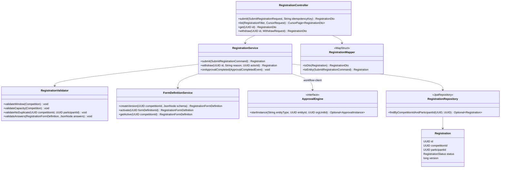
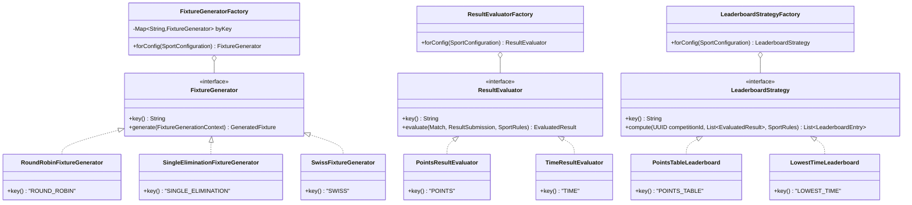
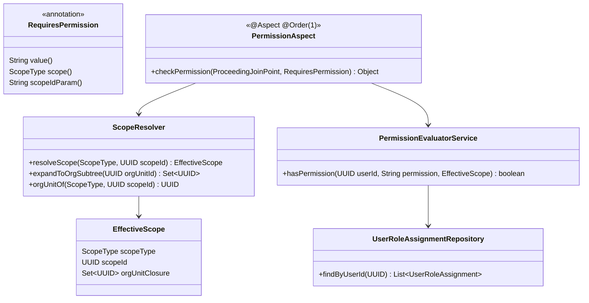
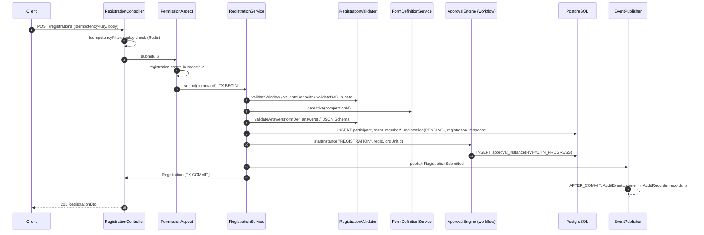
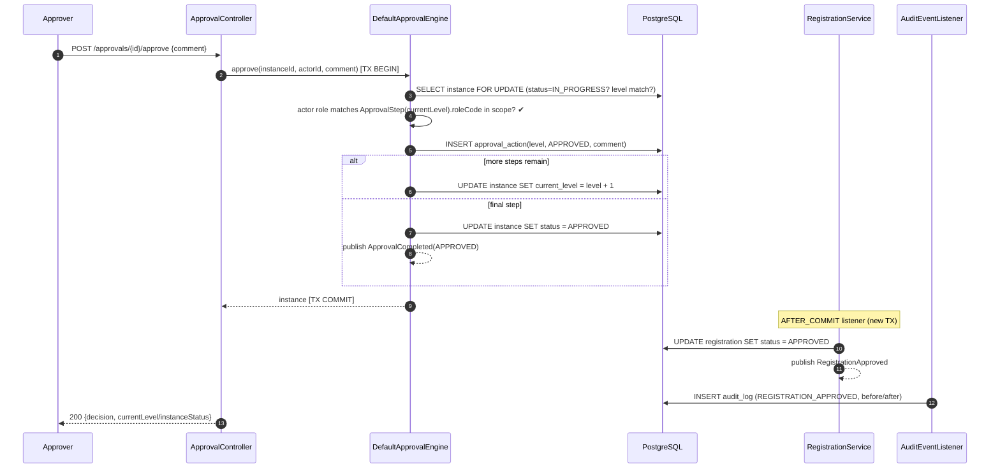
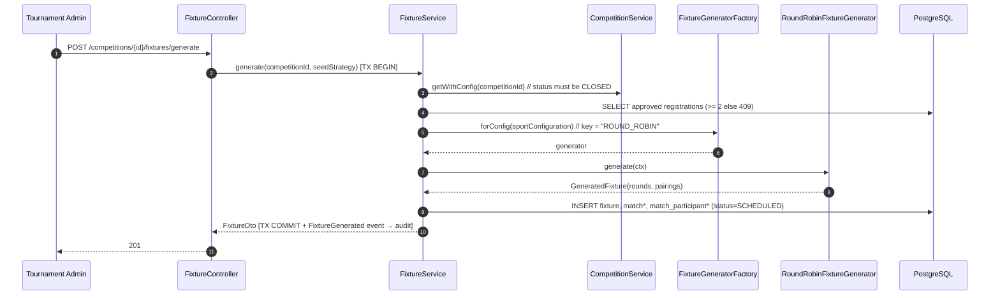

# 09 — Low-Level Design (Spring Boot Modular Monolith)

| Field | Value |
|---|---|
| Version | 1.0 |
| Status | Approved |
| Date | 2026-07-26 |
| Owner | Samarth |
| Depends on | 03_HLD, 04_DATABASE_DESIGN, 05_RBAC_AND_ORGANIZATION, 06_SPORT_CONFIGURATION_ENGINE, 07_APPROVAL_WORKFLOW_ENGINE, 08_API_CONTRACTS |

---

## 1. Package Structure

Java 21, Spring Boot 3.x, single Gradle module (modular monolith). Module boundaries enforced with ArchUnit rules (`api` and `service` of one module may only depend on another module's `service` interfaces, never its `repo`/`domain`).

```
com.acme.tms
├── common
│   ├── api            # RFC-7807 ProblemDetail advice, CursorPage<T>, IdempotencyFilter
│   ├── config         # Jackson, Redis, S3, async executor, Hibernate filter config
│   ├── domain         # BaseEntity (UUIDv7 id, audit cols, deleted_at), DomainEvent marker
│   ├── exception      # TmsException hierarchy (§10)
│   ├── security       # JwtAuthFilter, @RequiresPermission, PermissionAspect, ScopeResolver
│   └── validation     # JsonSchemaValidator wrapper (networknt json-schema-validator)
├── identity
│   ├── api            # AuthController, UserController, RoleAssignmentController
│   ├── dto            # LoginRequest, TokenResponse, InviteUserRequest, RoleAssignmentDto
│   ├── service        # AuthService, UserService, RoleAssignmentService, TokenService
│   ├── domain         # User, Role, Permission, RolePermission, UserRoleAssignment
│   ├── repo           # UserRepository, UserRoleAssignmentRepository, ...
│   └── config         # SecurityFilterChain, password policy
├── organization
│   ├── api | dto | service | domain (OrganizationUnit) | repo | config
├── tournament
│   ├── api            # TournamentController, CompetitionController, PublicTournamentController
│   ├── dto | service (TournamentService, CompetitionService, TournamentLifecycleService)
│   ├── domain         # Tournament, Competition, Venue, Sport, SportConfiguration
│   ├── repo | config
├── registration
│   ├── api            # RegistrationController, FormDefinitionController
│   ├── dto            # SubmitRegistrationRequest, RegistrationDto, FormDefinitionDto
│   ├── service        # RegistrationService, FormDefinitionService, RegistrationValidator
│   ├── domain         # Participant, TeamMember, Registration, RegistrationFormDefinition, RegistrationResponse
│   ├── repo | config
├── fixture
│   ├── api | dto
│   ├── service        # FixtureService, FixtureGeneratorFactory, generators.* (RoundRobin, SingleElimination, DoubleElimination, Swiss, NoOp)
│   ├── domain         # Fixture, Match, MatchParticipant
│   ├── repo | config
├── result
│   ├── api | dto
│   ├── service        # ResultService, LeaderboardService, ResultEvaluatorFactory, LeaderboardStrategyFactory, evaluators.*, leaderboards.*
│   ├── domain         # Result, LeaderboardEntry
│   ├── repo | config
├── workflow
│   ├── api            # ApprovalController
│   ├── dto | service  # ApprovalEngine (interface + DefaultApprovalEngine), WorkflowAdminService
│   ├── domain         # ApprovalWorkflow, ApprovalStep, ApprovalInstance, ApprovalAction
│   ├── repo | config
├── document
│   ├── api | dto | service (DocumentService, DocumentStorageClient + S3DocumentStorageClient) | domain (Document) | repo | config
└── audit
    ├── api | dto | service (AuditRecorder + AuditService query side, AuditEventListener) | domain (AuditLog) | repo | config
```

## 2. Layered Flow & Mapping

```
HTTP → Controller(api) → [PermissionAspect] → Service → Repository → PostgreSQL
         │ DTO in/out                          │ entities only below this line
         └── MapStruct mapper (dto ↔ domain)   └── publishes DomainEvents
```

Rules:

- **Controllers** are thin: bind DTO, delegate, map result. No business logic, no entities in signatures.
- **DTO↔entity mapping via MapStruct** (`componentModel = "spring"`), one `*Mapper` per module in `dto`. Update-mapping uses `@BeanMapping(nullValuePropertyMappingStrategy = IGNORE)` for PATCH semantics. Entities never serialize to JSON (no Jackson annotations in `domain`).
- **Services** own transactions, permission-checked via annotation (§5), publish domain events (§9), and are the only cross-module entry points.
- **Repositories** are Spring Data JPA interfaces; JSONB columns (`RegistrationResponse.answers`, `SportConfiguration.config`, audit states) mapped with Hibernate 6 `@JdbcTypeCode(SqlTypes.JSON)`.
- **Multi-tenancy**: Hibernate filter `orgScopeFilter` (param `orgUnitIds`) enabled per request by `ScopeResolver`-computed subtree ids; service-layer checks remain authoritative (defense in depth).

## 3. Class Diagram — Registration Module



`RegistrationService.onApprovalCompleted` is an `@TransactionalEventListener` that flips the registration status when the workflow module publishes the terminal event — registration never reaches into `workflow.repo`.

## 4. Class Diagram — Sport Configuration Engine

Strategy interfaces + keyed factories; no `if (sport == FOOTBALL)` anywhere. Implementations self-register by key via Spring injection of `List<T>` into the factory.



Factory lookup failure (unknown key in a stored config) throws `TmsValidationFailedException("UNKNOWN_STRATEGY_KEY")` — surfaces as RFC-7807 400. Adding Chess = one `SwissFixtureGenerator` bean (already present) + a `SportConfiguration` row; zero factory changes.

## 5. Class Diagram — Scoped RBAC Enforcement



Usage:

```java
@RequiresPermission(value = "registration:approve",
                    scope = ScopeType.COMPETITION,
                    scopeIdParam = "competitionId")
public ApprovalDecisionDto approve(UUID competitionId, UUID instanceId, String comment) { ... }
```

Resolution algorithm in `PermissionAspect`:
1. Read `scopeIdParam` from method args (SpEL); `ScopeResolver` maps it to the owning entity chain (COMPETITION → TOURNAMENT → ORGANIZATION path).
2. Load the caller's `UserRoleAssignment`s (Redis-cached, §11). A grant matches if: GLOBAL; or ORGANIZATION and the target's org unit is inside the assignment's subtree closure; or exact TOURNAMENT/COMPETITION scopeId match (TOURNAMENT scope also covers its child competitions).
3. Check the matched roles' `RolePermission` set for the permission string. Fail → `TmsForbiddenException("SCOPE_FORBIDDEN")`.

Subtree closure is computed with a recursive CTE on `organization_unit` and cached (`orgSubtree` cache).

## 6. Core Interface Definitions

```java
public interface FixtureGenerator {
    String key(); // ROUND_ROBIN | SINGLE_ELIMINATION | DOUBLE_ELIMINATION | SWISS | NONE
    GeneratedFixture generate(FixtureGenerationContext ctx);
    // ctx: competitionId, List<SeededParticipant>, SportRules rules, SeedStrategy seedStrategy
}

public interface ResultEvaluator {
    String key(); // POINTS | WIN_LOSS | TIME | DISTANCE | SCORE
    EvaluatedResult evaluate(Match match, ResultSubmission submission, SportRules rules)
        throws TmsValidationFailedException;
}

public interface LeaderboardStrategy {
    String key(); // POINTS_TABLE | LOWEST_TIME | HIGHEST_DISTANCE | HIGHEST_SCORE | BRACKET
    List<LeaderboardEntry> compute(UUID competitionId,
                                   List<EvaluatedResult> results,
                                   SportRules rules);
}

public interface ApprovalEngine {
    /** Returns empty if no ApprovalWorkflow is configured for (orgUnit, entityType) —
        caller then auto-approves per 07_APPROVAL_WORKFLOW_ENGINE §4. */
    Optional<ApprovalInstance> startInstance(String entityType, UUID entityId, UUID organizationUnitId);
    ApprovalInstance approve(UUID instanceId, UUID actorId, String comment);
    ApprovalInstance reject(UUID instanceId, UUID actorId, String comment);
    void cancel(UUID instanceId, UUID actorId);
    CursorPage<ApprovalInstance> pendingFor(UUID userId, String entityType, CursorRequest page);
}

public interface DocumentStorageClient {
    PresignedUpload initUpload(String objectKey, String mimeType, long sizeBytes, Duration ttl);
    boolean objectExists(String objectKey);              // HEAD before attach
    URI presignDownload(String objectKey, Duration ttl);
    void delete(String objectKey);
}

public interface AuditRecorder {
    void record(AuditEntry entry);
    // AuditEntry: actorId, action, entityType, entityId,
    //             beforeState (JsonNode), afterState (JsonNode), organizationUnitId, ipAddress
}
```

`AuditRecorder` is invoked from `@TransactionalEventListener(phase = AFTER_COMMIT)` listeners plus an `@Auditable`-annotation AOP interceptor for straight CRUD mutations; writes go through a `REQUIRES_NEW` transaction so audit persistence never rolls back business work (accepted trade-off: audit row may exist for a very narrow post-commit failure window — mitigated by retry).

## 7. Sequence Diagrams

### 7.1 Registration Submission (end-to-end)



Failure at any validation step throws before any INSERT; JSON-Schema errors map to 400 `FORM_ANSWERS_INVALID` with per-field `errors[]`.

### 7.2 Approve Action



`SELECT ... FOR UPDATE` on the instance serializes concurrent approvers; a loser whose expected level moved gets `409 STALE_LEVEL`.

### 7.3 Fixture Generation



Generators are pure functions over the context (no repository access) — trivially unit-testable.

## 8. Transaction Boundaries & @Transactional Strategy

- **Service methods are the transaction boundary.** `@Transactional` on service class (write methods), `@Transactional(readOnly = true)` on query services. Controllers and repositories never open transactions.
- **Propagation `REQUIRED` everywhere** except: `AuditRecorder` (`REQUIRES_NEW`, post-commit), idempotency-key claim (`REQUIRES_NEW` so the key survives business rollback with FAILED marker).
- **Cross-module calls stay in the caller's TX** for atomicity (registration + approval instance commit together); *reactions* (status flip on approval, leaderboard recompute) run in `AFTER_COMMIT` listeners with their own TX — an approval must never roll back because the leaderboard cache write failed.
- **No `@Transactional` on `@Async` or listener classes' private methods** (self-invocation pitfall); listeners annotate the public handler.
- External I/O (S3 presign, HEAD) is done **outside** or **before** the transaction; only the `attach` DB write is transactional.

## 9. Domain Events (Spring Application Events)

| Event | Publisher | Listeners (all `@TransactionalEventListener(AFTER_COMMIT)`) |
|---|---|---|
| `RegistrationSubmitted(registrationId, competitionId, orgUnitId, actorId)` | RegistrationService | AuditEventListener; NotificationOutboxListener (schema reserved, delivery post-MVP) |
| `RegistrationApproved(registrationId, ...)` / `RegistrationRejected` | RegistrationService (on ApprovalCompleted) | AuditEventListener |
| `ApprovalCompleted(instanceId, entityType, entityId, decision)` | DefaultApprovalEngine | RegistrationService (status flip); AuditEventListener |
| `MatchCompleted(matchId, competitionId, resultId)` | ResultService | **LeaderboardUpdateListener** (recompute via LeaderboardStrategy, write `LeaderboardEntry` rows, evict Redis key); AuditEventListener |
| `TournamentStatusChanged(tournamentId, from, to)` | TournamentLifecycleService | AuditEventListener; PublicCacheEvictionListener |

Events are plain records implementing `DomainEvent`; published via `ApplicationEventPublisher`. In-JVM only in V1 — the record shapes are kept broker-serializable so V2 can bridge to an outbox without touching publishers.

## 10. Exception Hierarchy → RFC-7807

```
TmsException (abstract; fields: code, httpStatus, detail, Map<String,Object> extensions)
├── TmsNotFoundException          → 404  (e.g. TOURNAMENT_NOT_FOUND)
├── TmsForbiddenException         → 403  (SCOPE_FORBIDDEN, NOT_CURRENT_STEP_APPROVER)
├── TmsConflictException          → 409  (SLUG_TAKEN, INVALID_STATE_TRANSITION, STALE_VERSION, ...)
└── TmsValidationFailedException  → 400  (VALIDATION_FAILED, FORM_ANSWERS_INVALID; carries errors[])
```

`GlobalProblemAdvice` (`@RestControllerAdvice` extending `ResponseEntityExceptionHandler`) maps:
- `TmsException` → `ProblemDetail` with `type = https://docs.acme-tms.com/problems/{kebab(code)}`, `code`, `traceId` (from MDC) extensions.
- `MethodArgumentNotValidException` / `ConstraintViolationException` → 400 `VALIDATION_FAILED` with `errors[]`.
- `OptimisticLockingFailureException` → 409 `STALE_VERSION`.
- `DataIntegrityViolationException` on named unique constraints → mapped by constraint name (`uk_tournament_slug` → 409 `SLUG_TAKEN`).
- Anything else → 500 with generic detail (no stack traces in body), logged at ERROR with traceId.

## 11. Validation Approach

Two layers, both mandatory:

1. **Bean Validation (Jakarta)** on DTOs: `@NotNull`, `@Email`, `@Pattern(regexp = "^[a-z0-9-]{3,60}$")` for slugs, `@Valid` cascading into nested team members. Method-level `@Validated` on services for cross-module calls.
2. **Dynamic form validation**: `JsonSchemaValidator` (networknt, draft 2020-12) validates `answers` (JsonNode) against the active `RegistrationFormDefinition.schema`. Compiled `JsonSchema` objects are cached per `(formDefinitionId)` in the `formSchema` cache. Violations translate to `FieldErrorDto(field=jsonPointer, message)` inside `TmsValidationFailedException("FORM_ANSWERS_INVALID")`. The definition itself is validated against the JSON-Schema meta-schema at creation (`INVALID_JSON_SCHEMA`).

Business-rule validation (windows, capacity, duplicates, state transitions) lives in dedicated validators/services and throws `TmsConflictException` — never Bean Validation, which is reserved for shape.

## 12. Caching (Redis, Spring Cache Abstraction)

| Cache | Key | TTL | Eviction trigger |
|---|---|---|---|
| `leaderboard` | `lb:{competitionId}` | 10 min | `MatchCompleted` listener `@CacheEvict` |
| `publicTournament` | `pub:t:{slug}` | 5 min | `TournamentStatusChanged`, competition changes |
| `orgSubtree` | `org:subtree:{orgUnitId}` | 30 min | OrganizationUnit create/status change |
| `userGrants` | `grants:{userId}` | 5 min | Role assignment create/delete (`@CacheEvict`) |
| `formSchema` | `form:{formDefinitionId}` | none (immutable version) | activate of newer version (belt & braces) |
| idempotency (raw Redis, not cache abstraction) | `idem:{userId}:{key}` | 24 h | — |

`@Cacheable(cacheNames = "leaderboard", key = "'lb:' + #competitionId")` on `LeaderboardService.get`. All caches are read-through; correctness never depends on cache state (DB is source of truth).

## 13. Concurrency

- **Optimistic locking (`@Version long version`)** on `Registration` and `Result` (also `Match`). Concurrent withdraw-vs-approve or double result-entry loses with `STALE_VERSION` (409); clients refetch and retry. The `POST /matches/{id}/result` body carries `version` explicitly (08 §12.2).
- **Slug uniqueness race**: two creators can pass the pre-check simultaneously; DB unique constraint `uk_tournament_slug` is the arbiter. `DataIntegrityViolationException` translated to 409 `SLUG_TAKEN` (§10) — never a 500.
- **Approval level race**: pessimistic `SELECT ... FOR UPDATE` on `ApprovalInstance` (short TX), see §7.2; chosen over optimistic here because contention is expected (multiple eligible approvers) and retries would be user-visible.
- **Registration capacity race**: `validateCapacity` uses `SELECT count(*) ... FOR UPDATE` on the competition row when `maxRegistrations` is set, serializing the last few submissions.
- **Idempotency claim**: Redis `SET NX` on `idem:{userId}:{key}` before processing; the losing concurrent duplicate gets the replay/`IDEMPOTENCY_KEY_REUSE` path.

## 14. Testing Strategy (summary — full plan in 13_CODING_STANDARDS)

| Layer | Tooling | Scope & examples |
|---|---|---|
| Unit | JUnit 5, Mockito, AssertJ | Strategies as pure functions (round-robin pairing counts, points-table tie-breaks), validators, ScopeResolver closure logic, MapStruct mappers (generated impl smoke tests) |
| Slice | `@WebMvcTest` + `@Import(GlobalProblemAdvice)`, `@DataJpaTest` | Controller JSON contracts incl. RFC-7807 shapes and 400/403/409 paths; repository JSONB round-trips and cursor queries |
| Integration | **Testcontainers** (PostgreSQL 16, Redis), `@SpringBootTest` | End-to-end registration submit → approval → status flip; fixture generation on real data; optimistic-lock and slug-race tests with parallel threads; Hibernate tenant filter verification |
| Contract | Spring REST Docs generated from slice tests | Keeps 08_API_CONTRACTS examples honest (snippets diffed in CI) |
| Architecture | ArchUnit | Module dependency rules (§1), "no entity leaves service layer", "every mutating service method audited or event-publishing" |

Coverage gate: 80% line on `service` packages; strategy implementations 95%. Integration suite runs in CI on every PR (~4 min budget); no H2 anywhere — Postgres-specific features (JSONB, recursive CTE) make Testcontainers mandatory.

---

*End of 09_LLD.md.*
