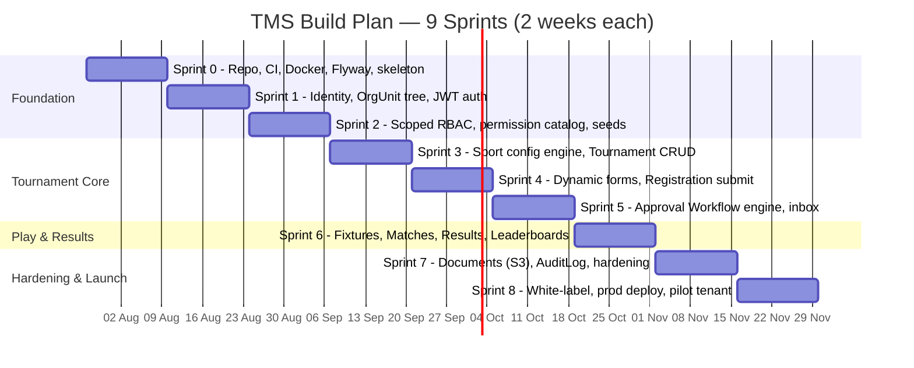

# 10 — Development Roadmap

| | |
|---|---|
| **Version** | 1.0 |
| **Status** | Approved |
| **Date** | 2026-07-26 |
| **Owner** | Samarth |
| **Depends on** | 00–09 (all frozen design docs), ARCHITECTURE_BRIEF.md |

---

## 1. Planning Assumptions

- **Team:** 1 solo developer + AI pair-programming assistance.
- **Cadence:** 2-week sprints (10 working days). Velocity is calibrated for AI-assisted development: boilerplate, migrations, DTOs, mappers and test scaffolding are cheap; design decisions and integration debugging are the real cost.
- **Scope source:** ARCHITECTURE_BRIEF.md is frozen. No entity renames, no enum changes, no scope additions mid-sprint. New ideas go to `11_FUTURE_ENHANCEMENTS.md`.
- **Stack:** Java 21, Spring Boot 3.x modular monolith, PostgreSQL 16 (shared-schema, `organization_unit_id` scoping), Redis, S3-compatible storage, JWT auth, Flyway migrations.
- **Order rationale:** identity → organization tree → RBAC → tournament core → dynamic forms → approvals → fixtures/results → documents/audit → white-label/prod. Each sprint produces something demoable; nothing is built before its dependency exists.

## 2. Timeline Overview

### 2.1 Milestones and demo checkpoints

| End of | Milestone | Demo script (what is shown working) |
|---|---|---|
| Sprint 0 | **M0 — Walking skeleton** | Clone → `docker compose up` → app healthy, Flyway applied, CI badge green |
| Sprint 1 | **M1 — Tenants exist** | Build the SAI → Haryana → Sonipat District tree; invite user; JWT login/refresh |
| Sprint 2 | **M2 — Authority is scoped** | Haryana `TENANT_ADMIN` manages Haryana subtree, gets 403 on Punjab |
| Sprint 3 | **M3 — Tournaments are public** | Create tournament + competitions, publish, open `/t/haryana-games-2027` logged out |
| Sprint 4 | **M4 — People can register** | Define form v1, submit registration with validated JSONB answers, withdraw |
| Sprint 5 | **M5 — Approvals flow** | 3-level workflow drives a registration `PENDING → APPROVED`; inbox shows level 2 |
| Sprint 6 | **M6 — Games are played** | Round-robin fixtures, results entered, points table + lowest-time board correct |
| Sprint 7 | **M7 — Trustworthy platform** | Presigned upload, audit trail of every mutation, hardening scan clean |
| Sprint 8 | **M8 — Production pilot** | Pilot tenant runs a themed, real tournament to `COMPLETED` in prod |

### 2.2 API surface by sprint (from 08_API_CONTRACTS)

| Sprint | Endpoint groups delivered |
|---|---|
| 1 | `/api/v1/auth/**`, `/api/v1/users/**`, `/api/v1/organization-units/**` |
| 2 | `/api/v1/roles/**`, `/api/v1/permissions`, `/api/v1/role-assignments/**` |
| 3 | `/api/v1/sports/**`, `/api/v1/sport-configurations/**`, `/api/v1/tournaments/**` (+ lifecycle sub-resources), `/api/v1/tournaments/{id}/competitions/**`, `/api/v1/venues/**`, `/api/v1/public/t/{tournament-slug}` |
| 4 | `/api/v1/registration-form-definitions/**`, `/api/v1/participants/**`, `/api/v1/registrations/**` (+ `/withdraw`) |
| 5 | `/api/v1/approval-workflows/**`, `/api/v1/approval-instances/**` (+ `/actions`), `/api/v1/approvals/inbox` |
| 6 | `/api/v1/competitions/{id}/fixtures/**`, `/api/v1/matches/**`, `/api/v1/results/**`, `/api/v1/public/.../leaderboards` |
| 7 | `/api/v1/documents/**` (presign, confirm), `/api/v1/audit-logs` (scoped read) |
| 8 | `/api/v1/organization-units/{id}/theme` |

## 3. Sprint-by-Doc Dependency Map

| Sprint | Primarily implements | Also touches |
|---|---|---|
| 0 | 03_HLD (module layout), 13_CODING_STANDARDS | 04 (Flyway baseline) |
| 1 | 05_RBAC_AND_ORGANIZATION (User, OrganizationUnit), 08_API_CONTRACTS (auth) | 04, 09 |
| 2 | 05_RBAC_AND_ORGANIZATION (roles, permissions, scoping) | 08, 09 |
| 3 | 06_SPORT_CONFIGURATION_ENGINE, 02_DOMAIN_MODEL (Tournament/Competition) | 08, 09 |
| 4 | 02 (RegistrationFormDefinition/RegistrationResponse), 08 | 04, 09 |
| 5 | 07_APPROVAL_WORKFLOW_ENGINE | 08, 09 |
| 6 | 06 (strategies), 02 (Fixture/Match/Result/LeaderboardEntry) | 08, 09 |
| 7 | 02 (Document, AuditLog), 03 (cross-cutting) | 04, 08 |
| 8 | 12_UI_UX_GUIDELINES (white-label), 03 (deployment view) | 00, 01 |

---

## Sprint 0 — Foundation (repo, CI, Docker, Flyway, skeleton)

**Goal:** A cloneable repo where `docker compose up` gives Postgres + Redis, the app boots, Flyway runs `V1__baseline.sql`, CI is green, and every module package exists.

**Deliverables**
- [ ] Git repo, trunk-based branching, conventional-commit hook, PR template (per 13_CODING_STANDARDS)
- [ ] Gradle multi-source Spring Boot 3 project, Java 21 toolchain, package skeleton `com.acme.tms.{identity,organization,tournament,registration,fixture,result,workflow,document,audit,common}`
- [ ] `docker-compose.yml`: PostgreSQL 16, Redis, MinIO (S3-compatible), app
- [ ] Flyway wired; `V1__baseline.sql` (extensions, uuid v7 helper if needed)
- [ ] CI pipeline: build, unit tests, Testcontainers integration tests, static analysis (Spotless/Checkstyle, error-prone), Docker image publish
- [ ] `common` module: `TmsException` hierarchy, RFC-7807 error handler, UUID v7 generator, cursor-pagination helpers, structured JSON logging with correlation-ID filter
- [ ] `13_CODING_STANDARDS.md` enforced via tooling (formatter + checks in CI)
- [ ] Health endpoints (`/actuator/health`), OpenAPI (springdoc) stub at `/api/v1`

**Definition of Done:** fresh clone → one command to run locally; CI green on main; a sample failing migration blocks the pipeline; ADR-011/012/013 references linked from README.

**Key risks:** over-engineering the skeleton (timebox to 3 days); Flyway/Testcontainers version drift — pin all versions.

---

## Sprint 1 — Identity + OrganizationUnit tree + JWT auth

**Goal:** Users can be created, log in with JWT (access + refresh), and belong to an `OrganizationUnit` tree (root node = tenant).

**Deliverables**
- [ ] Migrations: `user`, `organization_unit` (self-referencing `parent_organization_unit_id`, `type`, `status`, `slug`), audit columns + `deleted_at`
- [ ] `OrganizationUnit` CRUD + tree endpoints: create child, move subtree (guard against cycles), get ancestors/descendants; types `FEDERATION, STATE_ASSOCIATION, DISTRICT_ASSOCIATION, ACADEMY, COLLEGE, CLUB, PRIVATE_ORGANIZER`; statuses `ACTIVE, SUSPENDED, ARCHIVED`
- [ ] User lifecycle: `ACTIVE, INVITED, SUSPENDED, DEACTIVATED`; invite flow (token, no email delivery yet — logged link)
- [ ] Spring Security + JWT: login, refresh, logout (refresh-token revocation in Redis), password hashing (bcrypt), `/api/v1/auth/**`
- [ ] Hibernate tenant filter on `organization_unit_id` + service-layer scope-check seam (real checks come in Sprint 2)
- [ ] Testcontainers repo tests for tree operations (subtree query, cycle prevention)

**Definition of Done:** demo script — create SAI → Haryana → Sonipat District via API, invite a user, log in, call a protected endpoint; tree queries covered by integration tests; token expiry/refresh proven by test.

**Key risks:** subtree queries (recursive CTE vs. materialized path) — decide once, document in 04/09, benchmark with 10k nodes; JWT refresh-rotation subtleties — copy the exact flow from 08_API_CONTRACTS, don't improvise.

---

## Sprint 2 — Scoped RBAC + permission catalog + seed data

**Goal:** Every endpoint is guarded by fine-grained permissions evaluated against scope (`GLOBAL, ORGANIZATION, TOURNAMENT, COMPETITION`), with ORGANIZATION scope granting the whole subtree.

**Deliverables**
- [ ] Migrations: `role`, `permission`, `role_permission`, `user_role_assignment { user_id, role_id, scope_type, scope_id }`
- [ ] Permission catalog seeded (strings like `tournament:create`, `registration:approve`) — single Flyway seed migration, catalog documented in 05
- [ ] Seed roles: `SUPER_ADMIN (GLOBAL)`, `TENANT_ADMIN (ORGANIZATION)`, `ORG_OFFICIAL (ORGANIZATION)`, `TOURNAMENT_ADMIN (TOURNAMENT)`, `COMPETITION_OFFICIAL (COMPETITION)`, `PARTICIPANT_USER`, `PUBLIC_VIEWER`
- [ ] `@RequiresPermission("...")` method-security annotation + `ScopeEvaluator` (subtree resolution cached in Redis, invalidated on tree change)
- [ ] Role-assignment APIs (grant/revoke within caller's scope only — no privilege escalation)
- [ ] Dev seed dataset: 1 tenant tree (SAI → 2 states → 2 districts), users per role
- [ ] Permission-matrix integration test: role × endpoint × scope grid asserted in one table-driven test

**Definition of Done:** every existing endpoint annotated; matrix test green; a TENANT_ADMIN of Haryana cannot touch Punjab's data (negative test); escalation attempt returns 403 problem+json.

**Key risks:** subtree-scope evaluation performance — cache aggressively, measure; permission-string sprawl — the catalog in 05 is the only source, adding a permission requires a doc PR first.

---

## Sprint 3 — Sport + SportConfiguration engine core + Tournament/Competition CRUD + lifecycle + slugs + public pages

**Goal:** An organizer creates a Tournament with Competitions, each bound to a validated `SportConfiguration`, walks the lifecycle to `PUBLISHED`, and the public sees `/t/{tournament-slug}`.

**Deliverables**
- [ ] Migrations: `sport`, `sport_configuration` (JSONB config), `tournament`, `competition`, `venue`
- [ ] `SportConfiguration` JSONB schema validation: `{ sport, participantType, fixtureGenerator, resultEvaluator, leaderboardStrategy, rules{} }`; enum guards for `ROUND_ROBIN, SINGLE_ELIMINATION, DOUBLE_ELIMINATION, SWISS, NONE` / `POINTS, WIN_LOSS, TIME, DISTANCE, SCORE` / `POINTS_TABLE, LOWEST_TIME, HIGHEST_DISTANCE, HIGHEST_SCORE, BRACKET`
- [ ] Strategy factories as registries with no implementations yet needed beyond stubs: `FixtureGeneratorFactory`, `ResultEvaluatorFactory`, `LeaderboardStrategyFactory` (fail fast on unknown key at config-save time)
- [ ] Tournament lifecycle state machine: `DRAFT → PUBLISHED → REGISTRATION_OPEN → REGISTRATION_CLOSED → IN_PROGRESS → COMPLETED → ARCHIVED`, plus `CANCELLED`; illegal transitions rejected with problem+json
- [ ] Competition lifecycle: `DRAFT, OPEN, CLOSED, IN_PROGRESS, COMPLETED, CANCELLED`
- [ ] Slug service: platform-unique, generated from name, immutable after publish (DB constraint + service guard)
- [ ] Public read-only endpoints (no auth): `GET /api/v1/public/t/{tournament-slug}` tournament + competitions view (backing the frontend URL `/t/{tournament-slug}`); seed MVP sports Football (TEAM/ROUND_ROBIN/POINTS) and Athletics-100m (INDIVIDUAL/NONE/TIME)

**Definition of Done:** full lifecycle walk in an integration test; invalid `SportConfiguration` (unknown strategy key) rejected on save; slug collision and post-publish mutation both rejected; public page returns data without a token.

**Key risks:** lifecycle edge cases (cancel from every state?) — encode the full transition table from 02 as data, test exhaustively; JSONB validation drift — one `SportConfigurationValidator`, used by both create and update paths.

---

## Sprint 4 — Dynamic forms + Registration submit

**Goal:** Organizers define a versioned registration form per Competition; participants submit a Registration whose answers are validated against that form.

**Deliverables**
- [ ] Migrations: `participant` (polymorphic `participant_type ∈ INDIVIDUAL, TEAM, ORGANIZATION`), `team_member`, `registration`, `registration_form_definition` (JSON schema, versioned per Competition), `registration_response` (JSONB answers)
- [ ] Form-definition CRUD: publish creates an immutable version; edits after publish create version n+1; responses always pin the version they answered
- [ ] Server-side answer validation against the pinned form definition (types, required, options, min/max)
- [ ] Registration submit flow: create Participant (or reuse), submit → status `PENDING`; statuses `PENDING, APPROVED, REJECTED, WITHDRAWN`; withdraw by owner while `PENDING`
- [ ] Guards: registration window (Tournament `REGISTRATION_OPEN`), competition `OPEN`, participantType matches `SportConfiguration.participantType`, duplicate-registration prevention
- [ ] Team flows: TEAM participant with `TeamMember` roster, roster-size rules from `SportConfiguration.rules`

**Definition of Done:** end-to-end test — define form v1, open registration, submit valid + invalid answers, edit form to v2, verify old responses still render against v1; duplicate submit rejected; WITHDRAWN flow covered.

**Key risks:** form-versioning semantics (biggest correctness trap of the project) — write the versioning tests before the implementation; JSONB answer querying — keep MVP reads simple (fetch by registration), no ad-hoc JSONB search yet.

---

## Sprint 5 — Approval Workflow engine + approvals inbox

**Goal:** Tenant-configurable multi-level approvals drive Registration decisions; approvers see an inbox; registration status stays simple.

**Deliverables**
- [ ] Migrations: `approval_workflow { organization_unit_id, workflow_name, entity_type }`, `approval_step { workflow_id, level, role_code, approval_required }`, `approval_instance { workflow_id, entity_type, entity_id, current_level, status }`, `approval_action { instance_id, step_level, actor_id, decision, comment, timestamp }`
- [ ] Workflow-definition CRUD per tenant (1-level and 3-level configs both work with zero code changes — prove with tests)
- [ ] Engine: on Registration submit, resolve applicable workflow (nearest ancestor OrganizationUnit), open `ApprovalInstance` (`IN_PROGRESS`); approve advances `currentLevel`; final approval → instance `APPROVED` → registration `APPROVED`; any reject → instance `REJECTED` → registration `REJECTED`; withdraw → instance `CANCELLED`
- [ ] No-workflow-configured fallback: auto-approve (decision recorded as system `ApprovalAction`)
- [ ] Approvals inbox API: pending items for the caller, computed from role (`ApprovalStep.roleCode`) × scope; approve/reject with mandatory comment on reject
- [ ] Concurrency safety: two approvers acting on the same instance/level — optimistic locking, second actor gets a conflict

**Definition of Done:** 1-level and 3-level scenarios pass end to end; internal "pending at level 2" visible via workflow state only, never via registration status; inbox reflects scope correctly; conflict test green.

**Key risks:** workflow-resolution rules (which workflow applies when parent and child both define one) — nearest-ancestor rule from 07, tested explicitly; state-machine bugs — model engine transitions as a pure function, unit-test exhaustively before wiring to services.

---

## Sprint 6 — Fixtures (round robin + none) + Matches + Results + Leaderboards

**Goal:** Close registrations, generate fixtures, record results, and publish live leaderboards for the two MVP sports.

**Deliverables**
- [ ] Migrations: `fixture`, `match`, `match_participant`, `result`, `leaderboard_entry`
- [ ] `RoundRobinFixtureGenerator` (circle method, handles odd count via bye) and `NoneFixtureGenerator` (direct-final for measured events like 100m)
- [ ] Match lifecycle: `SCHEDULED, LIVE, COMPLETED, WALKOVER, CANCELLED, POSTPONED`; result entry gated by `match:record-result` permission
- [ ] Result evaluators: `POINTS` (win/draw/loss from `rules{}`), `TIME` (lowest wins); `ResultEvaluatorFactory` dispatch
- [ ] Leaderboards: `POINTS_TABLE` (points, then tie-breakers from `rules{}`) and `LOWEST_TIME`; recomputed on result confirmation; cached in Redis; public read via slug pages
- [ ] Regeneration rules: fixtures immutable once any match is `LIVE`/`COMPLETED`; regenerate allowed before that with explicit confirmation
- [ ] Proof-of-architecture test: register a fake `SWISS` strategy in tests and confirm the factories dispatch to it without core changes (Chess-readiness per brief)

**Definition of Done:** Football competition with 5 teams → 10 round-robin matches, results entered, points table correct incl. tie-breakers; 100m with 8 runners → times entered → `LOWEST_TIME` board correct; walkover and postponed paths tested; no sport-conditional (`if sport == ...`) anywhere — enforced by review + grep in CI.

**Key risks:** tie-breaker correctness — table-driven tests from worked examples in 06; leaderboard cache invalidation — recompute-on-write, cache is read-through only.

---

## Sprint 7 — Documents (S3) + AuditLog + hardening

**Goal:** File uploads via presigned URLs, immutable audit trail on all mutations, and a security/performance hardening pass before launch prep.

**Deliverables**
- [ ] Migrations: `document`, `audit_log`
- [ ] `Document` module: presigned S3 upload/download, `{ organizationUnitId, entityType, entityId, fileName, fileUrl, mimeType, sizeBytes, uploadedBy }`; mime/size allow-list; attach to Registration and Tournament
- [ ] `AuditLog` AOP interceptor at service layer: `actorId, action, entityType, entityId, beforeState/afterState (JSONB), organizationUnitId, ipAddress, timestamp`; read API for TENANT_ADMIN (scoped)
- [ ] Hardening: rate limiting on auth + public endpoints (Redis), request-size limits, security headers, dependency + container scan in CI, secrets audit
- [ ] Performance pass: N+1 sweep (Hibernate statistics in tests), indexes verified against 04, p95 targets measured with a k6/Gatling smoke on seed data
- [ ] Ops: structured-log dashboards, error alerting, backup/restore drill for Postgres, runbook draft

**Definition of Done:** every mutating service method audited (verified by an ArchUnit-style test on annotations/pointcuts); presigned flow works against MinIO in Testcontainers; restore drill executed once; zero criticals from scans.

**Key risks:** audit interceptor capturing lazy-loaded/partial state — snapshot DTO-level state, not raw entities; presigned-URL clock/expiry issues — short TTLs plus retry guidance in API docs.

---

## Sprint 8 — White-label theming, prod deployment, pilot tenant onboarding

**Goal:** The platform runs in production with tenant-specific branding, and the pilot tenant runs a real tournament on it.

**Deliverables**
- [ ] Tenant theming: theme config (logo URL, color tokens) stored per root `OrganizationUnit`, served to the SPA as CSS variables (per 12_UI_UX_GUIDELINES); custom domains explicitly deferred (11_FUTURE_ENHANCEMENTS)
- [ ] Public pages render tenant branding on `/t/{slug}`
- [ ] Production infra: managed Postgres + Redis + S3, TLS, environment config, Flyway on deploy, blue-green or rolling deploy, uptime monitoring
- [ ] Go-live checklist executed (backups verified, alerts firing, rate limits on, seed SUPER_ADMIN rotated)
- [ ] Pilot tenant onboarded: org tree created, roles assigned, one real tournament (1 Football + 1 Athletics-100m competition) end to end
- [ ] Feedback loop: pilot issues triaged daily; fixes land as patch releases; learnings filed into 11_FUTURE_ENHANCEMENTS

**Definition of Done:** pilot tournament reaches `COMPLETED` in production with real users; zero Sev-1s open; theming visibly differs from default for the pilot tenant; roadmap retro written.

**Key risks:** production surprises (email/URLs/CORS) — deploy to prod infra by day 3, not day 9; pilot scope creep — feature requests go to the backlog, only Sev-1/Sev-2 fixes ship during pilot.

---

## 4. Cross-Sprint Rules

- **Demo every sprint.** If it can't be demoed via API + a throwaway UI page, it isn't done.
- **Migrations are immutable** once merged (see 13). Fix-forward only.
- **Docs stay frozen; code follows docs.** A mismatch is a bug in one of them — file it, decide, update the non-frozen artifact.
- **Carry-over policy:** unfinished items move to the next sprint's top; the next sprint sheds scope from the bottom, never from its DoD.
- **Definition of Ready** for any sprint item: the relevant design doc section exists, API contract is in 08, and acceptance criteria are testable.
- **AI-assistance working agreement:** AI generates boilerplate (DTOs, mappers, migrations, test scaffolds, strategy stubs) from the docs; the developer owns every design decision, all state-machine logic, and reviews every generated line against 13 before merge.
- **Weekly cut:** every Friday, `main` is tagged and deployable to staging; broken main is the top priority over any feature work.
- **Doc updates ship with code:** if a sprint changes anything in a non-frozen doc (09, 10, 11), the doc PR merges in the same sprint.

### 4.1 Explicitly out of V1 scope (see 11_FUTURE_ENHANCEMENTS)

Notification delivery (schema is reserved via `Notification`), custom tenant domains, payment collection, SSO/OIDC tenants, `SINGLE_ELIMINATION`/`DOUBLE_ELIMINATION`/`SWISS` strategy implementations (architecture supports them; only `ROUND_ROBIN` and `NONE` ship), reporting/analytics over `RegistrationResponse` answers, Postgres row-level security, mobile apps.

## 5. Program-Level Risk Register

| # | Risk | Impact | Likelihood | Mitigation | Owned in |
|---|---|---|---|---|---|
| R1 | Cross-tenant data leak via missed scope check | Critical | Medium | Hibernate filter + `@RequiresPermission` on every endpoint + authz matrix test in CI | Sprint 2+ |
| R2 | Form-versioning bug corrupts historical registrations | High | Medium | Versioning tests written before implementation; responses pin definition version | Sprint 4 |
| R3 | Approval/registration state machines diverge under concurrency | High | Medium | Optimistic locking, pure-function engine transitions, conflict tests | Sprint 5 |
| R4 | Sport conditionals creep in, killing extensibility | High | Medium | Factory-only dispatch; grep gate in CI; review rule 13 §13.7; fake-SWISS test | Sprint 3/6 |
| R5 | Solo-dev bus factor / burnout | High | Low | Frozen scope, demoable sprints, carry-over policy, AI-assisted boilerplate | All |
| R6 | Subtree-scope queries too slow at federation scale | Medium | Medium | Redis-cached subtree closure, 10k-node benchmark in Sprint 1 | Sprint 1/2 |
| R7 | Prod environment surprises late in Sprint 8 | Medium | Medium | Deploy to prod infra by day 3 of Sprint 8; staging mirrors prod from Sprint 7 | Sprint 7/8 |
| R8 | Pilot tenant scope creep | Medium | High | Only Sev-1/Sev-2 fixes during pilot; everything else → 11_FUTURE_ENHANCEMENTS | Sprint 8 |
| R9 | Audit interceptor gaps on new mutations | Medium | Low | Architecture test asserting interception coverage | Sprint 7 |
| R10 | Migration mistakes on shared schema | High | Low | Immutable migrations, full-chain CI replay from empty DB, expand→migrate→contract | Sprint 0+ |

## 6. First 3 Things to Build Tomorrow

1. **Repo + skeleton:** initialize the Git repo with the Gradle/Spring Boot 3/Java 21 project, the ten `com.acme.tms.*` module packages, Spotless + Checkstyle wired to the standards in 13.
2. **Local stack:** `docker-compose.yml` with PostgreSQL 16, Redis, MinIO; Flyway configured with `V1__baseline.sql`; app boots green against it.
3. **CI pipeline:** GitHub Actions (build → test → static analysis → Docker image) so that every commit from day one is verified — including a deliberate failing-test commit to prove the gate works.

Everything else waits. These three items make every subsequent day's work verifiable, reproducible, and shippable — the highest-leverage 48 hours of the whole plan.

## 7. Launch Success Criteria (end of Sprint 8)

- Pilot tenant completes one real tournament (`DRAFT → ... → COMPLETED`) with ≥2 competitions and real registrations flowing through a configured approval workflow.
- Zero cross-tenant access incidents; authz matrix test green in prod pipeline.
- p95 API latency < 300ms on admin endpoints, < 150ms on cached public slug pages.
- All mutations present in `AuditLog`; restore drill re-verified on prod backups.
- Pilot NPS conversation done; top-5 requests filed in 11_FUTURE_ENHANCEMENTS with owner and rough sizing.
